# Rydvrse Database Schema Design

## Document Control

- Document Name: `Database_Schema.md`
- Product: `Rydvrse`
- Version: `1.0`
- Status: `Baseline Enterprise-Ready OLTP Schema for MVP`
- Last Updated: `2026-04-10`
- Source Documents:
  - `High_Level_Design.md`
  - `MVP_Scope.md`
  - `Product_Requirements_Document.md`
  - `Screen_Flow.md`
  - `Pricing_and_Payout_Design.md`

## 1. Purpose

This document defines the PostgreSQL database schema for the Rydvrse MVP.

It covers:

- entities
- relationships
- state models
- indexes
- audit tables
- event tables
- storage and partitioning recommendations

This schema is the backbone of the backend. It is designed to support:

- Spring Boot modular monolith architecture
- transactional consistency
- pricing and payout snapshot integrity
- high-trust operational workflows
- strong auditability
- future scale without immediate re-platforming

## 2. Scope

This document covers the `primary OLTP database` for the MVP.

It includes schema for:

- identity and access
- customer domain
- driver domain
- serviceability and configuration
- commercial pricing and payout
- booking and dispatch
- trip execution and tracking
- payments and finance
- support and incidents
- notifications
- audit and domain events

It does not define:

- data warehouse star schemas beyond minimal reporting tables
- Redis structures
- search indexes outside PostgreSQL
- blob/object storage layout in detail

## 3. Database Platform Assumptions

- Database: `PostgreSQL 16+`
- Extensions:
  - `pgcrypto` for `gen_random_uuid()`
  - `citext` for case-insensitive email
  - `postgis` for geo operations
- Time storage: `timestamptz`
- Money storage: `bigint` in paise
- JSON storage: `jsonb`

## 4. Design Principles

### 4.1 Single Database, Multiple Logical Schemas

Rydvrse should use one PostgreSQL database with multiple logical schemas to preserve module ownership without microservice overhead.

Recommended PostgreSQL schemas:

- `iam`
- `master`
- `customer`
- `driver`
- `commercial`
- `booking`
- `trip`
- `finance`
- `support`
- `comms`
- `audit`
- `analytics`

### 4.2 UUID Primary Keys

- use `uuid` primary keys for all business entities
- generate using `gen_random_uuid()`

### 4.3 Immutable Snapshots for Financial Trust

The following records must be immutable once finalized:

- quote snapshots
- booking fare snapshots
- accepted payout previews
- invoices
- refund decisions
- payout settlement records

### 4.4 Current State + Transition History

For major entities:

- store current state on the main table for fast reads
- store every transition in append-only history tables

This applies to:

- booking
- assignment
- trip
- support ticket
- incident case
- refund request
- driver onboarding status

### 4.5 Configuration Versioning

All commercial and serviceability rules must be versioned:

- pricing plans
- payout plans
- cancellation policies
- refund policies
- feature flags

### 4.6 Append-Only for Audit and Financial Records

Do not hard-delete or silently overwrite:

- audit logs
- financial records
- refund actions
- assignment rescue decisions
- support/incident actions

### 4.7 Soft Delete Selectively

Allow soft delete only where user-facing cleanup is needed, such as:

- saved locations
- device registrations
- notification templates

Do not soft-delete financial and audit records. Preserve history instead.

## 5. Naming and Column Conventions

### 5.1 Naming

- table names: singular snake_case
- column names: snake_case
- foreign keys: `<referenced_entity>_id`
- timestamp fields: `*_at`

### 5.2 Common Columns for Mutable Tables

Most mutable tables should include:

- `id uuid primary key`
- `created_at timestamptz not null default now()`
- `updated_at timestamptz not null default now()`
- `created_by_user_id uuid null`
- `updated_by_user_id uuid null`
- `row_version bigint not null default 0`
- `metadata jsonb not null default '{}'::jsonb`

### 5.3 Common Columns for Append-Only Event Tables

- `id uuid primary key`
- `created_at timestamptz not null default now()`
- `created_by_user_id uuid null`
- `event_payload jsonb not null default '{}'::jsonb`

### 5.4 State Columns

Use `text` plus application-level constants and database `check` constraints rather than PostgreSQL enum types.

Reason:

- easier migrations
- lower operational friction when state models evolve

### 5.5 Money Columns

All money fields are stored as `bigint` paise.

Examples:

- `quoted_total_paise`
- `night_surcharge_paise`
- `driver_payout_paise`

### 5.6 Geo Columns

Use:

- `geography(Point, 4326)` for lat/lng points
- `geometry(MultiPolygon, 4326)` for service zone polygons

## 6. High-Level Entity Relationship View

```mermaid
erDiagram
    iam_user_account ||--o| customer_customer_profile : "owns"
    iam_user_account ||--o| driver_driver_profile : "owns"
    iam_user_account ||--o{ iam_user_session : "has"
    iam_user_account ||--o{ iam_user_role_binding : "has"

    master_city ||--o{ master_service_zone : "contains"
    master_city ||--o{ commercial_pricing_plan : "has"
    master_city ||--o{ commercial_payout_plan : "has"

    customer_customer_profile ||--o{ customer_saved_location : "has"
    customer_customer_profile ||--o{ booking_booking : "creates"

    driver_driver_profile ||--o{ driver_driver_document : "uploads"
    driver_driver_profile ||--o{ booking_assignment_attempt : "receives"
    driver_driver_profile ||--o{ finance_driver_earning_ledger : "earns"

    commercial_quote ||--o{ commercial_quote_component : "contains"
    booking_booking ||--|| commercial_booking_fare_snapshot : "locks"
    commercial_pricing_plan ||--o{ commercial_pricing_rule : "defines"
    commercial_payout_plan ||--o{ commercial_payout_rule : "defines"

    booking_booking ||--o{ booking_booking_state_log : "transitions"
    booking_booking ||--o{ booking_assignment : "has"
    booking_assignment ||--o{ booking_assignment_attempt : "attempts"
    booking_booking ||--o| trip_trip : "creates"

    trip_trip ||--o{ trip_trip_event : "emits"
    trip_trip ||--o| trip_handover_checklist : "has"
    trip_trip ||--o| trip_tracking_session : "has"
    trip_tracking_session ||--o{ trip_location_ping : "stores"
    trip_trip ||--o{ trip_trip_share_link : "shares"

    booking_booking ||--o{ finance_payment_order : "bills"
    finance_payment_order ||--o{ finance_payment_transaction : "tracks"
    booking_booking ||--o| finance_invoice : "invoices"
    finance_payment_order ||--o{ finance_refund_request : "refunds"
    finance_refund_request ||--o| finance_refund_decision : "decides"
    finance_refund_request ||--o{ finance_refund_transaction : "settles"

    booking_assignment ||--o| finance_driver_payout_preview : "previews"
    trip_trip ||--o{ finance_driver_earning_ledger : "creates"
    finance_driver_payout_batch ||--o{ finance_driver_payout_batch_item : "contains"

    booking_booking ||--o{ support_support_ticket : "raises"
    trip_trip ||--o{ support_support_ticket : "context"
    support_support_ticket ||--o{ support_support_ticket_note : "has"
    support_support_ticket ||--o| support_incident_case : "may escalate"
    support_incident_case ||--o{ support_case_evidence : "contains"
    support_incident_case ||--o{ support_resolution_action : "tracks"

    audit_audit_log ||--o| finance_refund_request : "audits"
    audit_audit_log ||--o| booking_assignment : "audits"
```

## 7. Logical Schema Breakdown

## 7.1 `iam` Schema

Purpose:

- authentication
- sessions
- roles and permissions
- OTP flows
- device registration

Tables:

- `iam.user_account`
- `iam.otp_challenge`
- `iam.user_session`
- `iam.role`
- `iam.permission`
- `iam.role_permission`
- `iam.user_role_binding`
- `iam.device_registration`

## 7.2 `master` Schema

Purpose:

- city and serviceability master data
- bands and geography
- global configuration

Tables:

- `master.city`
- `master.service_zone`
- `master.airport_zone_band`
- `master.one_way_band`
- `master.serviceability_rule`
- `master.feature_flag`
- `master.business_config`

## 7.3 `customer` Schema

Purpose:

- customer profile and customer-specific preferences

Tables:

- `customer.customer_profile`
- `customer.saved_location`
- `customer.emergency_contact`
- `customer.trusted_share_contact`
- `customer.preference`
- `customer.customer_flag`

## 7.4 `driver` Schema

Purpose:

- driver identity, compliance, onboarding, and availability

Tables:

- `driver.driver_profile`
- `driver.driver_document`
- `driver.driver_document_review`
- `driver.driver_training_record`
- `driver.driver_bank_account`
- `driver.driver_availability_status`
- `driver.driver_availability_slot`
- `driver.driver_zone_eligibility`
- `driver.driver_flag`
- `driver.driver_status_log`

## 7.5 `commercial` Schema

Purpose:

- quotes
- pricing config
- payout config
- policies
- snapshots

Tables:

- `commercial.pricing_plan`
- `commercial.pricing_rule`
- `commercial.tax_profile`
- `commercial.quote`
- `commercial.quote_component`
- `commercial.booking_fare_snapshot`
- `commercial.fare_adjustment`
- `commercial.payout_plan`
- `commercial.payout_rule`
- `commercial.driver_payout_preview`
- `commercial.driver_payout_component`
- `commercial.cancellation_policy`
- `commercial.refund_policy`
- `commercial.override_audit`

## 7.6 `booking` Schema

Purpose:

- booking lifecycle
- passenger context
- assignment and dispatch

Tables:

- `booking.booking`
- `booking.booking_passenger_context`
- `booking.booking_instruction`
- `booking.booking_state_log`
- `booking.assignment`
- `booking.assignment_attempt`
- `booking.driver_candidate_snapshot`

## 7.7 `trip` Schema

Purpose:

- trip start/end
- trip events
- handover
- tracking

Tables:

- `trip.trip`
- `trip.trip_event`
- `trip.handover_checklist`
- `trip.tracking_session`
- `trip.location_ping`
- `trip.trip_share_link`

## 7.8 `finance` Schema

Purpose:

- payment
- invoices
- refunds
- driver earnings and payout batches

Tables:

- `finance.payment_order`
- `finance.payment_transaction`
- `finance.invoice`
- `finance.refund_request`
- `finance.refund_decision`
- `finance.refund_transaction`
- `finance.driver_earning_ledger`
- `finance.driver_payout_batch`
- `finance.driver_payout_batch_item`

## 7.9 `support` Schema

Purpose:

- support tickets
- incidents
- evidence
- resolution actions

Tables:

- `support.support_ticket`
- `support.support_ticket_note`
- `support.incident_case`
- `support.case_evidence`
- `support.resolution_action`

## 7.10 `comms` Schema

Purpose:

- notification events and delivery tracking

Tables:

- `comms.notification_template`
- `comms.notification_event`
- `comms.notification_delivery`

## 7.11 `audit` Schema

Purpose:

- privileged action audit
- domain events
- outbox

Tables:

- `audit.audit_log`
- `audit.domain_event_log`
- `audit.outbox_event`
- `audit.idempotency_key`

## 7.12 `analytics` Schema

Purpose:

- low-latency reporting aggregates for operations

Tables:

- `analytics.fact_booking_daily`
- `analytics.fact_trip_daily`
- `analytics.fact_support_daily`

## 8. Core State Models

## 8.1 `booking.booking.status`

Allowed values:

- `DRAFT`
- `QUOTED`
- `CONFIRMED`
- `PENDING_ASSIGNMENT`
- `ASSIGNED`
- `DRIVER_ARRIVING`
- `ARRIVED`
- `TRIP_START_PENDING`
- `IN_PROGRESS`
- `COMPLETED`
- `CANCELLED`
- `FAILED_FULFILLMENT`
- `UNDER_REVIEW`

## 8.2 `booking.assignment.status`

Allowed values:

- `SEARCHING`
- `OFFERED`
- `ACCEPTED`
- `REJECTED`
- `EXPIRED`
- `ESCALATED`
- `REASSIGNED`
- `FINALIZED`
- `CANCELLED`

## 8.3 `trip.trip.status`

Allowed values:

- `CREATED`
- `ARRIVAL_PENDING`
- `START_PENDING`
- `IN_PROGRESS`
- `COMPLETED`
- `ABANDONED`
- `UNDER_REVIEW`

## 8.4 `driver.driver_profile.onboarding_status`

Allowed values:

- `DRAFT`
- `SUBMITTED`
- `IN_REVIEW`
- `CORRECTION_REQUIRED`
- `APPROVED`
- `REJECTED`
- `SUSPENDED`

## 8.5 `driver.driver_document.status`

Allowed values:

- `UPLOADED`
- `IN_REVIEW`
- `APPROVED`
- `REJECTED`
- `EXPIRED`
- `REPLACED`

## 8.6 `driver.driver_availability_status.current_status`

Allowed values:

- `OFFLINE`
- `AVAILABLE`
- `RESERVED`
- `EN_ROUTE`
- `ON_TRIP`
- `BLOCKED`

## 8.7 `finance.payment_order.status`

Allowed values:

- `CREATED`
- `PENDING`
- `AUTHORIZED`
- `CAPTURED`
- `FAILED`
- `CANCELLED`
- `PARTIALLY_REFUNDED`
- `REFUNDED`

## 8.8 `finance.refund_request.status`

Allowed values:

- `REQUESTED`
- `UNDER_REVIEW`
- `APPROVED`
- `REJECTED`
- `PROCESSING`
- `COMPLETED`
- `FAILED`
- `CANCELLED`

## 8.9 `support.support_ticket.status`

Allowed values:

- `OPEN`
- `IN_PROGRESS`
- `PENDING_INTERNAL`
- `PENDING_CUSTOMER`
- `RESOLVED`
- `CLOSED`
- `REOPENED`

## 8.10 `support.incident_case.status`

Allowed values:

- `OPEN`
- `TRIAGED`
- `INVESTIGATING`
- `ACTION_TAKEN`
- `RESOLVED`
- `CLOSED`

## 8.11 `comms.notification_delivery.status`

Allowed values:

- `QUEUED`
- `SENT`
- `DELIVERED`
- `FAILED`
- `SUPPRESSED`

## 8.12 `finance.driver_payout_batch.status`

Allowed values:

- `DRAFT`
- `LOCKED`
- `PROCESSING`
- `PAID`
- `FAILED`
- `PARTIALLY_PAID`

## 9. Table Specifications

The sections below define the main table-level schema.

## 9.1 `iam.user_account`

Purpose:

- canonical identity record for customer, driver, and internal users

Columns:

| Column | Type | Null | Notes |
|---|---|---|---|
| id | uuid | No | PK |
| user_type | text | No | `CUSTOMER`, `DRIVER`, `INTERNAL`, `ADMIN` |
| mobile_country_code | text | No | e.g. `+91` |
| mobile_number_e164 | text | No | globally unique login identifier |
| email | citext | Yes | partial unique if present |
| status | text | No | account lifecycle |
| is_mobile_verified | boolean | No | default false |
| last_login_at | timestamptz | Yes | last successful auth |
| created_at | timestamptz | No | default now |
| updated_at | timestamptz | No | default now |
| created_by_user_id | uuid | Yes | self or admin |
| updated_by_user_id | uuid | Yes | latest actor |
| row_version | bigint | No | optimistic locking |
| metadata | jsonb | No | extensible attributes |

Constraints:

- PK on `id`
- unique on `mobile_number_e164`
- partial unique on `email` where `email is not null`
- check on `user_type`
- check on `status`

Indexes:

- unique btree `(mobile_number_e164)`
- btree `(user_type, status)`
- partial btree `(email)` where `email is not null`

## 9.2 `iam.otp_challenge`

Purpose:

- track OTP issuance, verification, retry, and abuse control

Columns:

| Column | Type | Null | Notes |
|---|---|---|---|
| id | uuid | No | PK |
| user_account_id | uuid | Yes | nullable for pre-account OTP flows |
| mobile_number_e164 | text | No | target phone |
| channel | text | No | `SMS`, `WHATSAPP` |
| purpose | text | No | `LOGIN`, `ONBOARDING`, `RECOVERY` |
| otp_hash | text | No | never store raw OTP |
| status | text | No | `ISSUED`, `VERIFIED`, `EXPIRED`, `BLOCKED` |
| attempt_count | integer | No | failed attempts |
| max_attempts | integer | No | configured max |
| expires_at | timestamptz | No | OTP expiry |
| verified_at | timestamptz | Yes | verification timestamp |
| request_ip | inet | Yes | abuse control |
| device_fingerprint | text | Yes | optional |
| created_at | timestamptz | No | default now |

Constraints:

- FK to `iam.user_account(id)` on `user_account_id`
- check non-negative attempt counts

Indexes:

- btree `(mobile_number_e164, created_at desc)`
- btree `(status, expires_at)`
- btree `(user_account_id, created_at desc)` where `user_account_id is not null`

## 9.3 `iam.user_session`

Purpose:

- refresh token and session tracking

Columns:

| Column | Type | Null | Notes |
|---|---|---|---|
| id | uuid | No | PK |
| user_account_id | uuid | No | FK |
| refresh_token_hash | text | No | secure token hash |
| session_status | text | No | `ACTIVE`, `REVOKED`, `EXPIRED` |
| device_registration_id | uuid | Yes | linked push device |
| issued_at | timestamptz | No | session issue time |
| expires_at | timestamptz | No | session expiry |
| revoked_at | timestamptz | Yes | revocation time |
| last_seen_at | timestamptz | Yes | heartbeat/update |
| request_ip | inet | Yes | latest ip |
| user_agent | text | Yes | latest ua |
| created_at | timestamptz | No | default now |

Constraints:

- FK to `iam.user_account(id)`
- optional FK to `iam.device_registration(id)`

Indexes:

- btree `(user_account_id, session_status)`
- btree `(expires_at)`
- unique `(refresh_token_hash)`

## 9.4 `iam.role`, `iam.permission`, `iam.role_permission`, `iam.user_role_binding`

Purpose:

- role-based access control for admin and internal users

### `iam.role`

Columns:

- `id uuid pk`
- `role_code text unique not null`
- `role_name text not null`
- `is_system_role boolean not null default false`
- `created_at timestamptz not null`

### `iam.permission`

Columns:

- `id uuid pk`
- `permission_code text unique not null`
- `permission_name text not null`
- `resource_type text not null`
- `created_at timestamptz not null`

### `iam.role_permission`

Columns:

- `role_id uuid not null`
- `permission_id uuid not null`
- `created_at timestamptz not null`

Constraints:

- composite PK `(role_id, permission_id)`

### `iam.user_role_binding`

Columns:

- `id uuid pk`
- `user_account_id uuid not null`
- `role_id uuid not null`
- `binding_status text not null`
- `effective_from timestamptz not null`
- `effective_to timestamptz yes`
- `created_at timestamptz not null`

Indexes:

- btree `(user_account_id, binding_status)`
- btree `(role_id, binding_status)`

## 9.5 `iam.device_registration`

Purpose:

- push notification target registration

Columns:

| Column | Type | Null | Notes |
|---|---|---|---|
| id | uuid | No | PK |
| user_account_id | uuid | No | FK |
| device_type | text | No | `IOS`, `ANDROID`, `WEB` |
| push_token | text | No | provider token |
| app_variant | text | No | `CUSTOMER`, `DRIVER` |
| status | text | No | `ACTIVE`, `REVOKED`, `INVALID` |
| last_seen_at | timestamptz | Yes | latest app heartbeat |
| revoked_at | timestamptz | Yes | optional |
| created_at | timestamptz | No | default now |

Indexes:

- unique `(push_token)`
- btree `(user_account_id, status)`

## 9.6 `master.city`

Purpose:

- launch city and commercial/operational boundary

Columns:

| Column | Type | Null | Notes |
|---|---|---|---|
| id | uuid | No | PK |
| city_code | text | No | unique short code |
| city_name | text | No | display name |
| country_code | text | No | ISO country code |
| timezone | text | No | e.g. `Asia/Kolkata` |
| launch_status | text | No | `PLANNED`, `ACTIVE`, `PAUSED`, `DISABLED` |
| currency_code | text | No | `INR` |
| created_at | timestamptz | No | default now |
| updated_at | timestamptz | No | default now |

Indexes:

- unique `(city_code)`
- btree `(launch_status)`

## 9.7 `master.service_zone`

Purpose:

- geo-defined operating zone

Columns:

| Column | Type | Null | Notes |
|---|---|---|---|
| id | uuid | No | PK |
| city_id | uuid | No | FK |
| zone_code | text | No | unique within city |
| zone_name | text | No | display name |
| zone_type | text | No | `CORE`, `EXTENDED`, `AIRPORT`, `RESTRICTED` |
| boundary_geom | geometry(MultiPolygon,4326) | No | PostGIS polygon |
| centroid_geo | geography(Point,4326) | Yes | convenience |
| launch_status | text | No | `ACTIVE`, `PAUSED`, `DISABLED` |
| sort_order | integer | No | list order |
| created_at | timestamptz | No | default now |
| updated_at | timestamptz | No | default now |

Constraints:

- unique `(city_id, zone_code)`

Indexes:

- gist `(boundary_geom)`
- btree `(city_id, launch_status)`
- btree `(city_id, zone_type)`

## 9.8 `master.airport_zone_band`

Purpose:

- map service zones to airport pricing bands

Columns:

| Column | Type | Null | Notes |
|---|---|---|---|
| id | uuid | No | PK |
| city_id | uuid | No | FK |
| band_code | text | No | `A`, `B`, `C` |
| band_name | text | No | display label |
| service_zone_id | uuid | No | FK |
| airport_code | text | No | logical airport target |
| created_at | timestamptz | No | default now |

Constraints:

- unique `(city_id, airport_code, service_zone_id)`

Indexes:

- btree `(city_id, airport_code, band_code)`

## 9.9 `master.one_way_band`

Purpose:

- classify one-way drop difficulty or return effort

Columns:

| Column | Type | Null | Notes |
|---|---|---|---|
| id | uuid | No | PK |
| city_id | uuid | No | FK |
| band_code | text | No | `A`, `B`, `C`, `D` |
| band_name | text | No | display label |
| source_zone_id | uuid | No | FK |
| destination_zone_id | uuid | No | FK |
| created_at | timestamptz | No | default now |

Constraints:

- unique `(city_id, source_zone_id, destination_zone_id)`

Indexes:

- btree `(city_id, band_code)`
- btree `(source_zone_id, destination_zone_id)`

## 9.10 `master.serviceability_rule`

Purpose:

- enable or disable services by city, zone, and time windows

Columns:

| Column | Type | Null | Notes |
|---|---|---|---|
| id | uuid | No | PK |
| city_id | uuid | No | FK |
| service_zone_id | uuid | No | FK |
| service_type | text | No | supported service |
| is_enabled | boolean | No | enabled flag |
| min_lead_minutes | integer | No | booking rule |
| operating_start_local | time | Yes | daily window start |
| operating_end_local | time | Yes | daily window end |
| created_at | timestamptz | No | default now |
| updated_at | timestamptz | No | default now |

Constraints:

- unique `(city_id, service_zone_id, service_type)`

Indexes:

- btree `(city_id, service_type, is_enabled)`

## 9.11 `master.feature_flag`

Purpose:

- gated rollout for product or ops features

Columns:

- `id uuid pk`
- `flag_key text unique not null`
- `scope_type text not null`
- `scope_id uuid yes`
- `is_enabled boolean not null`
- `payload jsonb not null default '{}'`
- `created_at timestamptz not null`
- `updated_at timestamptz not null`

Indexes:

- unique `(flag_key, scope_type, scope_id)` with `scope_id` nullable pattern handled via application rule

## 9.12 `master.business_config`

Purpose:

- key-value operational config by city or global scope

Columns:

- `id uuid pk`
- `config_key text not null`
- `scope_type text not null`
- `scope_id uuid yes`
- `config_value jsonb not null`
- `version_no integer not null`
- `is_active boolean not null`
- `created_at timestamptz not null`

Constraints:

- unique `(config_key, scope_type, scope_id, version_no)`

## 9.13 `customer.customer_profile`

Purpose:

- customer business profile

Columns:

| Column | Type | Null | Notes |
|---|---|---|---|
| id | uuid | No | PK |
| user_account_id | uuid | No | unique FK |
| first_name | text | No | customer name |
| last_name | text | Yes | optional |
| default_city_id | uuid | No | launch city |
| status | text | No | `ACTIVE`, `BLOCKED`, `INACTIVE` |
| last_active_at | timestamptz | Yes | app activity |
| trust_score | numeric(5,2) | Yes | optional derived metric |
| created_at | timestamptz | No | default now |
| updated_at | timestamptz | No | default now |
| metadata | jsonb | No | extensible |

Constraints:

- unique `(user_account_id)`

Indexes:

- btree `(default_city_id, status)`
- btree `(last_active_at desc)`

## 9.14 `customer.saved_location`

Purpose:

- reusable customer addresses

Columns:

| Column | Type | Null | Notes |
|---|---|---|---|
| id | uuid | No | PK |
| customer_profile_id | uuid | No | FK |
| label | text | No | `HOME`, `OFFICE`, custom |
| address_line_1 | text | No | stored address |
| address_line_2 | text | Yes | optional |
| city_id | uuid | No | FK |
| service_zone_id | uuid | Yes | resolved zone |
| location_geo | geography(Point,4326) | No | point |
| is_default | boolean | No | default false |
| is_deleted | boolean | No | soft delete |
| created_at | timestamptz | No | default now |
| updated_at | timestamptz | No | default now |

Indexes:

- btree `(customer_profile_id, is_deleted, label)`
- gist `(location_geo)`

## 9.15 `customer.emergency_contact`

Purpose:

- emergency contact list for safety flows

Columns:

- `id uuid pk`
- `customer_profile_id uuid not null`
- `contact_name text not null`
- `contact_mobile_e164 text not null`
- `relationship_label text yes`
- `is_primary boolean not null default false`
- `created_at timestamptz not null`
- `updated_at timestamptz not null`

Indexes:

- btree `(customer_profile_id, is_primary desc)`

## 9.16 `customer.trusted_share_contact`

Purpose:

- saved contacts for trip sharing

Columns:

- `id uuid pk`
- `customer_profile_id uuid not null`
- `contact_name text not null`
- `contact_mobile_e164 text yes`
- `contact_email citext yes`
- `created_at timestamptz not null`

Indexes:

- btree `(customer_profile_id)`

## 9.17 `customer.preference`

Purpose:

- customer preferences and consent settings

Columns:

- `id uuid pk`
- `customer_profile_id uuid not null unique`
- `location_permission_status text not null`
- `marketing_opt_in boolean not null default false`
- `push_opt_in boolean not null default true`
- `sms_opt_in boolean not null default true`
- `language_code text yes`
- `updated_at timestamptz not null`

## 9.18 `customer.customer_flag`

Purpose:

- trust, abuse, or manual review flags

Columns:

- `id uuid pk`
- `customer_profile_id uuid not null`
- `flag_type text not null`
- `severity text not null`
- `status text not null`
- `reason text yes`
- `created_at timestamptz not null`
- `resolved_at timestamptz yes`

Indexes:

- btree `(customer_profile_id, status)`
- btree `(flag_type, status)`

## 9.19 `driver.driver_profile`

Purpose:

- canonical driver business record

Columns:

| Column | Type | Null | Notes |
|---|---|---|---|
| id | uuid | No | PK |
| user_account_id | uuid | No | unique FK |
| first_name | text | No | required |
| last_name | text | Yes | optional |
| default_city_id | uuid | No | FK |
| language_codes | text[] | Yes | spoken languages |
| onboarding_status | text | No | onboarding lifecycle |
| compliance_status | text | No | `CLEAR`, `WARNING`, `BLOCKED` |
| rating_avg | numeric(4,2) | Yes | denormalized |
| rating_count | integer | No | default 0 |
| punctuality_score | numeric(5,2) | Yes | derived |
| acceptance_rate | numeric(5,2) | Yes | derived |
| cancellation_rate | numeric(5,2) | Yes | derived |
| current_status | text | No | current runtime status |
| approved_at | timestamptz | Yes | approval time |
| suspended_at | timestamptz | Yes | suspension time |
| created_at | timestamptz | No | default now |
| updated_at | timestamptz | No | default now |
| metadata | jsonb | No | extensible |

Constraints:

- unique `(user_account_id)`

Indexes:

- btree `(default_city_id, onboarding_status)`
- btree `(default_city_id, compliance_status, current_status)`
- btree `(rating_avg desc)`

## 9.20 `driver.driver_document`

Purpose:

- document inventory for KYC/compliance

Columns:

| Column | Type | Null | Notes |
|---|---|---|---|
| id | uuid | No | PK |
| driver_profile_id | uuid | No | FK |
| document_type | text | No | `LICENSE`, `AADHAAR`, `PAN`, `SELFIE`, `BANK_PROOF` |
| document_number_masked | text | Yes | masked only |
| storage_key | text | No | blob/object reference |
| status | text | No | lifecycle |
| issued_at | date | Yes | optional |
| expires_at | date | Yes | optional |
| submitted_at | timestamptz | No | upload time |
| created_at | timestamptz | No | default now |
| updated_at | timestamptz | No | default now |

Indexes:

- btree `(driver_profile_id, document_type, status)`
- btree `(expires_at)` where `expires_at is not null`

## 9.21 `driver.driver_document_review`

Purpose:

- preserve review history for document decisions

Columns:

- `id uuid pk`
- `driver_document_id uuid not null`
- `review_status text not null`
- `reviewer_user_id uuid yes`
- `review_note text yes`
- `reviewed_at timestamptz not null`
- `created_at timestamptz not null`

Indexes:

- btree `(driver_document_id, reviewed_at desc)`

## 9.22 `driver.driver_training_record`

Purpose:

- onboarding and safety training history

Columns:

- `id uuid pk`
- `driver_profile_id uuid not null`
- `training_code text not null`
- `status text not null`
- `completed_at timestamptz yes`
- `expires_at timestamptz yes`
- `score numeric(5,2) yes`
- `created_at timestamptz not null`

Constraints:

- unique `(driver_profile_id, training_code)`

## 9.23 `driver.driver_bank_account`

Purpose:

- payout destination details

Columns:

- `id uuid pk`
- `driver_profile_id uuid not null`
- `account_holder_name text not null`
- `bank_name text not null`
- `account_number_masked text not null`
- `ifsc_code text not null`
- `provider_reference text yes`
- `verification_status text not null`
- `is_primary boolean not null default true`
- `created_at timestamptz not null`
- `updated_at timestamptz not null`

Indexes:

- btree `(driver_profile_id, is_primary desc)`

## 9.24 `driver.driver_availability_status`

Purpose:

- current live availability state

Columns:

- `driver_profile_id uuid pk`
- `current_status text not null`
- `current_booking_id uuid yes`
- `current_assignment_id uuid yes`
- `current_trip_id uuid yes`
- `updated_at timestamptz not null`
- `updated_by_user_id uuid yes`

Indexes:

- btree `(current_status, updated_at desc)`

## 9.25 `driver.driver_availability_slot`

Purpose:

- optional preferred working windows

Columns:

- `id uuid pk`
- `driver_profile_id uuid not null`
- `weekday smallint not null`
- `slot_start_local time not null`
- `slot_end_local time not null`
- `is_active boolean not null`
- `created_at timestamptz not null`

Indexes:

- btree `(driver_profile_id, weekday, is_active)`

## 9.26 `driver.driver_zone_eligibility`

Purpose:

- zone and service-type eligibility for dispatch

Columns:

- `id uuid pk`
- `driver_profile_id uuid not null`
- `service_zone_id uuid not null`
- `service_type text not null`
- `eligibility_status text not null`
- `created_at timestamptz not null`
- `updated_at timestamptz not null`

Constraints:

- unique `(driver_profile_id, service_zone_id, service_type)`

Indexes:

- btree `(service_zone_id, service_type, eligibility_status)`

## 9.27 `driver.driver_flag`

Purpose:

- fraud, quality, or compliance flags

Columns:

- `id uuid pk`
- `driver_profile_id uuid not null`
- `flag_type text not null`
- `severity text not null`
- `status text not null`
- `reason text yes`
- `created_at timestamptz not null`
- `resolved_at timestamptz yes`

Indexes:

- btree `(driver_profile_id, status)`
- btree `(flag_type, status)`

## 9.28 `driver.driver_status_log`

Purpose:

- append-only history of onboarding/compliance/runtime status transitions

Columns:

- `id uuid pk`
- `driver_profile_id uuid not null`
- `status_type text not null`
- `from_status text yes`
- `to_status text not null`
- `reason_code text yes`
- `reason_note text yes`
- `changed_by_user_id uuid yes`
- `changed_at timestamptz not null`

Indexes:

- btree `(driver_profile_id, changed_at desc)`

## 9.29 `commercial.pricing_plan`

Purpose:

- versioned pricing plan header

Columns:

- `id uuid pk`
- `city_id uuid not null`
- `plan_code text not null`
- `version_no integer not null`
- `status text not null`
- `effective_from timestamptz not null`
- `effective_to timestamptz yes`
- `created_at timestamptz not null`
- `created_by_user_id uuid yes`

Constraints:

- unique `(city_id, plan_code, version_no)`

Indexes:

- btree `(city_id, status, effective_from desc)`

## 9.30 `commercial.pricing_rule`

Purpose:

- atomic pricing rule records

Columns:

| Column | Type | Null | Notes |
|---|---|---|---|
| id | uuid | No | PK |
| pricing_plan_id | uuid | No | FK |
| service_type | text | No | e.g. `SCHEDULED_LOCAL` |
| service_zone_id | uuid | Yes | nullable for broader scope |
| airport_zone_band_id | uuid | Yes | airport pricing |
| one_way_band_id | uuid | Yes | one-way allowance |
| lead_time_bucket | text | Yes | `FLEX`, `PRIORITY`, `EXPRESS` |
| rule_type | text | No | `BASE_90`, `EXTENSION_30`, `PRIORITY_FEE`, `NIGHT_SURCHARGE`, etc. |
| amount_paise | bigint | No | financial value |
| is_active | boolean | No | active rule |
| created_at | timestamptz | No | default now |

Supported Bengaluru hybrid rule types:

- `BLR_ONE_WAY_BASE`
- `BLR_DISTANCE_20_35`
- `BLR_DISTANCE_35_PLUS`
- `BLR_TRAFFIC_TIME`
- `BLR_PICKUP_ACCESS_FLOOR`
- `BLR_PICKUP_ACCESS_CAP`
- `BLR_ONE_WAY_RELOCATION`
- `BLR_ROUND_TRIP_BUNDLE_BASE`
- `BLR_ROUND_TRIP_EXTRA_KM`
- `BLR_ROUND_TRIP_EXTRA_MIN`
- `BLR_VEHICLE_ADJUSTMENT`
- `BLR_PEAK_TRAFFIC_FEE`
- `RYD_SECURE`
- `NIGHT_SURCHARGE`

Hybrid pricing engines may use hard-coded launch constants only as an implementation bootstrap. Production pricing changes must be represented by versioned `pricing_rule` rows or by versioned `business_config` payloads before multi-city rollout.

Indexes:

- btree `(pricing_plan_id, service_type, rule_type, is_active)`
- btree `(service_zone_id, service_type, rule_type)` where `service_zone_id is not null`
- btree `(airport_zone_band_id, rule_type)` where `airport_zone_band_id is not null`
- btree `(one_way_band_id, rule_type)` where `one_way_band_id is not null`

## 9.31 `commercial.tax_profile`

Purpose:

- versioned tax rules

Columns:

- `id uuid pk`
- `city_id uuid yes`
- `profile_code text not null`
- `version_no integer not null`
- `tax_percent numeric(5,2) not null`
- `status text not null`
- `effective_from timestamptz not null`
- `effective_to timestamptz yes`
- `created_at timestamptz not null`

Constraints:

- unique `(profile_code, version_no)`

## 9.32 `commercial.quote`

Purpose:

- quote request result shown to customer

Columns:

| Column | Type | Null | Notes |
|---|---|---|---|
| id | uuid | No | PK |
| customer_profile_id | uuid | No | FK |
| city_id | uuid | No | FK |
| service_type | text | No | requested service |
| pickup_zone_id | uuid | Yes | resolved pickup zone |
| drop_zone_id | uuid | Yes | resolved drop zone |
| airport_zone_band_id | uuid | Yes | optional |
| one_way_band_id | uuid | Yes | optional |
| pricing_plan_id | uuid | No | FK |
| tax_profile_id | uuid | No | FK |
| scheduled_pickup_at | timestamptz | No | quote pickup time |
| quoted_duration_minutes | integer | Yes | time-based services |
| currency_code | text | No | `INR` |
| subtotal_paise | bigint | No | ex tax |
| tax_paise | bigint | No | tax |
| total_paise | bigint | No | grand total |
| quote_status | text | No | `ACTIVE`, `EXPIRED`, `BOOKED`, `INVALIDATED` |
| expires_at | timestamptz | No | validity window |
| requested_at | timestamptz | No | creation timestamp |
| created_at | timestamptz | No | default now |
| metadata | jsonb | No | request snapshot |

Required `metadata` keys for Bengaluru hybrid quotes:

| Key | Type | Notes |
|---|---|---|
| `commercial_model` | text | e.g. `BLR_HYBRID_ONE_WAY_V1`, `BLR_HYBRID_ROUND_TRIP_V1` |
| `lead_time_bucket` | text | resolved lead-time bucket |
| `rounded_distance_km` | integer | rounded-up route distance used for price |
| `predicted_drive_minutes` | integer | traffic-aware route ETA used for price |
| `included_distance_km` | integer | distance included in base/bundle |
| `included_minutes` | integer | traffic minutes included before time fee |
| `driver_pickup_distance_km` | integer | estimated driver acquisition distance |
| `driver_pickup_eta_minutes` | integer | estimated driver acquisition ETA |
| `estimated_pickup_cost_paise` | bigint | customer-facing pickup acquisition component before cap/floor |
| `pickup_arrival_sla_minutes` | integer | Bengaluru launch target, default `30` |
| `transmission_type` | text | matching and vehicle complexity input |
| `car_type` | text | matching and vehicle complexity input |
| `car_brand_model` | text | display/ops context |
| `car_number_masked` | text | masked vehicle registration, if captured |
| `safety_addon_opted` | boolean | whether safety component was included |
| `estimate_quality` | text | `CLIENT_OR_MAP_ESTIMATE`, `SERVER_ESTIMATE`, `FALLBACK` |
| `driver_payout_preview` | json | payout component preview calculated at quote time |
| `savings_summary` | json | optional customer-facing comparison against reference model |

Indexes:

- btree `(customer_profile_id, created_at desc)`
- btree `(quote_status, expires_at)`
- btree `(scheduled_pickup_at)`

## 9.33 `commercial.quote_component`

Purpose:

- line items of a quote

Columns:

- `id uuid pk`
- `quote_id uuid not null`
- `component_type text not null`
- `display_label text not null`
- `amount_paise bigint not null`
- `sort_order integer not null`
- `is_tax boolean not null default false`
- `component_payload jsonb not null default '{}'`
- `created_at timestamptz not null`

Indexes:

- btree `(quote_id, sort_order)`

## 9.34 `commercial.booking_fare_snapshot`

Purpose:

- immutable pricing snapshot attached to a booking

Columns:

| Column | Type | Null | Notes |
|---|---|---|---|
| id | uuid | No | PK |
| booking_id | uuid | No | unique FK |
| quote_id | uuid | Yes | original quote |
| pricing_plan_id | uuid | No | plan used |
| tax_profile_id | uuid | No | tax used |
| service_type | text | No | locked service type |
| scheduled_pickup_at | timestamptz | No | locked pickup time |
| quoted_duration_minutes | integer | Yes | locked duration |
| subtotal_paise | bigint | No | ex tax |
| tax_paise | bigint | No | tax |
| total_paise | bigint | No | total |
| snapshot_payload | jsonb | No | full componentized snapshot |
| created_at | timestamptz | No | default now |

Constraints:

- unique `(booking_id)`

Indexes:

- unique `(booking_id)`
- btree `(quote_id)` where `quote_id is not null`

## 9.35 `commercial.fare_adjustment`

Purpose:

- explicit positive or negative adjustments after booking

Columns:

- `id uuid pk`
- `booking_id uuid not null`
- `trip_id uuid yes`
- `adjustment_type text not null`
- `direction text not null`
- `amount_paise bigint not null`
- `reason_code text not null`
- `reason_note text yes`
- `is_customer_visible boolean not null`
- `approved_by_user_id uuid yes`
- `created_by_user_id uuid not null`
- `created_at timestamptz not null`

Indexes:

- btree `(booking_id, created_at desc)`
- btree `(trip_id, created_at desc)` where `trip_id is not null`

## 9.36 `commercial.payout_plan`

Purpose:

- versioned driver payout plan header

Columns:

- `id uuid pk`
- `city_id uuid not null`
- `plan_code text not null`
- `version_no integer not null`
- `status text not null`
- `effective_from timestamptz not null`
- `effective_to timestamptz yes`
- `created_at timestamptz not null`

Constraints:

- unique `(city_id, plan_code, version_no)`

## 9.37 `commercial.payout_rule`

Purpose:

- atomic payout rule definitions

Columns:

- `id uuid pk`
- `payout_plan_id uuid not null`
- `service_type text not null`
- `service_zone_id uuid yes`
- `airport_zone_band_id uuid yes`
- `lead_time_bucket text yes`
- `rule_type text not null`
- `amount_paise bigint not null`
- `is_active boolean not null`
- `created_at timestamptz not null`

Indexes:

- btree `(payout_plan_id, service_type, rule_type, is_active)`

## 9.38 `commercial.driver_payout_preview`

Purpose:

- immutable payout preview shown to driver for accepted assignment

Columns:

| Column | Type | Null | Notes |
|---|---|---|---|
| id | uuid | No | PK |
| assignment_id | uuid | No | unique FK |
| driver_profile_id | uuid | No | FK |
| payout_plan_id | uuid | No | FK |
| service_type | text | No | locked service type |
| preview_total_paise | bigint | No | total preview |
| created_at | timestamptz | No | default now |
| snapshot_payload | jsonb | No | breakdown snapshot |

Constraints:

- unique `(assignment_id)`

Indexes:

- btree `(driver_profile_id, created_at desc)`

## 9.39 `commercial.driver_payout_component`

Purpose:

- payout preview component line items

Columns:

- `id uuid pk`
- `driver_payout_preview_id uuid not null`
- `component_type text not null`
- `display_label text not null`
- `amount_paise bigint not null`
- `sort_order integer not null`
- `created_at timestamptz not null`

Indexes:

- btree `(driver_payout_preview_id, sort_order)`

## 9.40 `commercial.cancellation_policy`

Purpose:

- versioned cancellation rule set

Columns:

- `id uuid pk`
- `city_id uuid not null`
- `policy_code text not null`
- `version_no integer not null`
- `status text not null`
- `policy_payload jsonb not null`
- `effective_from timestamptz not null`
- `effective_to timestamptz yes`
- `created_at timestamptz not null`

Constraints:

- unique `(city_id, policy_code, version_no)`

## 9.41 `commercial.refund_policy`

Purpose:

- versioned refund rule set

Columns:

- `id uuid pk`
- `city_id uuid not null`
- `policy_code text not null`
- `version_no integer not null`
- `status text not null`
- `policy_payload jsonb not null`
- `effective_from timestamptz not null`
- `effective_to timestamptz yes`
- `created_at timestamptz not null`

Constraints:

- unique `(city_id, policy_code, version_no)`

## 9.42 `commercial.override_audit`

Purpose:

- specialized financial/commercial override journal

Columns:

- `id uuid pk`
- `entity_type text not null`
- `entity_id uuid not null`
- `override_type text not null`
- `previous_value jsonb not null`
- `new_value jsonb not null`
- `reason_code text not null`
- `reason_note text yes`
- `ticket_id uuid yes`
- `actor_user_id uuid not null`
- `created_at timestamptz not null`

Indexes:

- btree `(entity_type, entity_id, created_at desc)`
- btree `(actor_user_id, created_at desc)`

## 9.43 `booking.booking`

Purpose:

- central booking record

Columns:

| Column | Type | Null | Notes |
|---|---|---|---|
| id | uuid | No | PK |
| booking_code | text | No | customer-facing ID |
| customer_profile_id | uuid | No | FK |
| city_id | uuid | No | FK |
| service_type | text | No | requested service |
| pickup_zone_id | uuid | Yes | resolved |
| drop_zone_id | uuid | Yes | resolved |
| pickup_address_text | text | No | display address |
| drop_address_text | text | Yes | display address |
| pickup_geo | geography(Point,4326) | No | pickup |
| drop_geo | geography(Point,4326) | Yes | drop |
| scheduled_pickup_at | timestamptz | No | requested time |
| quoted_duration_minutes | integer | Yes | time-based |
| status | text | No | booking lifecycle |
| current_assignment_id | uuid | Yes | denormalized pointer |
| current_trip_id | uuid | Yes | denormalized pointer |
| cancellation_policy_id | uuid | No | FK |
| refund_policy_id | uuid | No | FK |
| fare_snapshot_id | uuid | Yes | unique FK |
| current_total_paise | bigint | No | current expected total |
| is_active | boolean | No | convenience |
| created_at | timestamptz | No | default now |
| updated_at | timestamptz | No | default now |
| metadata | jsonb | No | extensible |

Constraints:

- unique `(booking_code)`

Indexes:

- unique `(booking_code)`
- btree `(customer_profile_id, scheduled_pickup_at desc)`
- btree `(status, scheduled_pickup_at)`
- btree `(city_id, service_type, status, scheduled_pickup_at)`
- gist `(pickup_geo)`
- gist `(drop_geo)` where `drop_geo is not null`
- partial btree `(scheduled_pickup_at)` where `status in ('CONFIRMED','PENDING_ASSIGNMENT','ASSIGNED','DRIVER_ARRIVING','ARRIVED','TRIP_START_PENDING')`

## 9.44 `booking.booking_passenger_context`

Purpose:

- support booking for self or another passenger

Columns:

- `id uuid pk`
- `booking_id uuid not null unique`
- `passenger_name text not null`
- `passenger_mobile_e164 text yes`
- `is_self_booking boolean not null`
- `created_at timestamptz not null`

## 9.45 `booking.booking_instruction`

Purpose:

- customer instructions attached to booking

Columns:

- `id uuid pk`
- `booking_id uuid not null`
- `instruction_type text not null`
- `instruction_text text not null`
- `created_by_user_id uuid not null`
- `created_at timestamptz not null`

Indexes:

- btree `(booking_id, created_at asc)`

## 9.46 `booking.booking_state_log`

Purpose:

- append-only booking state history

Columns:

- `id uuid pk`
- `booking_id uuid not null`
- `from_status text yes`
- `to_status text not null`
- `reason_code text yes`
- `reason_note text yes`
- `changed_by_user_id uuid yes`
- `changed_at timestamptz not null`

Indexes:

- btree `(booking_id, changed_at asc)`
- btree `(to_status, changed_at desc)`

## 9.47 `booking.assignment`

Purpose:

- current and historical assignment records per booking

Columns:

| Column | Type | Null | Notes |
|---|---|---|---|
| id | uuid | No | PK |
| booking_id | uuid | No | FK |
| driver_profile_id | uuid | Yes | assigned driver |
| assignment_sequence_no | integer | No | 1,2,3... |
| status | text | No | assignment status |
| is_current | boolean | No | current pointer flag |
| assigned_at | timestamptz | Yes | assignment lock time |
| driver_eta_seconds | integer | Yes | current ETA |
| risk_status | text | No | `NORMAL`, `AT_RISK`, `BREACHED` |
| rescue_required | boolean | No | default false |
| created_at | timestamptz | No | default now |
| updated_at | timestamptz | No | default now |

Constraints:

- unique `(booking_id, assignment_sequence_no)`
- partial unique `(booking_id)` where `is_current = true`

Indexes:

- btree `(booking_id, assignment_sequence_no desc)`
- partial unique `(booking_id)` where `is_current`
- btree `(driver_profile_id, status)` where `driver_profile_id is not null`
- btree `(risk_status, rescue_required, updated_at desc)`

## 9.48 `booking.assignment_attempt`

Purpose:

- each driver offer/attempt in assignment flow

Columns:

- `id uuid pk`
- `assignment_id uuid not null`
- `driver_profile_id uuid not null`
- `attempt_status text not null`
- `offer_sequence_no integer not null`
- `offered_at timestamptz not null`
- `responded_at timestamptz yes`
- `response_reason_code text yes`
- `candidate_score numeric(8,4) yes`
- `candidate_snapshot jsonb not null`
- `created_at timestamptz not null`

Constraints:

- unique `(assignment_id, driver_profile_id, offer_sequence_no)`

Indexes:

- btree `(assignment_id, offered_at asc)`
- btree `(driver_profile_id, offered_at desc)`
- btree `(attempt_status, offered_at desc)`

## 9.49 `booking.driver_candidate_snapshot`

Purpose:

- optional snapshot of shortlisted candidates for a rescue or scoring event

Columns:

- `id uuid pk`
- `assignment_id uuid not null`
- `driver_profile_id uuid not null`
- `snapshot_rank integer not null`
- `score numeric(8,4) yes`
- `snapshot_payload jsonb not null`
- `created_at timestamptz not null`

Indexes:

- btree `(assignment_id, snapshot_rank)`

## 9.50 `trip.trip`

Purpose:

- execution record for an active or completed ride

Columns:

| Column | Type | Null | Notes |
|---|---|---|---|
| id | uuid | No | PK |
| booking_id | uuid | No | unique FK |
| assignment_id | uuid | No | FK |
| driver_profile_id | uuid | No | FK |
| customer_profile_id | uuid | No | FK |
| status | text | No | trip lifecycle |
| arrival_marked_at | timestamptz | Yes | driver marked arrival |
| customer_start_confirmed_at | timestamptz | Yes | billing trigger |
| started_at | timestamptz | Yes | actual trip start |
| completed_at | timestamptz | Yes | end time |
| abandoned_at | timestamptz | Yes | exceptional closure |
| final_duration_minutes | integer | Yes | computed |
| final_total_paise | bigint | Yes | after adjustments |
| under_review_reason_code | text | Yes | review reason |
| created_at | timestamptz | No | default now |
| updated_at | timestamptz | No | default now |

Constraints:

- unique `(booking_id)`

Indexes:

- unique `(booking_id)`
- btree `(driver_profile_id, status)`
- btree `(customer_profile_id, status)`
- btree `(status, created_at desc)`

## 9.51 `trip.trip_event`

Purpose:

- immutable trip timeline

Columns:

- `id uuid pk`
- `trip_id uuid not null`
- `event_type text not null`
- `event_at timestamptz not null`
- `actor_type text yes`
- `actor_user_id uuid yes`
- `event_payload jsonb not null`
- `created_at timestamptz not null`

Indexes:

- btree `(trip_id, event_at asc)`
- btree `(event_type, event_at desc)`

## 9.52 `trip.handover_checklist`

Purpose:

- customer-confirmed pre-trip handover state

Columns:

- `id uuid pk`
- `trip_id uuid not null unique`
- `confirmed_driver_match boolean not null default false`
- `fuel_note text yes`
- `instruction_note text yes`
- `visible_concern_note text yes`
- `confirmed_by_customer_id uuid not null`
- `confirmed_at timestamptz not null`
- `created_at timestamptz not null`

Indexes:

- unique `(trip_id)`

## 9.53 `trip.tracking_session`

Purpose:

- live tracking session container

Columns:

- `id uuid pk`
- `trip_id uuid not null unique`
- `status text not null`
- `started_at timestamptz not null`
- `ended_at timestamptz yes`
- `last_ping_at timestamptz yes`
- `created_at timestamptz not null`

Indexes:

- unique `(trip_id)`
- btree `(status, last_ping_at desc)`

## 9.54 `trip.location_ping`

Purpose:

- append-only location stream

Columns:

- `id uuid pk`
- `tracking_session_id uuid not null`
- `driver_profile_id uuid not null`
- `ping_at timestamptz not null`
- `location_geo geography(Point,4326) not null`
- `heading_degrees numeric(5,2) yes`
- `speed_kph numeric(6,2) yes`
- `accuracy_meters numeric(6,2) yes`
- `source_type text not null`
- `created_at timestamptz not null`

Indexes:

- btree `(tracking_session_id, ping_at desc)`
- btree `(driver_profile_id, ping_at desc)`
- gist `(location_geo)`

Partitioning Recommendation:

- monthly range partition on `ping_at`

## 9.55 `trip.trip_share_link`

Purpose:

- live tracking share tokens for trusted contacts

Columns:

- `id uuid pk`
- `trip_id uuid not null`
- `customer_profile_id uuid not null`
- `share_token_hash text not null`
- `status text not null`
- `expires_at timestamptz not null`
- `revoked_at timestamptz yes`
- `created_at timestamptz not null`

Indexes:

- unique `(share_token_hash)`
- btree `(trip_id, status)`
- btree `(expires_at)`

## 9.56 `finance.payment_order`

Purpose:

- internal payment intent/order record

Columns:

| Column | Type | Null | Notes |
|---|---|---|---|
| id | uuid | No | PK |
| booking_id | uuid | No | FK |
| trip_id | uuid | Yes | FK |
| invoice_id | uuid | Yes | FK |
| provider_name | text | No | payment provider |
| provider_order_id | text | Yes | provider reference |
| currency_code | text | No | `INR` |
| amount_paise | bigint | No | payable amount |
| status | text | No | payment order lifecycle |
| payment_method_type | text | Yes | `UPI`, `CARD`, etc. |
| created_at | timestamptz | No | default now |
| updated_at | timestamptz | No | default now |
| metadata | jsonb | No | provider payload summary |

Constraints:

- unique `(provider_name, provider_order_id)` where `provider_order_id is not null`

Indexes:

- btree `(booking_id, created_at desc)`
- btree `(status, created_at desc)`
- btree `(provider_name, provider_order_id)` where `provider_order_id is not null`

## 9.57 `finance.payment_transaction`

Purpose:

- provider callback and payment event stream

Columns:

- `id uuid pk`
- `payment_order_id uuid not null`
- `provider_transaction_id text yes`
- `transaction_type text not null`
- `status text not null`
- `amount_paise bigint not null`
- `provider_event_at timestamptz yes`
- `provider_payload jsonb not null`
- `recorded_at timestamptz not null`
- `created_at timestamptz not null`

Constraints:

- unique `(provider_transaction_id)` where `provider_transaction_id is not null`

Indexes:

- btree `(payment_order_id, recorded_at asc)`
- btree `(status, recorded_at desc)`

## 9.58 `finance.invoice`

Purpose:

- immutable customer invoice

Columns:

- `id uuid pk`
- `booking_id uuid not null unique`
- `trip_id uuid yes`
- `invoice_number text not null`
- `currency_code text not null`
- `subtotal_paise bigint not null`
- `tax_paise bigint not null`
- `total_paise bigint not null`
- `invoice_status text not null`
- `issued_at timestamptz not null`
- `storage_key text yes`
- `snapshot_payload jsonb not null`
- `created_at timestamptz not null`

Constraints:

- unique `(invoice_number)`
- unique `(booking_id)`

Indexes:

- unique `(invoice_number)`
- btree `(issued_at desc)`

## 9.59 `finance.refund_request`

Purpose:

- requested refund entity tied to payment and support

Columns:

| Column | Type | Null | Notes |
|---|---|---|---|
| id | uuid | No | PK |
| payment_order_id | uuid | No | FK |
| booking_id | uuid | No | FK |
| trip_id | uuid | Yes | FK |
| support_ticket_id | uuid | Yes | FK |
| requested_by_user_id | uuid | No | actor |
| reason_code | text | No | refund category |
| reason_note | text | Yes | explanation |
| requested_amount_paise | bigint | No | requested amount |
| status | text | No | request lifecycle |
| requested_at | timestamptz | No | request time |
| created_at | timestamptz | No | default now |

Indexes:

- btree `(booking_id, requested_at desc)`
- btree `(status, requested_at desc)`
- btree `(support_ticket_id)` where `support_ticket_id is not null`

## 9.60 `finance.refund_decision`

Purpose:

- approval or rejection decision for refund request

Columns:

- `id uuid pk`
- `refund_request_id uuid not null unique`
- `decision_status text not null`
- `approved_amount_paise bigint yes`
- `decided_by_user_id uuid not null`
- `decision_reason_code text not null`
- `decision_note text yes`
- `decided_at timestamptz not null`
- `created_at timestamptz not null`

Indexes:

- unique `(refund_request_id)`
- btree `(decided_by_user_id, decided_at desc)`

## 9.61 `finance.refund_transaction`

Purpose:

- provider-level refund settlement events

Columns:

- `id uuid pk`
- `refund_request_id uuid not null`
- `provider_refund_id text yes`
- `amount_paise bigint not null`
- `status text not null`
- `provider_payload jsonb not null`
- `processed_at timestamptz yes`
- `created_at timestamptz not null`

Constraints:

- unique `(provider_refund_id)` where `provider_refund_id is not null`

Indexes:

- btree `(refund_request_id, created_at asc)`
- btree `(status, created_at desc)`

## 9.62 `finance.driver_earning_ledger`

Purpose:

- canonical trip-level driver earning record

Columns:

| Column | Type | Null | Notes |
|---|---|---|---|
| id | uuid | No | PK |
| driver_profile_id | uuid | No | FK |
| trip_id | uuid | No | unique FK |
| assignment_id | uuid | No | FK |
| payout_preview_id | uuid | Yes | FK |
| ledger_status | text | No | `PENDING`, `LOCKED`, `BATCHED`, `SETTLED`, `DISPUTED` |
| gross_payout_paise | bigint | No | total payout |
| adjustment_paise | bigint | No | signed delta |
| net_payout_paise | bigint | No | final amount |
| created_at | timestamptz | No | default now |
| locked_at | timestamptz | Yes | lock time |
| settled_at | timestamptz | Yes | settlement time |
| snapshot_payload | jsonb | No | full payout breakdown |

Constraints:

- unique `(trip_id)`

Indexes:

- btree `(driver_profile_id, created_at desc)`
- btree `(ledger_status, created_at desc)`
- btree `(settled_at)` where `settled_at is not null`

## 9.63 `finance.driver_payout_batch`

Purpose:

- payout batch header

Columns:

- `id uuid pk`
- `batch_code text not null`
- `city_id uuid yes`
- `status text not null`
- `scheduled_settlement_at timestamptz yes`
- `processed_at timestamptz yes`
- `created_by_user_id uuid not null`
- `created_at timestamptz not null`

Constraints:

- unique `(batch_code)`

Indexes:

- unique `(batch_code)`
- btree `(status, created_at desc)`

## 9.64 `finance.driver_payout_batch_item`

Purpose:

- link earning ledger rows to payout batch

Columns:

- `id uuid pk`
- `driver_payout_batch_id uuid not null`
- `driver_earning_ledger_id uuid not null`
- `driver_profile_id uuid not null`
- `amount_paise bigint not null`
- `item_status text not null`
- `provider_transfer_reference text yes`
- `created_at timestamptz not null`

Constraints:

- unique `(driver_earning_ledger_id)`

Indexes:

- btree `(driver_payout_batch_id, item_status)`
- btree `(driver_profile_id, created_at desc)`

## 9.65 `support.support_ticket`

Purpose:

- primary support case record for customer and driver issues

Columns:

| Column | Type | Null | Notes |
|---|---|---|---|
| id | uuid | No | PK |
| ticket_code | text | No | customer-facing ID |
| ticket_type | text | No | `CUSTOMER`, `DRIVER`, `INTERNAL` |
| booking_id | uuid | Yes | FK |
| trip_id | uuid | Yes | FK |
| customer_profile_id | uuid | Yes | FK |
| driver_profile_id | uuid | Yes | FK |
| category_code | text | No | billing/behavior/etc |
| severity | text | No | `SEV1` to `SEV4` |
| status | text | No | ticket lifecycle |
| current_owner_user_id | uuid | Yes | assigned handler |
| subject | text | Yes | optional summary |
| description | text | Yes | initial report |
| opened_at | timestamptz | No | opening timestamp |
| resolved_at | timestamptz | Yes | resolved time |
| closed_at | timestamptz | Yes | closed time |
| created_at | timestamptz | No | default now |
| updated_at | timestamptz | No | default now |

Constraints:

- unique `(ticket_code)`

Indexes:

- unique `(ticket_code)`
- btree `(status, severity, opened_at desc)`
- btree `(booking_id)` where `booking_id is not null`
- btree `(trip_id)` where `trip_id is not null`
- btree `(current_owner_user_id, status)` where `current_owner_user_id is not null`

## 9.66 `support.support_ticket_note`

Purpose:

- timeline notes and communications on support tickets

Columns:

- `id uuid pk`
- `support_ticket_id uuid not null`
- `note_type text not null`
- `is_internal boolean not null default true`
- `author_user_id uuid yes`
- `author_role text yes`
- `note_text text not null`
- `created_at timestamptz not null`

Indexes:

- btree `(support_ticket_id, created_at asc)`

## 9.67 `support.incident_case`

Purpose:

- escalated or structured incident linked to a support ticket

Columns:

- `id uuid pk`
- `support_ticket_id uuid not null unique`
- `booking_id uuid yes`
- `trip_id uuid yes`
- `incident_type text not null`
- `severity text not null`
- `status text not null`
- `owner_user_id uuid yes`
- `opened_at timestamptz not null`
- `resolved_at timestamptz yes`
- `closed_at timestamptz yes`
- `summary text yes`
- `created_at timestamptz not null`
- `updated_at timestamptz not null`

Indexes:

- unique `(support_ticket_id)`
- btree `(status, severity, opened_at desc)`
- btree `(owner_user_id, status)` where `owner_user_id is not null`

## 9.68 `support.case_evidence`

Purpose:

- evidence attachments and references for incidents

Columns:

- `id uuid pk`
- `incident_case_id uuid not null`
- `evidence_type text not null`
- `storage_key text yes`
- `external_reference text yes`
- `uploaded_by_user_id uuid yes`
- `uploaded_at timestamptz not null`
- `created_at timestamptz not null`

Indexes:

- btree `(incident_case_id, uploaded_at asc)`

## 9.69 `support.resolution_action`

Purpose:

- auditable action log on incidents and tickets

Columns:

- `id uuid pk`
- `support_ticket_id uuid yes`
- `incident_case_id uuid yes`
- `action_type text not null`
- `action_payload jsonb not null`
- `performed_by_user_id uuid not null`
- `performed_at timestamptz not null`
- `created_at timestamptz not null`

Indexes:

- btree `(support_ticket_id, performed_at asc)` where `support_ticket_id is not null`
- btree `(incident_case_id, performed_at asc)` where `incident_case_id is not null`

## 9.70 `comms.notification_template`

Purpose:

- versioned notification copy templates

Columns:

- `id uuid pk`
- `template_code text not null`
- `channel text not null`
- `language_code text not null`
- `subject_template text yes`
- `body_template text not null`
- `is_active boolean not null`
- `created_at timestamptz not null`

Constraints:

- unique `(template_code, channel, language_code)`

## 9.71 `comms.notification_event`

Purpose:

- logical event queued for fan-out

Columns:

- `id uuid pk`
- `event_type text not null`
- `user_account_id uuid yes`
- `booking_id uuid yes`
- `trip_id uuid yes`
- `payload jsonb not null`
- `created_at timestamptz not null`

Indexes:

- btree `(event_type, created_at desc)`
- btree `(user_account_id, created_at desc)` where `user_account_id is not null`

## 9.72 `comms.notification_delivery`

Purpose:

- per-channel delivery tracking

Columns:

- `id uuid pk`
- `notification_event_id uuid not null`
- `channel text not null`
- `target_address text not null`
- `template_id uuid yes`
- `status text not null`
- `provider_message_id text yes`
- `error_code text yes`
- `queued_at timestamptz not null`
- `sent_at timestamptz yes`
- `delivered_at timestamptz yes`
- `created_at timestamptz not null`

Indexes:

- btree `(notification_event_id, channel)`
- btree `(status, queued_at desc)`
- btree `(provider_message_id)` where `provider_message_id is not null`

Partitioning Recommendation:

- monthly partition by `queued_at` if volume grows materially

## 9.73 `audit.audit_log`

Purpose:

- generic privileged-action audit table

Columns:

| Column | Type | Null | Notes |
|---|---|---|---|
| id | uuid | No | PK |
| actor_user_id | uuid | Yes | actor |
| actor_role_code | text | Yes | role context |
| action_type | text | No | `REFUND_APPROVED`, `ASSIGNMENT_REASSIGNED`, etc. |
| entity_type | text | No | affected entity |
| entity_id | uuid | No | affected id |
| old_value | jsonb | Yes | prior state |
| new_value | jsonb | Yes | resulting state |
| reason_code | text | Yes | required for key actions |
| note | text | Yes | details |
| request_id | text | Yes | traceability |
| source_system | text | No | `API`, `ADMIN_UI`, `JOB` |
| created_at | timestamptz | No | default now |

Indexes:

- btree `(entity_type, entity_id, created_at desc)`
- btree `(actor_user_id, created_at desc)` where `actor_user_id is not null`
- btree `(action_type, created_at desc)`

Partitioning Recommendation:

- monthly partition on `created_at`

## 9.74 `audit.domain_event_log`

Purpose:

- append-only business event journal

Columns:

- `id uuid pk`
- `aggregate_type text not null`
- `aggregate_id uuid not null`
- `event_type text not null`
- `event_version integer not null`
- `event_payload jsonb not null`
- `occurred_at timestamptz not null`
- `created_at timestamptz not null`

Indexes:

- btree `(aggregate_type, aggregate_id, occurred_at asc)`
- btree `(event_type, occurred_at desc)`

Partitioning Recommendation:

- monthly partition on `occurred_at`

## 9.75 `audit.outbox_event`

Purpose:

- transactional outbox for async workers

Columns:

- `id uuid pk`
- `aggregate_type text not null`
- `aggregate_id uuid not null`
- `event_type text not null`
- `payload jsonb not null`
- `outbox_status text not null`
- `available_at timestamptz not null`
- `processed_at timestamptz yes`
- `retry_count integer not null default 0`
- `created_at timestamptz not null`

Indexes:

- btree `(outbox_status, available_at asc)`
- btree `(event_type, created_at desc)`

## 9.76 `audit.idempotency_key`

Purpose:

- idempotent API protection for booking creation, payment callbacks, and other sensitive writes

Columns:

- `id uuid pk`
- `idempotency_key text not null`
- `request_scope text not null`
- `request_hash text not null`
- `response_reference_type text yes`
- `response_reference_id uuid yes`
- `status text not null`
- `expires_at timestamptz yes`
- `created_at timestamptz not null`

Constraints:

- unique `(request_scope, idempotency_key)`

Indexes:

- unique `(request_scope, idempotency_key)`
- btree `(expires_at)` where `expires_at is not null`

## 9.77 `analytics.fact_booking_daily`

Purpose:

- daily booking KPI aggregate

Columns:

- `fact_date date not null`
- `city_id uuid not null`
- `service_type text not null`
- `zone_id uuid yes`
- `booking_count bigint not null`
- `fulfilled_count bigint not null`
- `cancelled_count bigint not null`
- `failed_fulfillment_count bigint not null`
- `created_at timestamptz not null`

Constraints:

- primary key `(fact_date, city_id, service_type, zone_id)`

## 9.78 `analytics.fact_trip_daily`

Purpose:

- daily trip and margin proxy aggregate

Columns:

- `fact_date date not null`
- `city_id uuid not null`
- `service_type text not null`
- `trip_count bigint not null`
- `gross_revenue_paise bigint not null`
- `refund_paise bigint not null`
- `driver_payout_paise bigint not null`
- `created_at timestamptz not null`

Constraints:

- primary key `(fact_date, city_id, service_type)`

## 9.79 `analytics.fact_support_daily`

Purpose:

- daily support and incident aggregate

Columns:

- `fact_date date not null`
- `city_id uuid not null`
- `ticket_count bigint not null`
- `sev1_count bigint not null`
- `sev2_count bigint not null`
- `refund_case_count bigint not null`
- `created_at timestamptz not null`

Constraints:

- primary key `(fact_date, city_id)`

## 10. Relationship Rules

## 10.1 Identity Relationships

- one `iam.user_account` may have one `customer.customer_profile`
- one `iam.user_account` may have one `driver.driver_profile`
- internal/admin accounts may have no customer or driver profile

## 10.2 Booking Relationships

- one customer may create many bookings
- one booking has one immutable fare snapshot
- one booking may have many assignment records over time
- one booking has at most one trip

## 10.3 Dispatch Relationships

- one assignment may have many assignment attempts
- one driver may receive many assignment attempts over time
- exactly one current assignment per booking may exist at a time

## 10.4 Trip Relationships

- one trip belongs to one booking
- one trip belongs to one final assignment record
- one trip may have many events and many location pings

## 10.5 Finance Relationships

- one booking may have one or more payment orders depending on retries
- one booking has one invoice
- one payment order may have many refund requests over time, bounded by captured amount
- one trip has one driver earning ledger row
- one earning ledger row may belong to one payout batch item

## 10.6 Support Relationships

- one booking or trip may have many support tickets
- one support ticket may escalate into one incident case
- one incident case may have many evidence items and resolution actions

## 11. Required Index Strategy

This section summarizes the index strategy at a cross-table level.

## 11.1 Customer-Facing Read Paths

Optimize for:

- customer upcoming bookings
- booking detail by booking code
- active trip by booking or customer
- quote expiry checks

Critical indexes:

- `booking.booking(customer_profile_id, scheduled_pickup_at desc)`
- `booking.booking(booking_code)`
- `trip.trip(customer_profile_id, status)`
- `commercial.quote(customer_profile_id, created_at desc)`

## 11.2 Driver-Facing Read Paths

Optimize for:

- driver current assignment
- incoming offers
- earnings summary
- compliance checks

Critical indexes:

- `booking.assignment(driver_profile_id, status)`
- `driver.driver_availability_status(current_status, updated_at desc)`
- `finance.driver_earning_ledger(driver_profile_id, created_at desc)`
- `driver.driver_document(driver_profile_id, document_type, status)`

## 11.3 Ops-Facing Read Paths

Optimize for:

- rescue queue
- booking monitoring
- support inbox
- refund queue
- onboarding review

Critical indexes:

- `booking.assignment(risk_status, rescue_required, updated_at desc)`
- `booking.booking(status, scheduled_pickup_at)`
- `support.support_ticket(status, severity, opened_at desc)`
- `finance.refund_request(status, requested_at desc)`
- `driver.driver_profile(onboarding_status, compliance_status)`

## 11.4 Geo Query Paths

Optimize for:

- point-in-polygon zone resolution
- nearby zone lookup

Critical indexes:

- gist on `master.service_zone.boundary_geom`
- gist on `booking.booking.pickup_geo`
- gist on `trip.location_ping.location_geo`

## 11.5 Financial Reconciliation Paths

Optimize for:

- payment to invoice mapping
- refund history by booking
- payout settlement by driver

Critical indexes:

- `finance.payment_order(booking_id, created_at desc)`
- `finance.refund_request(booking_id, requested_at desc)`
- `finance.driver_earning_ledger(driver_profile_id, ledger_status, created_at desc)`
- `finance.driver_payout_batch_item(driver_payout_batch_id, item_status)`

## 12. Partitioning Recommendations

Partition only high-volume append-only tables in MVP if volume requires it. Design tables so partitioning can be introduced without rewriting business logic.

Recommended partition candidates:

- `trip.location_ping` by month on `ping_at`
- `audit.audit_log` by month on `created_at`
- `audit.domain_event_log` by month on `occurred_at`
- `comms.notification_delivery` by month on `queued_at` if needed

Do not prematurely partition low-volume transactional tables such as:

- booking
- quote
- payment_order
- support_ticket

## 13. Audit and Compliance Design

## 13.1 What Must Be Audited

- reassignment actions
- refund decisions
- pricing overrides
- cancellation fee waivers
- onboarding approvals and rejections
- compliance blocks and suspensions
- business config changes
- support incident resolution actions

## 13.2 Audit Write Strategy

For every privileged state-changing action:

1. perform business change in transaction
2. insert `audit.audit_log` row in same transaction
3. insert `audit.domain_event_log` and `audit.outbox_event` if async side effects are needed

## 13.3 Data Retention Guidance

Recommended minimum retention classes:

- audit logs: `7 years`
- invoices and payments: `7 years`
- refund records: `7 years`
- support and incident history: `3-7 years` depending on legal obligations
- location pings: shorter operational retention plus aggregated retention later
- driver documents: retain according to compliance policy; never indefinitely without policy basis

## 14. Concurrency and Consistency Rules

## 14.1 Idempotent Operations

The following write paths should use `audit.idempotency_key`:

- booking creation
- payment callback processing
- refund processing callback
- ticket creation from unstable mobile network retries

## 14.2 Optimistic Locking

Use `row_version` on mutable tables such as:

- booking.booking
- booking.assignment
- driver.driver_profile
- master.business_config

## 14.3 Current Pointer Integrity

The following denormalized current pointer columns must remain consistent in the same transaction:

- `booking.booking.current_assignment_id`
- `booking.booking.current_trip_id`
- `driver.driver_availability_status.current_assignment_id`
- `driver.driver_availability_status.current_trip_id`

## 14.4 Financial Snapshot Integrity

The following rules are mandatory:

- quote to booking snapshot copy must be atomic with booking creation
- payout preview snapshot must be atomic with accepted assignment finalization
- invoice snapshot must be atomic with payment-ready trip completion

## 15. Migration and Rollout Guidance

## 15.1 Migration Strategy

- use versioned SQL migrations
- never edit historical migration files after production use
- use repeatable migrations only for views or helper functions where safe

## 15.2 Seed Data

Seed these safely in non-prod and production bootstrap:

- roles
- permissions
- supported city
- initial service zones
- initial pricing plan
- initial payout plan
- cancellation/refund policy versions

## 15.3 Backfill Rules

If schema evolves:

- backfill history tables before exposing new current-state columns
- never fabricate audit history silently; label synthetic backfills clearly

## 16. Recommended SQL-Level Constraints Summary

Use the database to enforce critical integrity, not only application logic.

Recommended mandatory constraints:

- unique mobile number in `iam.user_account`
- unique booking code
- unique one active fare snapshot per booking
- unique one trip per booking
- unique one current assignment per booking via partial unique index
- unique refund decision per refund request
- unique earning ledger row per trip
- FK integrity across finance, booking, support, and trip domains

Recommended `check` constraints:

- positive or zero money values where appropriate
- non-negative attempt counts
- valid percentage ranges for derived scores if stored
- valid time ranges for availability slots
- status value checks for major state columns

## 17. Open Questions for Future LLD

These do not block the schema baseline but should be resolved in LLD and implementation:

- exact list of masked communication records if call masking provider requires persistence
- whether a dedicated `trip_change_request` table is needed for user-requested route changes
- whether ticket replies from users should be stored in `support_ticket_note` or a separate messaging table
- whether the first version stores customer and driver ratings in separate tables or denormalized aggregates only

## 18. Backbone Summary

This schema is designed to support Rydvrse as a trust-first, scheduled-driver platform with:

- immutable commercial snapshots
- auditable operations
- strong lifecycle state tracking
- efficient customer and driver reads
- operational rescue workflows
- finance-grade reconciliation

If engineering implements the backend against this schema discipline, the system will have a stable foundation for:

- booking and dispatch
- trip execution
- pricing and payout
- support and incidents
- future scale and analytics
