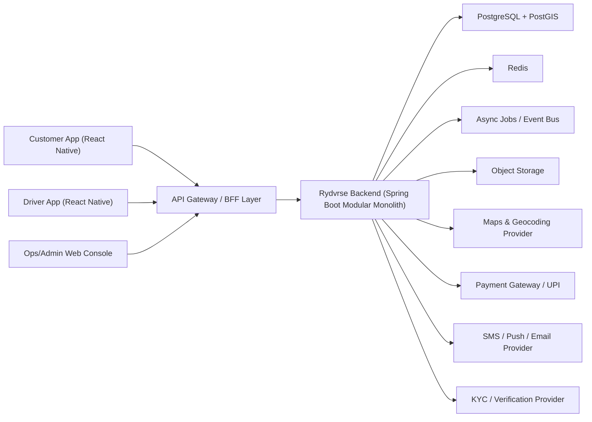
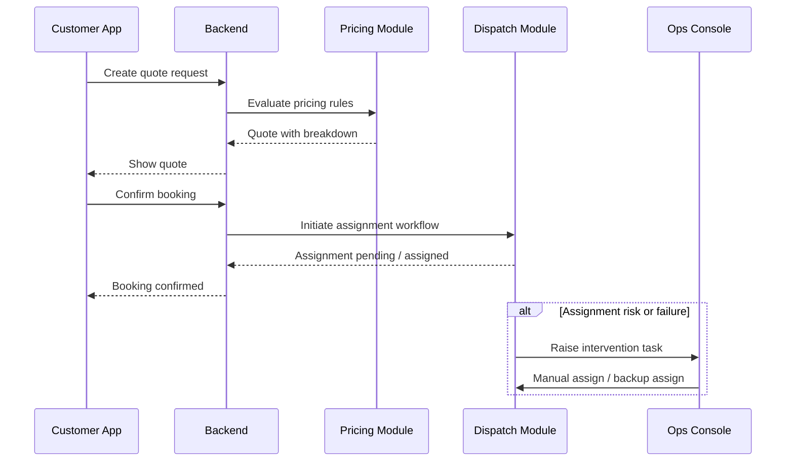

# Rydvrse High Level Design

## Document Control

- Document Name: `High_Level_Design.md`
- Product: `Rydvrse`
- Version: `1.0`
- Status: `Baseline HLD for MVP and enterprise-ready evolution`
- Last Updated: `2026-04-10`
- Intended Audience:
  - Founders and product owners
  - Engineering leads and developers
  - UI/UX designers
  - Operations and support teams
  - Finance, compliance, and growth stakeholders

## 1. Purpose

This document defines the high-level design for Rydvrse as a trust-first, scalable, and low-burn driver-on-demand platform for private car owners.

The intent of this HLD is to remove ambiguity in future implementation by making the following explicit:

- what Rydvrse is and is not
- the initial business model and service boundaries
- the product workflows for customers, drivers, and operations
- the system architecture and module boundaries
- the data model and ownership model
- the pricing and payout principles
- the security, safety, and support model
- the deployment and scale strategy
- the path from MVP to enterprise readiness

This document is written to be a long-term reference. If implementation details later differ from this design, those changes should be captured as deliberate design decisions rather than accidental drift.

## 2. Executive Summary

Rydvrse will launch as a `scheduled-first private driver platform` for customers who already own cars and want a verified driver to operate their vehicle.

Rydvrse is intentionally not designed as a capital-heavy transportation marketplace in the initial phase. It does not launch with owned vehicles, city-wide aggressive instant dispatch, or subsidy-based pricing. Instead, it focuses on:

- predictable booking and pricing
- high trust and safety
- operational reliability
- transparent driver economics
- strong support and incident handling
- phased, low-burn expansion

The product is positioned to compete with DriveU not by matching breadth immediately, but by winning on clarity, reliability, and customer confidence.

## 3. Strategic Context

### 3.1 Problem Statement

Customers with private cars often face the following problems:

- they need a verified driver at a specific time
- they do not want billing surprises
- they do not want a driver to start the trip or meter before pickup is actually confirmed
- they want stronger trust, visibility, and support during the ride
- they want a backup plan if the assigned driver becomes unavailable

Drivers face a different set of problems:

- unclear payout structures
- unreliable booking quality
- invisible incentives
- weak support during customer disputes
- limited growth and upskilling pathways

Operations teams struggle with:

- late assignments
- weak fulfillment visibility
- manual firefighting
- poor evidence during disputes
- inconsistent pricing logic and refund decisions

Rydvrse is designed to solve these problems through better product and better operational design.

### 3.2 Strategic Positioning

Rydvrse should be positioned as:

`The most reliable way to book a verified driver for your own car, with clear pricing and stronger trip control.`

### 3.3 Business Constraints

The design is explicitly constrained by a low-capital operating model.

Implications:

- one-city launch
- dense micro-zone launch strategy
- scheduled-first demand shaping
- modular monolith architecture over microservices
- manual ops support in key loops
- limited SKU complexity in MVP
- no discount warfare

## 4. Product Principles

The following principles are mandatory and should be treated as non-negotiable design anchors.

### 4.1 Trust Before Scale

Every core flow should answer:

- who is coming
- when they will arrive
- how much the booking will cost
- when the trip actually starts
- what the user can do if something goes wrong

### 4.2 Clarity Before Cleverness

Pricing, assignment, cancellation, and support must be simple enough to explain in one screen without operational interpretation.

### 4.3 Scheduled-First Efficiency

The product should prefer bookings that can be fulfilled reliably with lower operational cost. Planned rides are economically healthier than desperate instant demand.

### 4.4 Driver Fairness Is a Product Feature

If drivers do not trust the system, customers eventually will not trust it either. Transparent earnings and predictable dispatch are part of the customer experience.

### 4.5 Ops Is Part of the Product

In the early phases, operational quality is a competitive advantage. The admin and dispatch system is not a back-office convenience; it is part of the service itself.

## 5. Goals and Non-Goals

### 5.1 MVP Goals

- launch a reliable scheduled driver booking platform for private car owners
- support the primary service types needed for repeat usage
- ensure transparent fare visibility before confirmation
- ensure driver assignment and trip-start controls are trustworthy
- provide live tracking, safety, and support
- create a controllable operations layer
- preserve positive unit economics without high burn

### 5.2 Non-Goals for MVP

- becoming a full transportation super app
- operating owned vehicle fleets
- city-wide instant availability promises
- multi-day outstation orchestration at scale
- enterprise corporate tenancy with custom contracts
- AI-first dispatch dependence
- deep loyalty, gamification, or cashback systems
- heavy real-time microservice architecture

## 6. Scope Definition

### 6.1 Included Service Types for MVP

- `Scheduled Local`
- `Scheduled One-Way Drop`
- `Scheduled Round Trip`
- `Airport Pickup/Drop`
- `Late-Night Safe Return`

### 6.2 Excluded from MVP

- self-drive vehicle inventory
- car rental with driver where the platform owns or manages cars
- intercity multi-day tours
- white-labeled B2B corporate portals
- wallet-heavy or cashback-heavy systems
- full subscription economy in v1

### 6.3 Launch Geography

- one city only
- start with 2-3 dense operating zones
- expand zone by zone after core KPIs stabilize

## 7. User Personas and Actors

### 7.1 Customer Personas

#### A. Urban Professional

- books for airport, meetings, or evening return
- values punctuality and booking speed
- likely to repeat if experience is reliable

#### B. Family Coordinator

- books for spouse, parents, or guests
- cares deeply about trust and safety
- wants live share, support, and clear driver information

#### C. Regular Commuter

- needs predictable recurring service
- responds well to pre-booking and packages
- expects lower variance in arrival and fare

### 7.2 Driver Persona

- works independently and depends on fair payout visibility
- prefers scheduled rides with known earnings
- needs clear support, dispute handling, and incentives

### 7.3 Internal Actors

- `Ops Executive`
- `City Manager`
- `Driver Onboarding Reviewer`
- `Support Specialist`
- `Finance Admin`
- `System Administrator`

## 8. Functional Requirements

### 8.1 Customer Requirements

- mobile OTP registration and login
- city and location setup
- booking creation for supported service types
- pricing preview with component breakdown
- booking confirmation and status visibility
- live tracking during driver approach and trip
- masked calling and chat
- trip sharing
- SOS and support
- trip completion, payment, invoice, rating, and issue reporting
- cancellation and modification per policy

### 8.2 Driver Requirements

- OTP login
- profile creation and document upload
- approval workflow
- online/offline availability
- scheduled shift preference or slot selection
- trip offer and earning preview
- navigation and arrival confirmation
- trip execution and completion
- earnings summary and payout visibility
- issue reporting and support access

### 8.3 Ops Requirements

- booking queue monitoring
- assignment and reassignment
- delayed or failed fulfillment intervention
- driver onboarding approval
- support and incident resolution
- refund and fare adjustment workflows
- performance and health dashboards

### 8.4 Admin Requirements

- role-based access control
- city/zone management
- pricing rule configuration
- service availability configuration
- user and driver profile review
- audit and reporting

## 9. Non-Functional Requirements

### 9.1 Availability

- customer booking APIs target `99.9%` monthly availability for production
- trip execution and live state services target higher operational resilience than non-critical modules

### 9.2 Performance

- booking search and quote generation under `2 seconds` p95
- assignment result within `30-90 seconds` for scheduled confirmation workflows where possible
- live tracking refresh every `3-10 seconds` depending on trip state and battery constraints

### 9.3 Scalability

- architecture must support city-wise scale without immediate re-platforming
- module separation should allow future service extraction
- all business-critical entities must be designed with audit and lifecycle state models

### 9.4 Security

- encryption in transit and at rest for sensitive data
- RBAC for admin systems
- audit logs for all privileged actions
- document and PII isolation

### 9.5 Observability

- request tracing
- business event monitoring
- SLA breach alerts
- trip-state anomaly alerts
- payment reconciliation alerts

### 9.6 Maintainability

- bounded module ownership
- stable API contracts
- versioned configuration
- event logging for operational workflows

## 10. Solution Overview

Rydvrse consists of the following top-level systems:

- Customer Mobile App
- Driver Mobile App
- Admin and Ops Web Console
- Backend Platform Services
- Data Platform
- External Integrations

### 10.1 System Context

## 11. Architecture Approach

### 11.1 Recommended Architecture Style

Use a `modular monolith` on Spring Boot for MVP and early scale.

Why:

- lower infrastructure overhead
- simpler deployment
- easier debugging
- lower operational cost
- faster iteration
- easier consistency for transactional business flows

Why not microservices initially:

- too much coordination overhead for a small team
- higher DevOps and observability complexity
- unnecessary early network and deployment boundaries
- increased failure modes before product-market fit

### 11.2 Modular Monolith Rules

Each module should:

- own its aggregate roots and core tables
- expose functionality through internal interfaces
- publish domain events through an internal event mechanism
- avoid direct cross-module table writes except through sanctioned services
- maintain clear responsibility boundaries

## 12. Module Decomposition

### 12.1 Auth Module

Responsibilities:

- OTP login and token issuance
- session management
- device registration
- admin authentication
- role and permission handling

Core entities:

- `user_account`
- `user_session`
- `role`
- `permission`

### 12.2 Customer Module

Responsibilities:

- customer profile
- saved places
- emergency contacts
- preferences
- trusted recipients for live share

Core entities:

- `customer_profile`
- `saved_location`
- `emergency_contact`

### 12.3 Driver Module

Responsibilities:

- driver profile
- document collection
- onboarding status
- training level
- availability preferences
- suspension and compliance status

Core entities:

- `driver_profile`
- `driver_document`
- `driver_training_record`
- `driver_status`
- `driver_availability_preference`

### 12.4 Booking Module

Responsibilities:

- booking creation
- booking updates
- booking lifecycle
- booking metadata
- customer instructions
- service type validation

Core entities:

- `booking`
- `booking_passenger_context`
- `booking_instruction`
- `booking_state_log`

### 12.5 Pricing Module

Responsibilities:

- quote generation
- city and zone pricing
- time-window pricing
- night surcharge
- return allowance logic
- cancellation fee rules
- admin override rules

Core entities:

- `pricing_rule`
- `pricing_zone`
- `quote`
- `quote_component`
- `cancellation_policy`

### 12.6 Dispatch Module

Responsibilities:

- candidate driver discovery
- eligibility filtering
- assignment scoring
- auto-assignment
- reassignment
- ops escalation triggers

Core entities:

- `assignment`
- `assignment_attempt`
- `driver_candidate_snapshot`

### 12.7 Trip Module

Responsibilities:

- trip start/end
- trip timeline
- handover checklist
- start confirmation
- trip notes
- trip completion summary

Core entities:

- `trip`
- `trip_event`
- `handover_checklist`
- `trip_summary`

### 12.8 Tracking Module

Responsibilities:

- live location ingestion
- route status
- ETA calculations
- customer trip map updates
- trip share tokens

Core entities:

- `location_ping`
- `tracking_session`
- `trip_share_link`

### 12.9 Payment Module

Responsibilities:

- payment intent creation
- payment capture
- refund processing
- invoice generation
- driver payout ledger
- earnings ledger

Core entities:

- `payment_order`
- `payment_transaction`
- `refund`
- `invoice`
- `driver_earning_ledger`
- `driver_payout_batch`

### 12.10 Notification Module

Responsibilities:

- push notifications
- SMS notifications
- email notifications where relevant
- template management
- notification preference enforcement

Core entities:

- `notification_event`
- `notification_delivery`
- `notification_template`

### 12.11 Support and Incident Module

Responsibilities:

- support tickets
- ride complaints
- incidents and escalations
- evidence and media
- refund reason capture
- resolution SLA tracking

Core entities:

- `support_ticket`
- `incident_case`
- `case_evidence`
- `resolution_action`

### 12.12 Admin and Configuration Module

Responsibilities:

- city configuration
- zone definitions
- role management
- operational dashboards
- business rule administration

Core entities:

- `city`
- `service_zone`
- `feature_flag`
- `business_config`

### 12.13 Analytics and Audit Module

Responsibilities:

- business events
- audit logs
- operational metrics
- reporting feeds

Core entities:

- `audit_log`
- `domain_event_log`
- `fact_trip_daily`
- `fact_booking_daily`

## 13. Product Workflows

## 13.1 Customer Booking Workflow

Detailed flow:

1. Customer opens the app.
2. Customer selects service type.
3. Customer enters pickup, drop, date, and time.
4. Backend validates serviceability based on city, zone, and availability rules.
5. Pricing module returns a quote with itemized components.
6. Customer confirms the booking.
7. Booking is created in `PENDING_ASSIGNMENT`.
8. Dispatch begins driver candidate search.
9. Candidate drivers are contacted or reserved per assignment strategy.
10. Once a driver accepts, assignment is locked.
11. Customer sees assigned driver details and ETA window.
12. If assignment is delayed or fails, ops is alerted and backup assignment starts.

## 13.2 Driver Assignment Workflow

1. Dispatch receives a booking request.
2. It filters candidate drivers based on:
   - service zone compatibility
   - current availability
   - service type support
   - compliance state
   - training status
   - recent workload
3. It scores candidates using:
   - proximity to pickup
   - punctuality score
   - acceptance rate
   - cancellation tendency
   - expected arrival reliability
4. Top drivers are contacted in sequence or controlled batches.
5. If no driver accepts within threshold, backup logic is triggered.
6. If still unresolved, booking enters ops intervention queue.
7. Ops manually resolves by reassignment or customer communication.

## 13.3 Trip Start Workflow

This flow is a critical differentiator.

1. Driver reaches pickup point and marks `ARRIVED`.
2. Customer app receives arrival notification.
3. Customer opens the trip-start screen.
4. Optional handover checklist is shown:
   - fuel level
   - car instructions
   - notable pre-existing issues
5. Customer taps `Confirm and Start Trip`.
6. Only now does the trip move to `IN_PROGRESS`.

Policy:

- no trip billing begins until the customer confirms the start or ops explicitly overrides under documented exception policy

## 13.4 Trip Completion Workflow

1. Driver reaches destination or customer ends service.
2. Driver taps trip completion.
3. System validates completion and calculates final fare.
4. Invoice and payment summary are shown to customer.
5. Customer pays using the available method.
6. Driver sees earnings breakdown.
7. Customer rates the driver and can report an issue.
8. Any disputes route into the support workflow.

## 13.5 Cancellation Workflow

The cancellation system must prioritize clarity.

Customer cancellation stages:

- before assignment
- after assignment but before driver arrival
- after driver arrival
- after trip start

Driver cancellation stages:

- before assignment confirmation
- after accepting assignment
- during approach
- during trip due to emergency escalation

Rules:

- fees must be displayed before customer confirms cancellation
- customer should see alternatives like `delay`, `reassign`, or `contact support`
- driver cancellation reasons must be captured and penalized when warranted

## 14. Booking and Trip State Model

### 14.1 Booking States

- `DRAFT`
- `QUOTED`
- `CONFIRMED`
- `PENDING_ASSIGNMENT`
- `ASSIGNED`
- `DRIVER_ARRIVING`
- `ARRIVED`
- `TRIP_START_PENDING`
- `IN_PROGRESS`
- `COMPLETED`
- `CANCELLED`
- `FAILED_FULFILLMENT`
- `UNDER_REVIEW`

### 14.2 Assignment States

- `SEARCHING`
- `OFFERED`
- `ACCEPTED`
- `REJECTED`
- `EXPIRED`
- `ESCALATED`
- `REASSIGNED`
- `FINALIZED`

### 14.3 Incident States

- `OPEN`
- `TRIAGED`
- `INVESTIGATING`
- `ACTION_TAKEN`
- `RESOLVED`
- `CLOSED`

## 15. Domain Data Model

The following are the canonical business aggregates.

### 15.1 Customer Aggregate

- identity
- contact profile
- saved locations
- preferences
- support history
- trust and abuse flags

### 15.2 Driver Aggregate

- identity
- KYC and verification
- service eligibility
- earnings history
- ratings and quality signals
- compliance state
- training and badges

### 15.3 Booking Aggregate

- request details
- service type
- scheduling details
- instructions
- quote snapshot
- lifecycle state
- assigned driver

### 15.4 Trip Aggregate

- start/end timestamps
- live route and events
- handover confirmation
- issue markers
- final billing

### 15.5 Finance Aggregate

- payment transactions
- invoices
- refund actions
- driver earning ledger
- payout settlement state

## 16. Data Storage Strategy

### 16.1 Primary Database

Use `PostgreSQL` as the primary relational store.

Reasons:

- strong transactional integrity
- mature indexing and reporting options
- JSON support for flexible metadata
- PostGIS support for geo features

### 16.2 Spatial Data

Use `PostGIS` for:

- service zone definitions
- point-in-polygon serviceability
- heatmaps and geo reports

### 16.3 Cache and Ephemeral Data

Use `Redis` for:

- session/cache acceleration
- short-lived quote caching
- rate limiting
- hot assignment data
- driver live availability states

### 16.4 Object Storage

Use cloud object storage for:

- KYC documents
- incident evidence
- invoices
- exports and reports

### 16.5 Event Processing

Initial design should support async work without forcing a large event platform.

Recommended path:

- MVP: database outbox + worker processors
- early scale: Redis-backed or managed queue
- later scale: dedicated event bus or streaming infrastructure if justified

## 17. API Architecture

### 17.1 API Style

- REST APIs for core request/response interactions
- WebSocket or Server-Sent Events for live tracking and state updates
- webhooks for payment and external provider callbacks

### 17.2 API Design Principles

- versioned APIs
- resource-oriented naming
- idempotent mutation semantics where possible
- strong request validation
- consistent error response contract
- correlation IDs for traceability

### 17.3 Core API Domains

- `/auth`
- `/customers`
- `/drivers`
- `/bookings`
- `/quotes`
- `/assignments`
- `/trips`
- `/payments`
- `/support`
- `/admin`
- `/config`

### 17.4 Example API Surface

#### Customer APIs

- `POST /auth/otp/request`
- `POST /auth/otp/verify`
- `POST /quotes`
- `POST /bookings`
- `GET /bookings/{id}`
- `POST /bookings/{id}/cancel`
- `POST /bookings/{id}/start-confirmation`
- `GET /trips/{id}/tracking`
- `POST /support/tickets`

#### Driver APIs

- `POST /drivers/onboarding`
- `POST /drivers/documents`
- `GET /drivers/jobs/upcoming`
- `POST /drivers/assignments/{id}/accept`
- `POST /drivers/trips/{id}/arrived`
- `POST /drivers/trips/{id}/complete`
- `GET /drivers/earnings/summary`

#### Admin APIs

- `GET /admin/bookings`
- `POST /admin/bookings/{id}/reassign`
- `POST /admin/refunds`
- `POST /admin/drivers/{id}/approve`
- `POST /admin/pricing/rules`
- `GET /admin/incidents`

## 18. Pricing and Payout Design

Pricing must satisfy three parties simultaneously:

- customer sees value and predictability
- driver sees fairness and enough earnings
- platform retains sustainable margin

### 18.1 Pricing Model for MVP

Supported price structures:

- `Scheduled Local`: minimum duration plus time increments
- `One-Way Drop`: Bengaluru hybrid distance-time price plus pickup access and relocation allowance
- `Round Trip`: discounted single-driver bundle using distance, time, and one pickup acquisition cost
- `Airport`: zone-based fixed fare
- `Late Night`: night surcharge overlay

### 18.2 Pricing Inputs

- city
- pickup zone
- drop zone
- service type
- booking lead time
- expected duration
- rounded distance in kilometers
- traffic-aware predicted drive time
- driver pickup distance and driver pickup ETA
- estimated driver acquisition cost
- car transmission type
- car category/type
- car brand/model and registration context
- day/time window
- night band rules
- toll and parking flags

### 18.3 Pricing Components

- base booking charge
- active service charge
- distance fee
- traffic-time fee
- driver pickup access fee
- one-way relocation allowance
- round-trip bundle discount/effectiveness credit
- vehicle complexity adjustment
- capped peak traffic risk fee
- night surcharge
- priority or express surcharge
- optional Rydvrse Secure fee
- tax
- optional toll and parking reimbursement

### 18.3.1 Bengaluru Hybrid Launch Model

For Bengaluru, Rydvrse must not price one-way trips using distance alone. The MVP quote engine uses:

`fare = base + distance_fee + traffic_time_fee + pickup_access_fee + relocation_or_bundle_component + vehicle_adjustment + peak_fee + safety_fee + night_fee + tax`

One-way defaults:

- base `Rs. 299` covers first `20 km` and first `75 min`
- `21-35 km` charged at `Rs. 6.50/km`
- `36+ km` charged at `Rs. 8/km`
- extra traffic minutes charged at `Rs. 1.75/min` after included minutes
- driver pickup access capped at `Rs. 49`
- one-way relocation allowance defaults to `Rs. 59`

Round-trip defaults:

- base bundle `Rs. 649` covers first `50 km` and `240 min`
- extra distance charged at `Rs. 6/km`
- extra time charged at `Rs. 1.50/min`
- driver pickup access charged once, not twice

This model is designed to beat common one-way reference pricing while still funding driver earnings and platform margin.

### 18.4 Quote Rules

- quote must display all charge categories
- quote must carry an expiry window
- booking stores a quote snapshot
- changes after confirmation require explicit recalculation and visibility

### 18.5 Driver Payout Components

- arrival fee
- active-time payout
- one-way return allowance
- night bonus
- incentive bonus
- tip

### 18.6 Financial Guardrails

- no below-floor pricing without explicit promotional approval
- no hidden charges after trip completion
- all operational overrides must be audited
- refund reasons must map to root-cause categories

## 19. Dispatch and Fulfillment Design

Dispatch is the heart of service reliability.

### 19.1 Dispatch Objectives

- maximize successful fulfillment
- minimize pickup lateness
- minimize reassignment frequency
- avoid driver overloading
- prefer reliable drivers for critical bookings

### 19.2 Candidate Eligibility Filters

- city and zone compatibility
- driver active status
- document validity
- training eligibility for service type
- schedule compatibility
- no active suspension or severe issue flag

### 19.3 Candidate Scoring Factors

- proximity
- historical punctuality
- acceptance rate
- recent cancellation behavior
- service-type familiarity
- current workload balance

### 19.4 Backup Assignment Design

Rydvrse should implement a backup philosophy early.

Rules:

- bookings at risk should not wait until customer-visible failure
- system raises risk state if the assigned driver is likely to miss SLA
- ops gets proactive intervention queue
- reassignment path should be first-class, not ad hoc

### 19.5 Manual Ops In Loop

The system intentionally allows human intervention in:

- assignment rescue
- customer communication
- urgent fare adjustments
- incident escalation

This is a feature, not a flaw, during early scale.

## 20. Trust, Safety, and Compliance Design

### 20.1 Driver Verification

- identity verification
- document validation
- driver license verification
- criminal or background check where legally and operationally available
- onboarding training completion
- periodic reverification

### 20.2 Trust Signals Exposed to Customer

- driver photo
- driver name
- language preference
- rating
- punctuality score or badge
- verification badge
- training badge where relevant

### 20.3 Safety Features

- SOS button in app
- trip share link
- masked call and contact controls
- live tracking
- incident reporting
- ops escalation workflow
- trip event logging

### 20.4 Pre-Trip Handover

This is a differentiator and a control mechanism.

The handover step may include:

- confirmation that the correct driver arrived
- car instructions
- fuel note
- visible pre-existing concern note
- optional photo capture in later phases

### 20.5 Compliance

The system should support:

- GST-compliant invoices
- data retention and auditability
- access control over user data
- consent tracking for location and communication

## 21. Support and Incident Management

### 21.1 Support Entry Points

- in-app support from booking details
- in-trip support
- post-trip issue reporting
- emergency escalation path

### 21.2 Ticket Categories

- assignment delay
- driver behavior
- billing dispute
- vehicle concern
- payment failure
- app issue
- safety issue

### 21.3 Incident Workflow

1. ticket created
2. severity assigned
3. ride context auto-attached
4. ops/support triage
5. evidence collection
6. action taken
7. refund, penalty, or escalation recorded
8. case resolved and audited

### 21.4 Severity Levels

- `SEV1`: active safety emergency
- `SEV2`: serious trip disruption or misconduct concern
- `SEV3`: service complaint or billing issue
- `SEV4`: informational or low-impact support request

## 22. Notification and Communication Design

### 22.1 Channels

- push notification
- SMS
- WhatsApp if later approved and justified
- email for invoices and support summaries where needed

### 22.2 Notification Events

- OTP requested
- booking confirmed
- driver assigned
- driver arriving
- driver arrived
- trip started
- trip completed
- payment succeeded
- refund processed
- support ticket updated
- driver document expiring

### 22.3 Reliability Rules

- notifications must be idempotent
- critical notifications should have fallback channels
- customer should not receive duplicate or contradictory trip status

## 23. UI and UX Design Direction

Rydvrse should visually communicate:

- calm confidence
- operational precision
- safety and transparency

### 23.1 Customer App UX Principles

- minimum-step booking
- pricing breakdown before payment
- clean trip timeline
- visible support entry points
- strong status communication

### 23.2 Driver App UX Principles

- zero confusion on earnings
- clear actions with minimal text
- large tap targets
- low-bandwidth resilience
- strong support shortcuts

### 23.3 Ops Dashboard UX Principles

- queue-first layout
- color-coded SLA risk
- clear override controls
- timeline and evidence visibility

## 24. Security Architecture

### 24.1 Authentication and Authorization

- OTP for customers and drivers
- admin login with stronger controls
- JWT or secure session tokens
- RBAC for internal systems

### 24.2 Data Protection

- PII encryption at rest where appropriate
- KYC document isolation
- secure URL signing for protected assets
- tokenized payment interactions via payment provider

### 24.3 Operational Security

- admin action audit logs
- suspicious login detection
- IP and device-level monitoring for admin surfaces
- rate limiting for OTP abuse and spam

### 24.4 Fraud and Abuse Controls

Support future checks for:

- fake trip starts
- location spoofing
- repeated cancellation abuse
- refund exploitation
- collusion between customer and driver

## 25. Observability and Reliability

### 25.1 Technical Observability

- centralized logs
- metrics collection
- distributed traces
- service health endpoints
- scheduled job monitoring

### 25.2 Business Observability

Track:

- booking conversion
- fulfillment rate
- assignment time
- no-show rate
- on-time arrival rate
- trip completion rate
- refund rate
- support ticket rate
- margin per trip
- driver utilization

### 25.3 Alerting

Create alerts for:

- failed payment callbacks
- quote or booking API latency spikes
- assignment backlog
- trip state stuck anomalies
- driver location ingestion failures
- high refund-rate anomalies

## 26. Deployment Topology

### 26.1 Environments

- `local`
- `dev`
- `staging`
- `production`

### 26.2 MVP Deployment Recommendation

- backend on managed container platform
- managed PostgreSQL
- managed Redis
- object storage for files
- CDN for static assets and admin web
- external provider integrations for SMS, push, maps, and payments

This is intentionally simple and cost-conscious.

### 26.3 Enterprise-Ready Path

As scale grows:

- add read replicas
- isolate background workers
- separate admin workloads if needed
- add dedicated analytics warehouse
- split modules into services only if justified by scale, team size, or failure isolation needs

## 27. Data Governance and Audit

### 27.1 Audit Requirements

The system must record:

- admin overrides
- pricing overrides
- refund decisions
- assignment decisions
- suspension and compliance actions
- support case actions

### 27.2 Data Retention

Retention should be defined for:

- support records
- trip logs
- location traces
- KYC documents
- financial records

Retention policies should satisfy both legal obligations and cost constraints.

## 28. Analytics and Decision Support

### 28.1 Core Dashboards

- city health dashboard
- booking funnel dashboard
- driver supply dashboard
- support and incident dashboard
- finance and margin dashboard

### 28.2 Foundational KPIs

- quote-to-booking conversion
- booking-to-fulfillment conversion
- p95 assignment time
- p95 driver arrival variance
- repeat customer rate
- average contribution margin per trip
- average driver earning per active hour
- customer NPS or satisfaction proxy

## 29. AI and Optimization Readiness

AI is not a dependency for MVP, but the system should prepare for later adoption.

### 29.1 Future AI Opportunities

- ETA prediction
- assignment scoring optimization
- fraud pattern detection
- demand forecasting
- support ticket classification
- driver performance insight generation

### 29.2 Readiness Requirements

- store historical booking and assignment data cleanly
- retain event timelines
- retain structured incident reasons
- capture labeled outcomes for success and failure states

## 30. Phased Evolution Plan

### 30.1 Phase 1: MVP

- customer app
- driver app
- admin and ops console
- quote engine
- booking engine
- dispatch and reassignment
- trip tracking
- payment and invoice basics
- support and incident handling

### 30.2 Phase 2: Reliability and Retention

- recurring commute bookings
- preferred drivers
- family booking accounts
- prepaid ride credits
- richer driver incentives
- better ops automation

### 30.3 Phase 3: Advanced Platform

- corporate plans
- advanced analytics
- AI-assisted assignment
- dynamic staffing
- deeper loyalty and package systems
- multi-city operations tooling

## 31. Risks and Mitigations

### 31.1 Supply Reliability Risk

Risk:

- too few reliable drivers cause failed fulfillment

Mitigation:

- start with dense zones
- scheduled-first model
- backup reassignment
- strong onboarding quality filters

### 31.2 Margin Erosion Risk

Risk:

- low pricing and high support cost destroy economics

Mitigation:

- pricing floor rules
- avoid discount wars
- optimize for repeat and pre-booked rides
- monitor contribution margin per service type

### 31.3 Trust Failure Risk

Risk:

- even a small number of severe incidents can damage the brand

Mitigation:

- verification rigor
- trip-start confirmation
- strong incident workflows
- auditability and quick support response

### 31.4 Product Scope Risk

Risk:

- overbuilding too many features delays launch

Mitigation:

- strict MVP boundaries
- phase-based roadmap
- prioritize operational excellence over breadth

## 32. Design Decisions Locked by This HLD

The following decisions are considered baseline unless explicitly revised:

- Rydvrse launches as a scheduled-first platform
- Rydvrse serves private car owners, not fleet rentals, in MVP
- the backend uses a Spring Boot modular monolith
- pricing is transparent and componentized
- trip billing begins only after customer start confirmation or an audited exception
- dispatch includes backup and ops rescue paths
- admin and ops tooling is part of MVP
- one-city, low-burn rollout is the default market strategy

## 33. Summary

Rydvrse is designed as a `trust-driven operational mobility platform`, not just a booking app.

Its competitiveness comes from the combination of:

- clear service scope
- operationally realistic architecture
- transparent pricing
- fair driver economics
- strong trust and safety controls
- scalable but low-burn technical choices

If implemented consistently against this HLD, Rydvrse can launch with clarity, evolve without architectural confusion, and build a stronger trust profile than legacy competitors.
