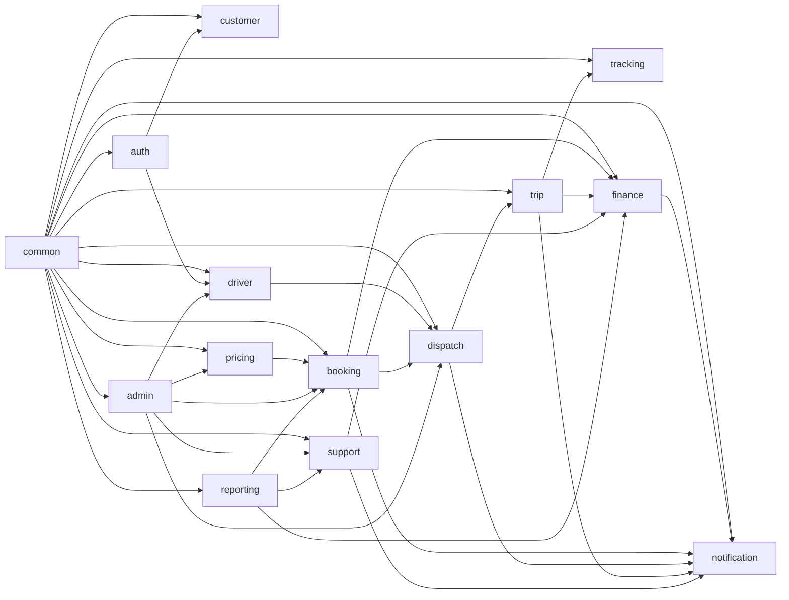
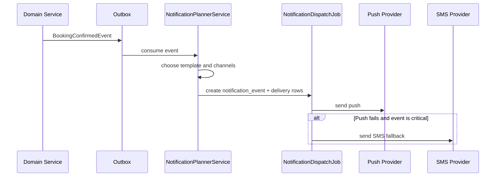
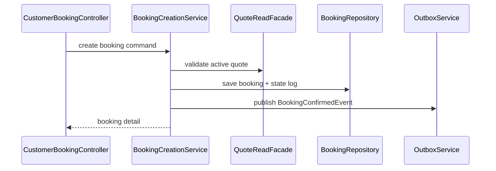

# Rydvrse Low Level Design

## Document Control

- Document Name: `Low_Level_Design.md`
- Product: `Rydvrse`
- Version: `1.0`
- Status: `Baseline Spring Boot LLD for MVP`
- Last Updated: `2026-04-10`
- Source Documents:
  - `High_Level_Design.md`
  - `MVP_Scope.md`
  - `Product_Requirements_Document.md`
  - `Screen_Flow.md`
  - `Pricing_and_Payout_Design.md`
  - `Database_Schema.md`
  - `API_Spec.md`
- Intended Audience:
  - backend engineers
  - engineering leads
  - QA engineers
  - DevOps and platform engineers
  - product and operations stakeholders reviewing implementation scope

## 1. Purpose

This document defines the low-level design for the Rydvrse backend implementation.

It is the bridge between:

- product requirements
- API contracts
- schema design
- engineering implementation

This document answers the questions engineering needs before building:

- how the Spring Boot modular monolith should be structured
- which modules own which responsibilities
- which service classes should exist
- which repositories belong to each module
- how modules collaborate without creating hidden coupling
- how async jobs and outbox processing work
- how notification and tracking flows are implemented
- where audit, idempotency, and transactional boundaries live

## 2. Scope

This document covers the MVP backend implementation for:

- customer APIs
- driver APIs
- admin and ops APIs
- pricing and booking lifecycle
- assignment and rescue
- trip execution and tracking
- payment and refund handling
- notifications
- support and incident handling
- audit, idempotency, and async processing

This document does not define:

- React Native frontend implementation
- admin web frontend implementation
- infrastructure-as-code in full detail
- warehouse and BI implementation in full detail

## 3. Implementation Assumptions

Recommended MVP stack:

- Java `21`
- Spring Boot `3.3+`
- Spring Web MVC
- Spring Security
- Spring Validation
- Spring Data JPA for aggregate writes and simple reads
- Spring JDBC for query-heavy admin projections where needed
- PostgreSQL `16+`
- Redis for cache, rate limiting, and live state acceleration
- Flyway for migrations
- Micrometer + OpenTelemetry for observability
- Jackson for JSON

The MVP should remain a `single deployable Spring Boot application` with package-based modular boundaries.

## 4. Architecture Style

Rydvrse should be implemented as a `modular monolith` with:

- one deployable backend
- one primary PostgreSQL database
- one Redis cluster or instance
- one object storage provider
- one payment gateway integration
- one communications abstraction layer over push and SMS

### 4.1 Internal Architectural Pattern

Each functional module should follow the same internal layering:

- `api`: controllers and transport DTOs
- `application`: orchestration services, commands, queries, facades
- `domain`: aggregates, policies, domain events, invariants
- `infrastructure`: persistence, external provider clients, cache adapters
- `jobs`: scheduled jobs and async handlers owned by the module

### 4.2 Core Rule

Controllers should be thin. Business logic must live in application services and domain policies. Repositories must not contain workflow logic.

## 5. Codebase Structure

Recommended package layout:

```text
src/main/java/com/rydvrse/
  RydvrseApplication.java
  common/
    api/
    auth/
    config/
    error/
    idempotency/
    audit/
    outbox/
    util/
  auth/
  customer/
  driver/
  pricing/
  booking/
  dispatch/
  trip/
  tracking/
  finance/
  notification/
  support/
  admin/
  reporting/
```

Within each module:

```text
<module>/
  api/
    customer/
    driver/
    admin/
    dto/
  application/
    command/
    query/
    service/
    facade/
    event/
  domain/
    model/
    policy/
    event/
    exception/
  infrastructure/
    persistence/
      entity/
      repository/
      mapper/
    integration/
    cache/
    config/
  jobs/
```

## 6. Cross-Cutting Platform Layer

The following capabilities should be centralized under `common/`.

### 6.1 Request and Security Components

Required shared components:

- `RequestContextFilter`
- `CorrelationIdFilter`
- `JwtAuthenticationFilter`
- `AdminAuthenticationProvider`
- `AccessDeniedHandler`
- `ApiAuthenticationEntryPoint`
- `ActorTypeAuthorizationGuard`

Responsibilities:

- extract or create `X-Request-Id`
- bind request context to logs and traces
- authenticate bearer tokens
- enforce actor type
- resolve current user and session identity

### 6.2 Exception and Validation Components

Required shared classes:

- `GlobalExceptionHandler`
- `ValidationErrorMapper`
- `DomainException`
- `BusinessRuleViolationException`
- `ResourceConflictException`
- `NotFoundException`
- `ExternalDependencyException`

Responsibilities:

- map all errors into the API error envelope from `API_Spec.md`
- standardize status codes and error codes
- reject unknown top-level request fields

### 6.3 Idempotency Components

Required shared classes:

- `IdempotencyService`
- `IdempotencyKeyRepository`
- `IdempotencyPayloadHasher`
- `IdempotencyInterceptor`

Behavior:

- validate `Idempotency-Key` on configured routes
- hash normalized request payload
- reserve key before executing business mutation
- store canonical response or conflict result
- return original response on safe retry

### 6.4 Audit Components

Required shared classes:

- `AuditService`
- `AuditContextFactory`
- `AuditLogRepository`
- `AuditActionType`
- `AuditActorResolver`

Behavior:

- every privileged action writes `audit.audit_log` in the same transaction
- audit records include actor, entity type, entity id, action type, reason, before/after snippets where appropriate

### 6.5 Outbox Components

Required shared classes:

- `OutboxService`
- `OutboxEventRepository`
- `OutboxDispatcherJob`
- `OutboxEventPublisher`
- `DomainEventRecorder`

Behavior:

- business transaction writes aggregate changes, domain event log, and outbox event together
- background dispatcher claims pending outbox rows using `FOR UPDATE SKIP LOCKED`
- handlers deliver async side effects safely and idempotently

### 6.6 Shared Utilities

Recommended shared classes:

- `TimeProvider`
- `JsonMapper`
- `Money`
- `GeoPoint`
- `PageCursorCodec`
- `RowVersionGuard`

## 7. Module Dependency Rules

The monolith must be modular by rule, not just by naming.

### 7.1 Allowed Dependency Direction



### 7.2 Rules

- no module may directly write another module's aggregate tables
- cross-module collaboration must happen through `application.facade` interfaces
- direct repository injection across modules is forbidden
- heavy admin read models may join across schemas, but write ownership remains unchanged
- enforce these rules with `ArchUnit` tests

## 8. Shared Design Patterns

### 8.1 Application Service Pattern

Every write use case should follow:

1. validate auth and actor
2. validate idempotency if required
3. load owned aggregates
4. run domain policies
5. persist aggregate change
6. write audit and outbox records in same transaction
7. map to API response DTO

### 8.2 Query Service Pattern

Every read use case should:

- avoid loading unnecessary write aggregates
- use dedicated read projections where needed
- join across modules only in query layer, never in write layer

### 8.3 Domain Policy Pattern

Rules like cancellation eligibility, trip-start permission, assignment eligibility, and refund limits should live in pure domain policy classes.

### 8.4 Mapper Pattern

- request DTOs map to command objects
- domain models map to response DTOs
- JPA entities are never returned directly to controllers

## 9. Module-by-Module Design

### 9.1 Auth Module

### Responsibilities

- OTP login for customer and driver
- JWT access token issuance
- refresh token rotation
- admin credential authentication
- session tracking
- device registration
- RBAC resolution

### Database Ownership

- `iam.user_account`
- `iam.user_session`
- `iam.otp_challenge`
- `iam.user_role_binding`
- `iam.user_device`

### API Adapters

- `auth.api.public.OtpAuthController`
- `auth.api.public.SessionController`
- `auth.api.admin.AdminAuthController`

### Application Services

| Class | Responsibility |
|---|---|
| `OtpChallengeService` | create OTP challenge and rate-limit request |
| `OtpVerificationService` | verify challenge and resolve actor account |
| `TokenService` | issue and validate JWT tokens |
| `SessionService` | create, rotate, revoke sessions |
| `AdminLoginService` | validate admin credentials and roles |
| `DeviceRegistrationService` | track device metadata and push token linkage |

### Repositories

- `UserAccountRepository`
- `UserSessionRepository`
- `OtpChallengeRepository`
- `UserRoleBindingRepository`
- `UserDeviceRepository`

### External Integrations

- `OtpSenderClient`
- `JwtSigner`
- `PasswordHashService`

### Published Events

- `UserLoggedInEvent`
- `SessionRevokedEvent`

### 9.2 Customer Module

### Responsibilities

- customer profile
- saved locations
- basic home payload
- trusted live-share recipients if enabled later

### Database Ownership

- `customer.customer_profile`
- `customer.saved_location`

### API Adapters

- `customer.api.customer.CustomerProfileController`
- `customer.api.customer.SavedLocationController`
- `customer.api.customer.CustomerHomeController`

### Application Services

| Class | Responsibility |
|---|---|
| `CustomerProfileService` | read and update profile |
| `SavedLocationService` | create, update, soft-delete saved locations |
| `CustomerHomeQueryService` | assemble home payload |

### Repositories

- `CustomerProfileRepository`
- `SavedLocationRepository`

### Consumed Facades

- `BookingSummaryFacade`
- `ConfigReadFacade`

### 9.3 Driver Module

### Responsibilities

- driver profile and onboarding
- document management
- compliance and approval state
- availability state
- driver dashboard summary

### Database Ownership

- `driver.driver_profile`
- `driver.driver_document`
- `driver.driver_onboarding`
- `driver.driver_status`
- `driver.driver_availability_preference`

### API Adapters

- `driver.api.driver.DriverProfileController`
- `driver.api.driver.DriverOnboardingController`
- `driver.api.driver.DriverDocumentController`
- `driver.api.driver.DriverAvailabilityController`
- `driver.api.admin.DriverReviewController`

### Application Services

| Class | Responsibility |
|---|---|
| `DriverProfileService` | profile reads and edits |
| `DriverOnboardingService` | submit onboarding data and track status |
| `DriverDocumentService` | register uploaded docs and validation |
| `DriverEligibilityService` | determine dispatch eligibility |
| `DriverAvailabilityService` | online and offline state transitions |
| `DriverDashboardQueryService` | home-screen read model |
| `DriverReviewService` | admin approve, reject, correction, suspend |

### Domain Policies

- `DriverEligibilityPolicy`
- `DriverDocumentPolicy`
- `DriverSuspensionPolicy`

### Repositories

- `DriverProfileRepository`
- `DriverDocumentRepository`
- `DriverOnboardingRepository`
- `DriverStatusRepository`
- `DriverAvailabilityRepository`

### Published Events

- `DriverApprovedEvent`
- `DriverSuspendedEvent`
- `DriverAvailabilityChangedEvent`

### 9.4 Pricing Module

### Responsibilities

- quote creation
- serviceability validation
- pricing plan resolution
- Bengaluru hybrid distance-time pricing
- driver pickup acquisition estimation
- driver payout preview generation
- tax and component breakdown
- modification preview
- cancellation preview

### Database Ownership

- `commercial.pricing_plan`
- `commercial.pricing_rule`
- `commercial.quote`
- `commercial.quote_component`
- `commercial.cancellation_policy`
- `commercial.override_audit`
- related version tables

### API Adapters

- `pricing.api.customer.QuoteController`
- `pricing.api.shared.ServiceabilityController`
- `pricing.api.admin.PricingAdminController`

### Application Services

| Class | Responsibility |
|---|---|
| `ServiceabilityService` | city and zone eligibility checks |
| `QuoteService` | generate quote from booking inputs |
| `PricingPlanResolver` | resolve active plan version |
| `BengaluruHybridFareCalculator` | compute one-way and round-trip distance-time fare components |
| `DriverAcquisitionEstimator` | estimate pickup access cost from driver pickup distance and ETA |
| `DriverPayoutPreviewCalculator` | compute driver earning preview from the same quote assumptions |
| `FareBreakdownBuilder` | normalize components into stable customer/admin line items |
| `TaxCalculator` | apply tax profile |
| `ModificationPreviewService` | preview changes for existing booking |
| `CancellationPreviewService` | preview cancellation fee and refund |
| `PricingPlanAdminService` | create and publish pricing plans |
| `PayoutPlanAdminService` | create and publish payout plans |

### Domain Policies

- `LeadTimeBucketPolicy`
- `NightSurchargePolicy`
- `OneWayBandPolicy`
- `BengaluruDistanceTimePolicy`
- `PickupAccessFeePolicy`
- `VehicleComplexityPolicy`
- `PeakTrafficRiskPolicy`
- `DriverPayoutFloorPolicy`
- `AirportFarePolicy`
- `CancellationFeePolicy`

### Bengaluru Hybrid Quote Flow

1. `QuoteController` validates the customer request and maps the mobile/API payload to `CreateQuoteCommand`.
2. `ServiceabilityService` confirms city, pickup zone, service type, and schedule are serviceable.
3. `QuoteService` resolves the active pricing plan and tax profile.
4. `BengaluruHybridFareCalculator` is selected for `SCHEDULED_ONE_WAY`, `ONE_WAY_DROP`, `SCHEDULED_ROUND_TRIP`, or `ROUND_TRIP` style requests in Bengaluru.
5. The calculator normalizes distance and time inputs:
   - distance rounds up to whole kilometers
   - missing route ETA falls back to `expected_duration_minutes`
   - missing pickup acquisition uses conservative default assumptions
6. `DriverAcquisitionEstimator` computes pickup access fee with floor/cap.
7. `DriverPayoutPreviewCalculator` computes the corresponding driver payout preview and verifies payout floor.
8. `TaxCalculator` applies the active tax profile.
9. `QuoteService` stores:
   - immutable quote row
   - quote components
   - quote metadata containing pricing assumptions, driver payout preview, and savings summary
10. `QuoteCreatedEvent` is published for analytics, ops monitoring, and future notification flows.

### Bengaluru Hybrid Component Contract

Customer-visible quote components must use stable codes:

- `BLR_ONE_WAY_BASE`
- `BLR_DISTANCE_20_35`
- `BLR_DISTANCE_35_PLUS`
- `BLR_TRAFFIC_TIME`
- `BLR_PICKUP_ACCESS`
- `BLR_ONE_WAY_RELOCATION`
- `BLR_ROUND_TRIP_BUNDLE_BASE`
- `BLR_ROUND_TRIP_DISTANCE`
- `BLR_ROUND_TRIP_TIME`
- `BLR_VEHICLE_ADJUSTMENT`
- `BLR_PEAK_TRAFFIC_FEE`
- `RYD_SECURE`
- `NIGHT_SURCHARGE`
- `GST`

The mobile app must not infer pricing logic from display labels. It must use component codes for icons, grouping, and analytics.

### Repositories

- `PricingPlanRepository`
- `PricingRuleRepository`
- `QuoteRepository`
- `QuoteComponentRepository`
- `CancellationPolicyRepository`
- `PayoutPlanRepository`

### External Integrations

- `GeoResolutionClient`

### Published Events

- `QuoteCreatedEvent`
- `PricingPlanPublishedEvent`
- `PayoutPlanPublishedEvent`

### 9.5 Booking Module

### Responsibilities

- booking creation
- booking detail reads
- modification apply
- cancellation apply
- booking lifecycle logging

### Database Ownership

- `booking.booking`
- `booking.booking_passenger_context`
- `booking.booking_instruction`
- `booking.booking_state_log`

### API Adapters

- `booking.api.customer.CustomerBookingController`
- `booking.api.admin.AdminBookingController`

### Application Services

| Class | Responsibility |
|---|---|
| `BookingCreationService` | create confirmed booking from valid quote |
| `BookingQueryService` | booking detail and list reads |
| `BookingModificationService` | apply allowed booking edits |
| `BookingCancellationService` | execute cancellation workflow |
| `BookingStateService` | canonical state transitions |
| `BookingTimelineAssembler` | booking timeline read model |

### Domain Policies

- `BookingModificationPolicy`
- `BookingCancellationPolicy`
- `BookingStateTransitionPolicy`

### Repositories

- `BookingRepository`
- `BookingPassengerContextRepository`
- `BookingInstructionRepository`
- `BookingStateLogRepository`

### Consumed Facades

- `QuoteReadFacade`
- `CancellationPreviewFacade`
- `AssignmentLifecycleFacade`
- `RefundFacade`

### Published Events

- `BookingConfirmedEvent`
- `BookingModifiedEvent`
- `BookingCancelledEvent`
- `BookingAtRiskEvent`

### 9.6 Dispatch Module

### Responsibilities

- candidate discovery
- eligibility filtering
- assignment offer lifecycle
- assignment locking
- reassignment and rescue
- ops rescue queue visibility

### Database Ownership

- `booking.assignment`
- `booking.assignment_attempt`
- `booking.driver_candidate_snapshot`

### API Adapters

- `dispatch.api.driver.DriverAssignmentController`
- `dispatch.api.admin.AssignmentRescueController`

### Application Services

| Class | Responsibility |
|---|---|
| `DispatchOrchestrator` | start assignment workflow for a booking |
| `CandidateDiscoveryService` | find nearby and eligible drivers |
| `CandidateScoringService` | compute score and rank order |
| `AssignmentOfferService` | create offers and manage offer expiry |
| `AssignmentLockService` | lock winning driver and booking assignment |
| `ReassignmentService` | reassign booking due to failure or admin override |
| `RescueQueueService` | build at-risk operational queue |
| `AssignmentQueryService` | driver and admin assignment reads |

### Domain Policies

- `DriverAssignmentEligibilityPolicy`
- `AssignmentTimeoutPolicy`
- `ReassignmentPolicy`

### Repositories

- `AssignmentRepository`
- `AssignmentAttemptRepository`
- `DriverCandidateSnapshotRepository`

### Consumed Facades

- `BookingReadFacade`
- `DriverEligibilityFacade`
- `DriverAvailabilityReadFacade`
- `PayoutPreviewFacade`

### Published Events

- `AssignmentOfferCreatedEvent`
- `AssignmentLockedEvent`
- `AssignmentExpiredEvent`
- `AssignmentRescueTriggeredEvent`
- `AssignmentReassignedEvent`

### 9.7 Trip Module

### Responsibilities

- driver arrival
- customer start confirmation
- handover checklist
- trip lifecycle
- trip completion

### Database Ownership

- `trip.trip`
- `trip.trip_event`
- `trip.handover_checklist`
- `trip.trip_summary`

### API Adapters

- `trip.api.customer.CustomerTripController`
- `trip.api.driver.DriverTripController`

### Application Services

| Class | Responsibility |
|---|---|
| `DriverArrivalService` | mark driver arrived and trigger start flow |
| `TripStartConfirmationService` | customer-confirmed trip start |
| `HandoverChecklistService` | capture pre-start notes and media |
| `TripQueryService` | customer and driver trip reads |
| `TripCompletionService` | complete trip and invoke finance |
| `TripEventService` | append lifecycle events |

### Domain Policies

- `TripStartPolicy`
- `TripCompletionPolicy`
- `OpsStartOverridePolicy`

### Repositories

- `TripRepository`
- `TripEventRepository`
- `HandoverChecklistRepository`
- `TripSummaryRepository`

### Consumed Facades

- `AssignmentReadFacade`
- `FinalFareFacade`
- `TrackingSessionFacade`

### Published Events

- `DriverArrivedEvent`
- `TripStartedEvent`
- `TripCompletedEvent`

### 9.8 Tracking Module

### Responsibilities

- track active assignment and trip location
- maintain live view state
- provide SSE updates
- generate share links
- store location history

### Database Ownership

- `trip.tracking_session`
- `trip.location_ping`
- `trip.trip_share_link`

### API Adapters

- `tracking.api.customer.TrackingController`
- `tracking.api.driver.TrackingIngestionController`

### Application Services

| Class | Responsibility |
|---|---|
| `TrackingSessionService` | open and close tracking sessions |
| `LocationIngestionService` | validate and persist ping batches |
| `TrackingProjectionService` | update Redis current state |
| `TrackingQueryService` | get latest tracking snapshot |
| `TrackingStreamService` | SSE subscription management |
| `TripShareLinkService` | create and validate share links |
| `EtaEstimationService` | calculate lightweight ETA estimates |

### Repositories

- `TrackingSessionRepository`
- `LocationPingRepository`
- `TripShareLinkRepository`

### Cache Keys

- `tracking:trip:{trip_id}:latest`
- `tracking:driver:{driver_id}:latest`
- `tracking:trip:{trip_id}:eta`

### Published Events

- `LocationBatchIngestedEvent`
- `TrackingSnapshotUpdatedEvent`

### 9.9 Finance Module

### Responsibilities

- payment order creation
- payment callback handling
- final fare finalization
- invoice creation
- refund workflow
- driver earning ledger

### Database Ownership

- `finance.payment_order`
- `finance.payment_transaction`
- `finance.invoice`
- `finance.refund_request`
- `finance.refund_transaction`
- `finance.driver_earning_ledger`
- `finance.driver_payout_batch`

### API Adapters

- `finance.api.customer.PaymentController`
- `finance.api.admin.RefundAdminController`
- `finance.api.webhook.PaymentWebhookController`

### Application Services

| Class | Responsibility |
|---|---|
| `PaymentOrderService` | create customer payment order |
| `PaymentCallbackService` | process provider callbacks idempotently |
| `FinalFareService` | compute final fare from trip and snapshot |
| `InvoiceService` | create invoice artifact and read invoice |
| `RefundService` | create and process refund requests |
| `DriverEarningLedgerService` | record driver earning at trip completion |
| `PayoutBatchService` | future payout batch management |

### Domain Policies

- `RefundEligibilityPolicy`
- `RefundLimitPolicy`
- `FinalFarePolicy`

### Repositories

- `PaymentOrderRepository`
- `PaymentTransactionRepository`
- `InvoiceRepository`
- `RefundRequestRepository`
- `RefundTransactionRepository`
- `DriverEarningLedgerRepository`
- `DriverPayoutBatchRepository`

### External Integrations

- `PaymentGatewayClient`

### Published Events

- `PaymentCapturedEvent`
- `PaymentFailedEvent`
- `RefundRequestedEvent`
- `RefundProcessedEvent`
- `InvoiceCreatedEvent`

### 9.10 Notification Module

### Responsibilities

- plan and send lifecycle notifications
- template rendering
- channel fallback
- delivery tracking

### Database Ownership

- `comms.notification_template`
- `comms.notification_event`
- `comms.notification_delivery`

### Internal Adapters

- no public business API beyond administrative config
- async consumers react to domain and outbox events

### Application Services

| Class | Responsibility |
|---|---|
| `NotificationPlannerService` | decide channels and templates from domain event |
| `TemplateRenderService` | render message content |
| `PushNotificationService` | send push messages |
| `SmsNotificationService` | send SMS fallback |
| `NotificationDeliveryService` | persist delivery attempts and status |
| `NotificationPreferenceService` | enforce actor preferences and mandatory channels |

### Repositories

- `NotificationTemplateRepository`
- `NotificationEventRepository`
- `NotificationDeliveryRepository`

### External Integrations

- `PushProviderClient`
- `SmsProviderClient`

### Consumed Events

- `BookingConfirmedEvent`
- `AssignmentLockedEvent`
- `AssignmentReassignedEvent`
- `DriverArrivedEvent`
- `TripStartedEvent`
- `TripCompletedEvent`
- `PaymentCapturedEvent`
- `RefundProcessedEvent`
- `SupportTicketCreatedEvent`

### 9.11 Support Module

### Responsibilities

- support ticket creation
- ticket actions and notes
- incident creation and escalation
- evidence management
- SLA tracking

### Database Ownership

- `support.support_ticket`
- `support.support_ticket_action`
- `support.incident_case`
- `support.case_evidence`
- `support.resolution_action`

### API Adapters

- `support.api.customer.CustomerSupportController`
- `support.api.driver.DriverSupportController`
- `support.api.admin.AdminSupportController`
- `support.api.admin.AdminIncidentController`

### Application Services

| Class | Responsibility |
|---|---|
| `SupportTicketService` | create and read tickets |
| `SupportActionService` | admin ticket actions |
| `IncidentService` | incident creation and management |
| `EvidenceService` | attach media evidence |
| `SlaService` | track ticket and incident SLA |

### Repositories

- `SupportTicketRepository`
- `SupportTicketActionRepository`
- `IncidentCaseRepository`
- `CaseEvidenceRepository`
- `ResolutionActionRepository`

### Published Events

- `SupportTicketCreatedEvent`
- `IncidentEscalatedEvent`
- `SupportTicketResolvedEvent`

### 9.12 Admin and Configuration Module

### Responsibilities

- dashboard reads
- serviceability and city config
- manual operational overrides
- pricing and payout publication
- audit search

### Database Ownership

- `master.city`
- `master.service_zone`
- `master.feature_flag`
- `master.business_config`

### API Adapters

- `admin.api.AdminDashboardController`
- `admin.api.ZoneAdminController`
- `admin.api.AuditQueryController`

### Application Services

| Class | Responsibility |
|---|---|
| `DashboardQueryService` | aggregate operational KPIs |
| `ZoneAdminService` | update serviceability state |
| `FeatureFlagService` | feature-flag reads and writes |
| `AuditQueryService` | audit read access |

### Repositories

- `CityRepository`
- `ServiceZoneRepository`
- `FeatureFlagRepository`
- `BusinessConfigRepository`

### 9.13 Reporting Module

### Responsibilities

- aggregate read models for admin dashboards
- operational KPI projections
- scheduled rollups

### Database Ownership

- reporting writes only to aggregate or materialized reporting tables

### Application Services

- `OperationsReportService`
- `KpiRollupService`

## 10. Controller-to-Service Mapping

The API layer should map cleanly to module services.

| Controller | Primary Service |
|---|---|
| `OtpAuthController` | `OtpChallengeService`, `OtpVerificationService` |
| `CustomerBookingController` | `BookingCreationService`, `BookingQueryService`, `BookingModificationService`, `BookingCancellationService` |
| `QuoteController` | `QuoteService` |
| `DriverAssignmentController` | `AssignmentQueryService`, `AssignmentOfferService`, `AssignmentLockService` |
| `CustomerTripController` | `TripQueryService`, `TripStartConfirmationService` |
| `DriverTripController` | `DriverArrivalService`, `TripCompletionService` |
| `TrackingController` | `TrackingQueryService`, `TrackingStreamService`, `TripShareLinkService` |
| `PaymentController` | `PaymentOrderService`, `InvoiceService` |
| `AdminBookingController` | `BookingQueryService`, `ReassignmentService`, `BookingCancellationService` |
| `AdminSupportController` | `SupportTicketService`, `SupportActionService` |

## 11. Repository Boundary Rules

### 11.1 General Rules

- repositories are module-private by default
- cross-module consumers depend on facades, not repositories
- write services load only the aggregates they mutate
- query services may use dedicated projection repositories

### 11.2 Persistence Strategy

Use:

- Spring Data JPA for aggregates and standard CRUD
- Spring JDBC row mappers for admin search, rescue queue, and reporting projections
- native SQL only for hot-path queries that cannot be expressed clearly otherwise

### 11.3 Repository Ownership Matrix

| Module | Write Repositories |
|---|---|
| `auth` | `UserAccountRepository`, `UserSessionRepository`, `OtpChallengeRepository`, `UserDeviceRepository` |
| `customer` | `CustomerProfileRepository`, `SavedLocationRepository` |
| `driver` | `DriverProfileRepository`, `DriverDocumentRepository`, `DriverOnboardingRepository`, `DriverStatusRepository` |
| `pricing` | `PricingPlanRepository`, `PricingRuleRepository`, `QuoteRepository`, `CancellationPolicyRepository`, `PayoutPlanRepository` |
| `booking` | `BookingRepository`, `BookingStateLogRepository`, `BookingInstructionRepository` |
| `dispatch` | `AssignmentRepository`, `AssignmentAttemptRepository`, `DriverCandidateSnapshotRepository` |
| `trip` | `TripRepository`, `TripEventRepository`, `HandoverChecklistRepository`, `TripSummaryRepository` |
| `tracking` | `TrackingSessionRepository`, `LocationPingRepository`, `TripShareLinkRepository` |
| `finance` | `PaymentOrderRepository`, `PaymentTransactionRepository`, `InvoiceRepository`, `RefundRequestRepository`, `DriverEarningLedgerRepository` |
| `notification` | `NotificationTemplateRepository`, `NotificationEventRepository`, `NotificationDeliveryRepository` |
| `support` | `SupportTicketRepository`, `SupportTicketActionRepository`, `IncidentCaseRepository`, `CaseEvidenceRepository` |
| `admin` | `CityRepository`, `ServiceZoneRepository`, `FeatureFlagRepository`, `BusinessConfigRepository` |
| `common` | `AuditLogRepository`, `DomainEventLogRepository`, `OutboxEventRepository`, `IdempotencyKeyRepository` |

## 12. Transaction Design

### 12.1 Write Transaction Rule

Every business write should wrap:

1. aggregate mutation
2. state-log insert if applicable
3. audit insert if privileged or policy-relevant
4. domain event log insert
5. outbox insert for async side effects

inside one database transaction.

### 12.2 Transaction Ownership Examples

| Use Case | Owning Service |
|---|---|
| OTP verify and session create | `OtpVerificationService` |
| Create quote | `QuoteService` |
| Confirm booking | `BookingCreationService` |
| Accept assignment | `AssignmentLockService` |
| Customer confirms trip start | `TripStartConfirmationService` |
| Complete trip | `TripCompletionService` |
| Payment webhook process | `PaymentCallbackService` |
| Admin reassign | `ReassignmentService` |
| Admin refund | `RefundService` |

### 12.3 Avoiding Cross-Module Distributed Transactions

Because this is a modular monolith with one database, strong consistency should be used for:

- booking creation
- assignment lock
- trip start
- trip completion
- payment callback processing
- refund creation

Async eventual consistency is acceptable for:

- notifications
- reporting rollups
- low-priority analytics events

## 13. Async Jobs and Worker Design

All async work should start with the `audit.outbox_event` table and scheduled workers.

### 13.1 Worker Runtime Pattern

- claim rows with `FOR UPDATE SKIP LOCKED`
- set `PROCESSING`
- execute handler
- mark `SUCCEEDED` or `FAILED`
- retry with exponential backoff until threshold
- move poison events to `DEAD` state after limit

### 13.2 Required Jobs for MVP

| Job | Owner Module | Responsibility |
|---|---|---|
| `OutboxDispatcherJob` | `common` | dispatch pending outbox events |
| `AssignmentOfferExpiryJob` | `dispatch` | expire stale offers and move to next candidates |
| `AssignmentRescueScannerJob` | `dispatch` | detect at-risk bookings and create rescue tasks |
| `NotificationDispatchJob` | `notification` | send pending notification deliveries |
| `NotificationRetryJob` | `notification` | retry failed deliveries and trigger fallback |
| `PaymentReconciliationJob` | `finance` | verify unresolved payment states with provider |
| `QuoteExpiryCleanupJob` | `pricing` | mark expired quotes and purge cache |
| `TrackingSessionStaleCheckJob` | `tracking` | detect stale pings and mark tracking degraded |
| `SupportSlaEscalationJob` | `support` | escalate overdue tickets and incidents |
| `DriverDocumentExpiryJob` | `driver` | mark expired documents and revoke eligibility |
| `ReportingRollupJob` | `reporting` | build operational aggregate tables |

### 13.3 Important Worker Flows

### Assignment Rescue

1. `BookingConfirmedEvent` triggers dispatch.
2. If no assignment lock occurs before threshold, `AssignmentRescueScannerJob` marks booking at risk.
3. Job writes outbox event for ops dashboard refresh and customer messaging.
4. Optional automatic fallback candidate batch starts before human intervention.

### Payment Reconciliation

1. Payment order created.
2. Webhook normally resolves payment state.
3. If webhook missing or delayed, `PaymentReconciliationJob` polls provider using provider order id.
4. Result is processed through the same `PaymentCallbackService` path to keep one code path.

## 14. Notification Flow Design

### 14.1 Design Principles

- notification creation must be event-driven
- push is preferred for app-enabled actors
- SMS is fallback for critical customer and driver lifecycle events
- notification events must reference the latest assignment and trip context

### 14.2 High-Level Flow



### 14.3 Mandatory Event-to-Notification Mapping

| Domain Event | Primary Channel | Fallback |
|---|---|---|
| `OTP requested` | SMS | none |
| `BookingConfirmedEvent` | push | SMS |
| `AssignmentLockedEvent` | push | SMS |
| `AssignmentReassignedEvent` | push | SMS |
| `DriverArrivedEvent` | push | SMS |
| `TripStartedEvent` | push | none |
| `TripCompletedEvent` | push | none |
| `PaymentCapturedEvent` | push | none |
| `RefundProcessedEvent` | push | SMS if high-value refund policy requires |
| `SupportTicketCreatedEvent` | admin internal queue | none |

### 14.4 Required Notification Classes

- `NotificationPlannerService`
- `NotificationDispatchJob`
- `TemplateRenderService`
- `PushNotificationService`
- `SmsNotificationService`
- `NotificationFailurePolicy`

## 15. Tracking Ingestion Design

Tracking is one of the highest-frequency parts of the system. The design should stay simple, durable, and efficient.

### 15.1 Tracking Write Path

1. Driver app sends batched pings to `POST /drivers/trips/{trip_id}/location-pings`
2. `TrackingIngestionController` authenticates actor and validates trip ownership
3. `LocationIngestionService` validates:
   - trip is active or assignment is in approach state
   - ping timestamps are not too stale or too far in future
   - coordinates are valid
4. pings are batch-inserted into `trip.location_ping`
5. latest location snapshot is written to Redis
6. `TrackingSnapshotUpdatedEvent` is published through outbox
7. SSE subscribers and internal consumers receive updated state

### 15.2 Why This Design

For MVP, synchronous DB batch insert plus Redis current-state projection is the right balance:

- simpler than write-behind pipelines
- preserves auditability
- keeps last-known state fast
- easy to debug

### 15.3 Tracking Read Path

`TrackingQueryService` should resolve live trip state in this order:

1. latest Redis snapshot
2. current trip and assignment state from OLTP tables
3. computed ETA from cached route or simple geo heuristic
4. last persisted DB ping if cache miss occurs

### 15.4 SSE Design

Use:

- `SseEmitter` registry per app instance
- Redis Pub/Sub for multi-instance event fan-out

Required classes:

- `TrackingStreamService`
- `TripSseEmitterRegistry`
- `TrackingPubSubPublisher`
- `TrackingPubSubSubscriber`

Event types:

- `trip.location_updated`
- `trip.state_changed`
- `assignment.reassigned`
- `payment.state_changed`

### 15.5 Stale Tracking Handling

If no ping arrives within configured threshold:

- mark tracking session as `DEGRADED`
- show last-updated timestamp to customer
- alert ops if threshold exceeds incident limit

### 15.6 Share-Link Handling

`TripShareLinkService` should:

- generate signed random tokens
- bind token to trip and expiry timestamp
- support revocation on trip completion or manual revoke

## 16. Booking, Dispatch, and Trip Critical Flows

### 16.1 Booking Creation Flow



### 16.2 Assignment Acceptance Flow

1. driver calls assignment accept endpoint
2. `AssignmentLockService` checks offer state and expiry
3. service obtains row-level lock on assignment and booking
4. winning driver is locked
5. booking state becomes `ASSIGNED`
6. outbox emits `AssignmentLockedEvent`
7. notifications are triggered asynchronously

### 16.3 Trip Start Flow

1. driver marks arrived through `DriverArrivalService`
2. booking and trip states move to `TRIP_START_PENDING`
3. customer confirms through `TripStartConfirmationService`
4. service validates current assignment and start eligibility
5. handover checklist persisted
6. trip state becomes `IN_PROGRESS`
7. outbox emits `TripStartedEvent`

### 16.4 Trip Completion Flow

1. driver submits completion request
2. `TripCompletionService` validates trip state
3. `FinalFareService` computes final fare from locked snapshot and allowed deltas
4. `DriverEarningLedgerService` creates earning ledger
5. invoice is created
6. trip and booking states updated
7. outbox emits `TripCompletedEvent`

## 17. Read Models and Query Optimization

Use dedicated query services for:

- customer home
- customer booking detail
- driver dashboard
- ops dashboard
- rescue queue
- support queue
- admin booking search

Recommended projection classes:

- `CustomerHomeProjection`
- `BookingDetailProjection`
- `DriverDashboardProjection`
- `RescueQueueProjection`
- `OpsDashboardProjection`
- `SupportQueueProjection`

These may use Spring JDBC and tuned SQL joins across schemas because they are read-only.

## 18. Caching Strategy

### 18.1 Redis Use Cases

- rate limits for OTP and auth attempts
- latest trip and driver locations
- hot assignment state
- quote cache by quote id
- SSE fan-out support

### 18.2 Cache Rules

- cache should accelerate reads, not become the source of truth
- financial and lifecycle decisions always revalidate against PostgreSQL
- cache invalidation should be event-driven where possible

## 19. Observability and Operations

### 19.1 Structured Logging

All logs should include:

- `request_id`
- `actor_type`
- `actor_id`
- `session_id`
- `booking_id` when present
- `trip_id` when present
- `assignment_id` when present

### 19.2 Metrics

Required counters and timers:

- OTP request and verify success rate
- quote creation latency
- booking creation latency
- assignment lock latency
- rescue queue size
- trip-start confirmation latency
- payment callback success rate
- tracking ingest success and failure rate
- notification delivery success by channel
- refund creation and processing rate

### 19.3 Alerts

Required operational alerts:

- booking creation failure spike
- assignment backlog spike
- tracking ingest failure spike
- payment callback backlog
- notification failure spike
- outbox stuck backlog

## 20. Security and Compliance Implementation Notes

- never return full driver KYC data outside admin review routes
- store document references, not document bytes, in the OLTP database
- encrypt sensitive columns where required by policy
- validate webhook signatures before any business mutation
- mask phone numbers on cross-actor read DTOs

## 21. Testing Strategy

### 21.1 Required Test Layers

- unit tests for domain policies
- service tests for application orchestration
- repository integration tests with PostgreSQL test container
- controller contract tests against API error envelopes
- async worker tests for outbox and notification retries
- `ArchUnit` tests for module boundaries

### 21.2 Critical Test Targets

- quote expiry and booking create idempotency
- assignment race conditions
- customer trip-start guard
- stale reassignment visibility
- payment webhook duplicate processing
- refund role-limit enforcement
- notification fallback behavior
- tracking stale-session behavior

## 22. Recommended Build Order

Engineering should implement in this order:

1. common platform components
2. auth module
3. customer and driver profile modules
4. pricing module
5. booking module
6. dispatch module
7. trip module
8. tracking module
9. finance module
10. notification module
11. support module
12. admin and reporting query layer

## 23. Engineering Readiness Checklist

The backend is ready to start implementation when:

- package boundaries are created
- Flyway baseline is prepared from `Database_Schema.md`
- API DTOs are generated or scaffolded from `API_Spec.md`
- module facades are defined
- outbox and audit infrastructure are built first
- ArchUnit boundary tests exist before modules expand

## 24. Recommended Next Step

The next most useful engineering document after this LLD is an `Implementation_Backlog.md` or `Sprint_Plan.md` that converts this module design into epics, tickets, owners, and build order milestones.
