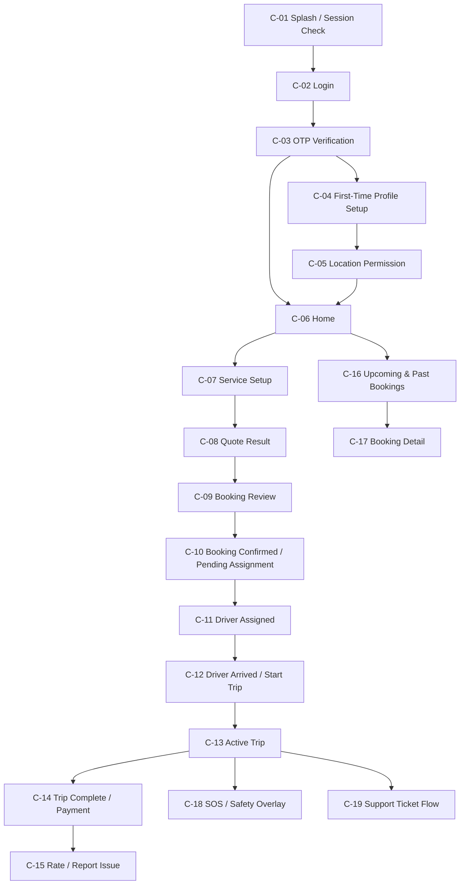
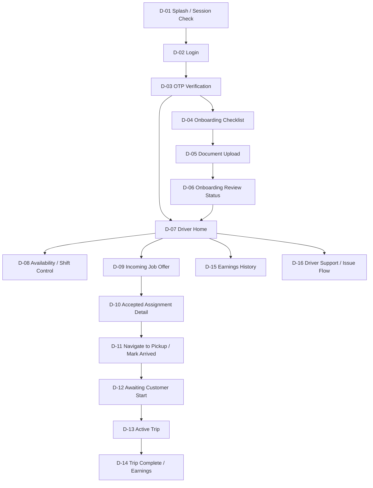
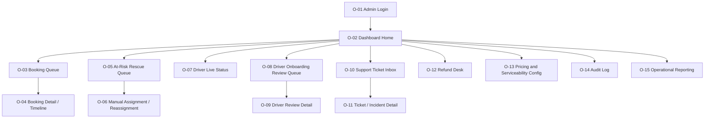

# Rydvrse Screen Flow Specification

## Document Control

- Document Name: `Screen_Flow.md`
- Product: `Rydvrse`
- Version: `1.0`
- Status: `Baseline Screen Flow for MVP`
- Last Updated: `2026-04-10`
- Source Documents:
  - `High_Level_Design.md`
  - `MVP_Scope.md`
  - `Product_Requirements_Document.md`

## 1. Purpose

This document defines the screen-by-screen user flows for the Rydvrse MVP across:

- Customer App
- Driver App
- Admin/Ops Dashboard

The objective is to remove ambiguity before UI design, API specification, and implementation begin.

This document answers:

- what screens exist
- why each screen exists
- what users can do on each screen
- what data each screen needs
- what validations and business rules apply
- what states and edge cases each screen must support
- where each screen leads next

## 2. Scope of This Document

This document covers only the MVP and only the actors already frozen in scope:

- customer
- driver
- operations/admin

This document does not define:

- visual design language in detail
- API payload schemas
- database design
- pixel-perfect layouts

Those should be defined in later companion documents, but they must remain aligned with this flow specification.

## 3. Reading Conventions

Each screen definition contains:

- `Screen ID`
- `User`
- `Purpose`
- `Entry Points`
- `Primary UI Sections`
- `Primary Actions`
- `Business Rules and Validation`
- `States`
- `Next Screens / Exit Paths`
- `API / Data Dependencies`

## 4. Global Product Rules

These rules apply across all platforms.

### 4.1 Booking and Pricing Rules

- pricing must be shown before booking confirmation
- quote must contain visible fare components
- no hidden post-trip charge may appear outside approved and audited flows
- quote expiry must be enforced

### 4.2 Assignment Rules

- bookings move into assignment immediately after confirmation
- assignment rescue must exist as a first-class path
- stale assignment information must not remain visible after reassignment

### 4.3 Trip Start Rule

- trip billing must not begin until the customer confirms trip start
- exception handling for missing customer confirmation must be routed through audited ops intervention

### 4.4 Support and Safety Rules

- support must be accessible during booking, during trip, and after trip
- SOS must be available during active trip screens
- support tickets should auto-attach ride context

### 4.5 Admin and Audit Rules

- privileged actions require role-based access control
- reassignment, pricing override, refund, and approval actions must be audited

## 5. Screen Taxonomy

### 5.1 Customer App Prefix

- `C-XX`

### 5.2 Driver App Prefix

- `D-XX`

### 5.3 Ops/Admin Prefix

- `O-XX`

## 6. Customer App Flow

## 6.1 Customer App High-Level Journey

## 6.2 Customer App Navigation Model

- Bottom navigation for MVP recommended:
  - `Home`
  - `Bookings`
  - `Help`
  - `Profile`
- Active trip state may override or minimize default nav in favor of trip controls
- Booking flow should use progressive screens or bottom-sheet progression, but the logical states below remain the same even if UI composition changes

## 6.3 Customer Screen Inventory

| Screen ID | Screen Name | Mandatory for MVP |
|---|---|---|
| C-01 | Splash / Session Check | Yes |
| C-02 | Login / Mobile Entry | Yes |
| C-03 | OTP Verification | Yes |
| C-04 | First-Time Profile Setup | Yes |
| C-05 | Location Permission / City Confirmation | Yes |
| C-06 | Home | Yes |
| C-07 | Service Setup / Booking Input | Yes |
| C-08 | Quote Result | Yes |
| C-09 | Booking Review | Yes |
| C-10 | Booking Confirmed / Pending Assignment | Yes |
| C-11 | Driver Assigned | Yes |
| C-12 | Driver Arrived / Start Trip | Yes |
| C-13 | Active Trip | Yes |
| C-14 | Trip Complete / Payment | Yes |
| C-15 | Rating / Report Issue | Yes |
| C-16 | Upcoming & Past Bookings | Yes |
| C-17 | Booking Detail | Yes |
| C-18 | SOS / Safety Overlay | Yes |
| C-19 | Support Ticket Flow | Yes |
| C-20 | Profile / Settings | Yes |

## 6.4 Customer Screen Definitions

### C-01 Splash / Session Check

- User: `Customer`
- Purpose: Determine whether user has a valid session and route them to the correct starting point
- Entry Points:
  - app launch
  - app reopened after being backgrounded long enough to require session validation
- Primary UI Sections:
  - brand mark
  - lightweight loading state
- Primary Actions:
  - none directly initiated by the user
- Business Rules and Validation:
  - if valid session exists, route to home
  - if no valid session exists, route to login
  - if first-time profile remains incomplete, route to profile setup
- States:
  - loading
  - authenticated
  - unauthenticated
  - incomplete profile
- Next Screens / Exit Paths:
  - `C-02 Login`
  - `C-04 First-Time Profile Setup`
  - `C-06 Home`
- API / Data Dependencies:
  - session validation endpoint
  - local auth token/session storage

### C-02 Login / Mobile Entry

- User: `Customer`
- Purpose: Start account access with minimal friction
- Entry Points:
  - unauthenticated app state
  - explicit logout
  - session expired
- Primary UI Sections:
  - mobile number entry
  - continue button
  - terms/privacy acknowledgement text
- Primary Actions:
  - enter mobile number
  - request OTP
- Business Rules and Validation:
  - phone number must be valid for supported country rules
  - request rate limiting applies
  - unsupported market messaging may appear if country or city is invalid
- States:
  - empty
  - invalid number
  - sending OTP
  - request blocked due to rate limit
  - network error
- Next Screens / Exit Paths:
  - `C-03 OTP Verification`
- API / Data Dependencies:
  - OTP request API

### C-03 OTP Verification

- User: `Customer`
- Purpose: Verify phone ownership and establish authenticated session
- Entry Points:
  - successful OTP request from `C-02`
- Primary UI Sections:
  - OTP input
  - resend OTP
  - change number
  - timer/countdown
- Primary Actions:
  - submit OTP
  - resend OTP
  - return to phone entry
- Business Rules and Validation:
  - expired OTP must be rejected with retry path
  - repeated failures may temporarily block retries
  - successful verification creates or resumes account
- States:
  - waiting for code
  - verifying
  - invalid OTP
  - expired OTP
  - too many attempts
  - success
- Next Screens / Exit Paths:
  - `C-04 First-Time Profile Setup` for new users
  - `C-06 Home` for returning users with complete profile
- API / Data Dependencies:
  - OTP verify API
  - account lookup or account creation

### C-04 First-Time Profile Setup

- User: `Customer`
- Purpose: Capture minimum profile data required before booking
- Entry Points:
  - first-time successful OTP verification
  - returning user with incomplete profile
- Primary UI Sections:
  - name
  - city selector
  - optional email
  - continue CTA
- Primary Actions:
  - save profile
- Business Rules and Validation:
  - name required
  - launch city must be one of supported cities
  - unsupported city should be blocked with waitlist-style messaging if desired later
- States:
  - empty
  - validation error
  - city unsupported
  - saving
  - success
- Next Screens / Exit Paths:
  - `C-05 Location Permission / City Confirmation`
- API / Data Dependencies:
  - customer profile create/update API
  - supported city configuration

### C-05 Location Permission / City Confirmation

- User: `Customer`
- Purpose: Establish location context for quote generation and booking convenience
- Entry Points:
  - after first-time profile setup
  - later through settings if permission not granted
- Primary UI Sections:
  - location permission prompt rationale
  - use current location CTA
  - skip for now option
- Primary Actions:
  - allow location
  - skip location
- Business Rules and Validation:
  - location is helpful but not strictly required if manual address entry is supported
  - if permission is denied, app must still allow manual address entry
- States:
  - permission not requested
  - permission granted
  - permission denied
  - device location unavailable
- Next Screens / Exit Paths:
  - `C-06 Home`
- API / Data Dependencies:
  - device location services
  - reverse geocoding if location available

### C-06 Home

- User: `Customer`
- Purpose: Primary launch point for bookings, upcoming trips, help, and repeat actions
- Entry Points:
  - successful session completion
  - app reopen with valid session
  - completed flow from booking or profile
- Primary UI Sections:
  - greeting and current city
  - service type cards:
    - Scheduled Local
    - One-Way Drop
    - Round Trip
    - Airport
    - Late-Night Safe Return
  - saved locations shortcut
  - upcoming bookings card
  - recent bookings shortcut
  - support/help shortcut
- Primary Actions:
  - start a new booking
  - open booking history
  - open an upcoming booking
  - open help
  - open profile/settings
- Business Rules and Validation:
  - only in-scope service types should appear
  - if user has active trip, active trip card should be prioritized
  - if city/serviceability is disabled temporarily, booking initiation should be blocked with clear messaging
- States:
  - normal
  - active upcoming booking
  - active trip in progress
  - no service available
  - loading
- Next Screens / Exit Paths:
  - `C-07 Service Setup / Booking Input`
  - `C-16 Upcoming & Past Bookings`
  - `C-17 Booking Detail`
  - `C-19 Support Ticket Flow`
  - `C-20 Profile / Settings`
- API / Data Dependencies:
  - customer profile
  - upcoming bookings summary
  - active trip summary
  - service availability configuration

### C-07 Service Setup / Booking Input

- User: `Customer`
- Purpose: Collect the booking inputs required to generate a valid quote
- Entry Points:
  - tap from home service cards
  - repeat booking or modify booking journey
- Primary UI Sections:
  - service type header
  - pickup location
  - drop location if required by service type
  - date selector
  - time selector
  - expected duration for hourly/local flows
  - special instructions field
  - continue/get quote CTA
- Primary Actions:
  - select service type
  - select pickup
  - select drop
  - choose schedule
  - choose expected duration
  - request quote
- Business Rules and Validation:
  - one-way and airport routes require drop location
  - booking time cannot be in the past
  - service lead time must respect configured minimums
  - airport service may require a terminal or airport direction subtype later, but this is optional for MVP
  - duration input required for local/hourly and round trip flows
- States:
  - empty
  - partially complete
  - validation error
  - searching location
  - computing quote
  - non-serviceable
- Next Screens / Exit Paths:
  - `C-08 Quote Result`
  - back to `C-06 Home`
- API / Data Dependencies:
  - maps/autocomplete
  - serviceability check
  - quote calculation API

### C-08 Quote Result

- User: `Customer`
- Purpose: Present transparent pricing and booking conditions before confirmation
- Entry Points:
  - successful quote response from `C-07`
- Primary UI Sections:
  - service summary
  - quote expiry timer
  - fare breakdown:
    - base booking charge
    - active time/service charge
    - one-way return allowance if applicable
    - night surcharge if applicable
    - taxes
    - toll/parking policy note
  - cancellation policy summary
  - assignment/availability note
  - continue CTA
- Primary Actions:
  - confirm quote
  - go back and edit booking inputs
  - refresh quote if expired
- Business Rules and Validation:
  - all visible charge components must map to pricing engine output
  - no hidden terms should remain off-screen
  - expired quotes must not be bookable
- States:
  - valid quote
  - quote expired
  - non-serviceable
  - pricing fetch failure
  - slow network
- Next Screens / Exit Paths:
  - `C-09 Booking Review`
  - `C-07 Service Setup / Booking Input`
- API / Data Dependencies:
  - quote data
  - pricing components
  - quote expiry timestamp

### C-09 Booking Review

- User: `Customer`
- Purpose: Provide a final confirmation step before the platform creates the booking
- Entry Points:
  - continue from `C-08`
- Primary UI Sections:
  - trip summary
  - contact/location recap
  - instructions recap
  - quote snapshot
  - booking confirmation CTA
- Primary Actions:
  - confirm booking
  - edit details
- Business Rules and Validation:
  - quote still must be valid at submission time
  - duplicate tap protection required
  - booking confirmation should be idempotent
- States:
  - ready to confirm
  - booking in progress
  - quote expired
  - network error
  - duplicate attempt blocked
- Next Screens / Exit Paths:
  - `C-10 Booking Confirmed / Pending Assignment`
  - back to `C-07` or `C-08`
- API / Data Dependencies:
  - booking creation API
  - idempotency token or equivalent protection

### C-10 Booking Confirmed / Pending Assignment

- User: `Customer`
- Purpose: Confirm that booking is accepted and show assignment progress clearly
- Entry Points:
  - successful booking creation from `C-09`
- Primary UI Sections:
  - booking ID
  - schedule summary
  - fare snapshot
  - assignment status timeline
  - expected assignment window
  - modify booking CTA if still allowed
  - cancel booking CTA if still allowed
  - support CTA
- Primary Actions:
  - monitor assignment status
  - modify booking
  - cancel booking
  - contact support
- Business Rules and Validation:
  - pending assignment is a normal visible state
  - customer should not feel abandoned during this state
  - if assignment enters risk/rescue, messaging should remain calm and informative
- States:
  - confirmed / pending assignment
  - assignment rescue in progress
  - assignment delayed
  - failed fulfillment
- Next Screens / Exit Paths:
  - `C-11 Driver Assigned`
  - `C-17 Booking Detail`
  - `C-19 Support Ticket Flow`
- API / Data Dependencies:
  - booking status polling or real-time updates
  - assignment timeline data

### C-11 Driver Assigned

- User: `Customer`
- Purpose: Show who the driver is and build confidence before pickup
- Entry Points:
  - driver assignment finalized
- Primary UI Sections:
  - driver photo
  - driver name
  - rating
  - verification badge
  - language if available
  - ETA to pickup
  - map preview
  - call/chat/contact options
  - booking controls:
    - modify if still permitted
    - cancel if still permitted
    - support
- Primary Actions:
  - call driver
  - open live map
  - cancel or modify booking if allowed
  - contact support
- Business Rules and Validation:
  - if reassignment occurs, the screen must update immediately
  - old driver details must not persist after new assignment
  - modification and cancellation availability depend on business timing rules
- States:
  - driver assigned
  - driver en route
  - reassigned
  - driver delayed
  - contact unavailable
- Next Screens / Exit Paths:
  - `C-12 Driver Arrived / Start Trip`
  - `C-19 Support Ticket Flow`
  - `C-17 Booking Detail`
- API / Data Dependencies:
  - live assignment details
  - ETA updates
  - masked contact routes

### C-12 Driver Arrived / Start Trip

- User: `Customer`
- Purpose: Hand control of trip start to the customer and prevent early billing
- Entry Points:
  - driver marks `ARRIVED`
- Primary UI Sections:
  - driver arrival confirmation
  - optional handover checklist:
    - correct driver confirmation
    - fuel note
    - car instruction note
    - visible pre-existing concern note
  - `Confirm and Start Trip` CTA
  - `Driver not here` or `Issue at pickup` CTA
  - support CTA
- Primary Actions:
  - confirm start
  - report arrival issue
  - contact support
- Business Rules and Validation:
  - trip cannot move to `IN_PROGRESS` until customer confirms start
  - arrival issue must create a supportable event
  - if customer cannot start due to app/network issue, ops exception path may be needed
- States:
  - driver arrived
  - awaiting customer confirmation
  - pickup issue
  - start confirmation failed
- Next Screens / Exit Paths:
  - `C-13 Active Trip`
  - `C-19 Support Ticket Flow`
- API / Data Dependencies:
  - trip start confirmation API
  - handover checklist submission
  - support event logging

### C-13 Active Trip

- User: `Customer`
- Purpose: Provide live visibility and safety during the ride
- Entry Points:
  - successful trip start
- Primary UI Sections:
  - live map
  - trip timer
  - booking/service summary
  - driver info compact card
  - live share CTA
  - SOS CTA
  - support CTA
  - destination/change support note if applicable
- Primary Actions:
  - open SOS
  - share trip
  - contact support
  - call driver if allowed
- Business Rules and Validation:
  - active trip state should remain visually calm and uncluttered
  - live share must use trip context
  - tracking interruptions should degrade gracefully with a stale-state indicator rather than showing false movement
- States:
  - active live tracking
  - tracking delayed
  - low network
  - issue raised
- Next Screens / Exit Paths:
  - `C-14 Trip Complete / Payment`
  - `C-18 SOS / Safety Overlay`
  - `C-19 Support Ticket Flow`
- API / Data Dependencies:
  - live tracking stream
  - trip event stream
  - support/safety actions

### C-14 Trip Complete / Payment

- User: `Customer`
- Purpose: Close the trip with clear billing and payment handling
- Entry Points:
  - driver/system marks trip completed
- Primary UI Sections:
  - trip summary:
    - start time
    - end time
    - duration
    - route summary if needed
  - final fare breakdown
  - payment method section
  - pay CTA
  - invoice preview
- Primary Actions:
  - pay now
  - retry payment if failed
  - contact support for fare issue
- Business Rules and Validation:
  - final fare must conform to approved pricing rules
  - undisclosed charges cannot appear
  - payment failure should not erase invoice context
- States:
  - payment pending
  - payment success
  - payment failed
  - under review due to fare issue
- Next Screens / Exit Paths:
  - `C-15 Rating / Report Issue`
  - `C-19 Support Ticket Flow`
  - `C-17 Booking Detail`
- API / Data Dependencies:
  - final fare API
  - payment intent/status
  - invoice generation

### C-15 Rating / Report Issue

- User: `Customer`
- Purpose: Capture customer quality signal and post-trip issues immediately while context is fresh
- Entry Points:
  - successful payment
  - trip completion if payment is deferred or external
- Primary UI Sections:
  - star rating
  - optional feedback
  - issue categories:
    - billing
    - driver behavior
    - lateness
    - car concern
    - other
  - submit CTA
- Primary Actions:
  - rate trip
  - report issue
  - skip
- Business Rules and Validation:
  - issue submission should auto-attach trip ID and driver context
  - low rating may prompt issue reason capture
- States:
  - unrated
  - rating submitted
  - issue submitted
  - submit error
- Next Screens / Exit Paths:
  - `C-06 Home`
  - `C-17 Booking Detail`
  - `C-19 Support Ticket Flow`
- API / Data Dependencies:
  - rating/review API
  - support ticket creation API

### C-16 Upcoming & Past Bookings

- User: `Customer`
- Purpose: Give customer a clear list of future and historical bookings
- Entry Points:
  - bottom navigation
  - home shortcuts
- Primary UI Sections:
  - tabs:
    - upcoming
    - past
  - booking cards with state, service type, time, and top summary
- Primary Actions:
  - open booking details
  - rebook from previous ride later if desired
- Business Rules and Validation:
  - active or upcoming bookings should appear with the latest state
  - historical items should be searchable or scrollable in simple MVP form
- States:
  - no upcoming bookings
  - no past bookings
  - loading
- Next Screens / Exit Paths:
  - `C-17 Booking Detail`
- API / Data Dependencies:
  - bookings list API

### C-17 Booking Detail

- User: `Customer`
- Purpose: Provide the single source of truth for any booking before, during, or after execution
- Entry Points:
  - booking list
  - notifications
  - deep links from home or support
- Primary UI Sections:
  - timeline
  - booking summary
  - fare snapshot/final fare
  - assignment/driver section when applicable
  - actions based on state
- Primary Actions:
  - cancel booking
  - modify booking if allowed
  - contact support
  - pay if pending
  - review invoice
- Business Rules and Validation:
  - actions must vary by booking state
  - cancellation button only appears when allowed
  - payment action only appears for unpaid completed bookings
- States:
  - pending assignment
  - assigned
  - arrived
  - in progress
  - completed
  - cancelled
  - failed fulfillment
- Next Screens / Exit Paths:
  - dynamic:
    - `C-11`
    - `C-12`
    - `C-13`
    - `C-14`
    - `C-19`
- API / Data Dependencies:
  - booking detail API
  - state timeline
  - invoice/payment data

### C-18 SOS / Safety Overlay

- User: `Customer`
- Purpose: Offer immediate safety actions without forcing the user through a complex flow
- Entry Points:
  - tap SOS from active trip
- Primary UI Sections:
  - emergency help header
  - emergency contact actions
  - support escalation action
  - live share state
- Primary Actions:
  - trigger emergency support
  - call predefined help path if configured
  - resend/share live trip
- Business Rules and Validation:
  - active trip context must be attached automatically
  - SOS actions should be large and accessible
- States:
  - normal
  - sending emergency action
  - failed to contact provider/network
- Next Screens / Exit Paths:
  - return to `C-13 Active Trip`
  - `C-19 Support Ticket Flow`
- API / Data Dependencies:
  - incident creation
  - emergency escalation service

### C-19 Support Ticket Flow

- User: `Customer`
- Purpose: Allow customer to raise help requests with contextual prefill
- Entry Points:
  - booking detail
  - active trip
  - post-trip issue
  - home/help
- Primary UI Sections:
  - ticket category selection
  - booking/trip context summary
  - free-text description
  - optional evidence upload later if needed
  - submit CTA
- Primary Actions:
  - create support ticket
  - track open ticket status if included in MVP UI
- Business Rules and Validation:
  - if launched from ride context, booking/trip should auto-bind
  - severe categories should escalate appropriately
- States:
  - new ticket
  - submit success
  - submit failed
  - escalated
- Next Screens / Exit Paths:
  - `C-06 Home`
  - `C-17 Booking Detail`
- API / Data Dependencies:
  - ticket category config
  - support ticket create API

### C-20 Profile / Settings

- User: `Customer`
- Purpose: Provide low-complexity account maintenance
- Entry Points:
  - home/profile navigation
- Primary UI Sections:
  - name
  - phone
  - city
  - saved locations
  - permissions/help
  - logout
- Primary Actions:
  - update basic profile
  - manage saved locations
  - logout
- Business Rules and Validation:
  - city changes may be restricted or may trigger availability review
- States:
  - normal
  - editing
  - save success
  - save error
- Next Screens / Exit Paths:
  - back to `C-06 Home`
- API / Data Dependencies:
  - customer profile update API
  - saved locations API

## 6.5 Customer Cross-Flow Edge Handling

### Booking Cancellation Flow

- Entry from:
  - `C-10`
  - `C-11`
  - `C-17`
- UI pattern:
  - confirmation bottom sheet or dedicated confirmation screen
- Must show:
  - current cancellation outcome
  - whether fee applies
  - alternatives if relevant:
    - wait
    - contact support
    - reassign or delay if enabled by ops flow

### Quote Expiry Flow

- If quote expires on `C-08` or `C-09`, user must be routed back through quote refresh
- System must avoid silent re-pricing

### Reassignment Flow

- If driver changes after assignment:
  - current booking detail and assigned driver screens must refresh
  - user should receive updated driver info
  - stale driver data must disappear

## 7. Driver App Flow

## 7.1 Driver App High-Level Journey

## 7.2 Driver Navigation Model

- Driver app should be task-first rather than menu-first
- Recommended tabs:
  - `Home`
  - `Jobs`
  - `Earnings`
  - `Support`
- Active assignment state may pin the trip workflow over normal nav

## 7.3 Driver Screen Inventory

| Screen ID | Screen Name | Mandatory for MVP |
|---|---|---|
| D-01 | Splash / Session Check | Yes |
| D-02 | Login / Mobile Entry | Yes |
| D-03 | OTP Verification | Yes |
| D-04 | Onboarding Checklist | Yes |
| D-05 | Document Upload | Yes |
| D-06 | Onboarding Review Status | Yes |
| D-07 | Driver Home | Yes |
| D-08 | Availability / Shift Control | Yes |
| D-09 | Incoming Job Offer | Yes |
| D-10 | Accepted Assignment Detail | Yes |
| D-11 | Navigate to Pickup / Mark Arrived | Yes |
| D-12 | Awaiting Customer Start | Yes |
| D-13 | Active Trip | Yes |
| D-14 | Trip Complete / Earnings | Yes |
| D-15 | Earnings History | Yes |
| D-16 | Driver Support / Issue Flow | Yes |
| D-17 | Profile / Compliance Status | Yes |

## 7.4 Driver Screen Definitions

### D-01 Splash / Session Check

- User: `Driver`
- Purpose: Determine whether the driver should be routed to login, onboarding, or live dashboard
- Entry Points:
  - app launch
- Primary UI Sections:
  - brand
  - loading indicator
- Primary Actions:
  - none
- Business Rules and Validation:
  - if session valid and onboarding approved, route to home
  - if session valid but onboarding incomplete or pending, route accordingly
- States:
  - loading
  - unauthenticated
  - onboarding incomplete
  - pending review
  - approved
- Next Screens / Exit Paths:
  - `D-02`
  - `D-04`
  - `D-06`
  - `D-07`
- API / Data Dependencies:
  - session validation
  - driver profile status

### D-02 Login / Mobile Entry

- User: `Driver`
- Purpose: Start authentication with low friction
- Entry Points:
  - unauthenticated state
  - logout
- Primary UI Sections:
  - phone number entry
  - request OTP CTA
- Primary Actions:
  - request OTP
- Business Rules and Validation:
  - phone validation
  - rate limiting
- States:
  - empty
  - invalid
  - sending
  - rate limited
- Next Screens / Exit Paths:
  - `D-03 OTP Verification`
- API / Data Dependencies:
  - driver OTP request API

### D-03 OTP Verification

- User: `Driver`
- Purpose: Verify identity and resume or create driver session
- Entry Points:
  - successful OTP request
- Primary UI Sections:
  - code entry
  - resend
  - change number
- Primary Actions:
  - verify OTP
  - resend OTP
- Business Rules and Validation:
  - same OTP integrity and anti-abuse rules as customer, with stricter ops oversight if needed
- States:
  - waiting
  - invalid code
  - expired code
  - success
- Next Screens / Exit Paths:
  - `D-04 Onboarding Checklist`
  - `D-06 Onboarding Review Status`
  - `D-07 Driver Home`
- API / Data Dependencies:
  - OTP verify
  - driver onboarding status lookup

### D-04 Onboarding Checklist

- User: `Driver`
- Purpose: Show the driver what profile items and documents are required to become active
- Entry Points:
  - first login
  - incomplete onboarding
- Primary UI Sections:
  - checklist items:
    - personal details
    - driving license
    - identity document
    - selfie or profile photo if required
    - bank details if in MVP onboarding
  - progress indicator
  - continue CTA
- Primary Actions:
  - open each required onboarding step
  - submit onboarding
- Business Rules and Validation:
  - incomplete checklist prevents approval
  - checklist order should reduce abandonment
- States:
  - not started
  - in progress
  - validation error
  - ready for review
- Next Screens / Exit Paths:
  - `D-05 Document Upload`
  - `D-06 Onboarding Review Status`
- API / Data Dependencies:
  - onboarding requirement config
  - driver onboarding draft data

### D-05 Document Upload

- User: `Driver`
- Purpose: Capture required documents and KYC/compliance data
- Entry Points:
  - onboarding checklist
- Primary UI Sections:
  - upload slots by document type
  - capture/retake controls
  - document status per item
  - submit CTA
- Primary Actions:
  - upload image
  - replace image
  - submit documents
- Business Rules and Validation:
  - required documents must be present before submission
  - unreadable uploads may be rejected later
- States:
  - empty
  - partial upload
  - uploading
  - upload failed
  - submitted
- Next Screens / Exit Paths:
  - `D-06 Onboarding Review Status`
- API / Data Dependencies:
  - document upload service
  - onboarding submission API

### D-06 Onboarding Review Status

- User: `Driver`
- Purpose: Communicate ops review outcome and next steps clearly
- Entry Points:
  - onboarding submission
  - returning driver awaiting approval
  - rejected driver re-entering app
- Primary UI Sections:
  - current status:
    - pending review
    - approved
    - correction needed
    - rejected
  - reason and next step
  - contact support CTA if needed
- Primary Actions:
  - resubmit corrections
  - contact support
- Business Rules and Validation:
  - drivers must not receive jobs until approved
  - rejection/correction reasons must be visible
- States:
  - pending review
  - approved
  - correction required
  - rejected
- Next Screens / Exit Paths:
  - `D-04`
  - `D-07`
  - `D-16`
- API / Data Dependencies:
  - onboarding review status
  - reviewer comments

### D-07 Driver Home

- User: `Driver`
- Purpose: Main dashboard for work status, jobs, earnings snapshot, and support
- Entry Points:
  - approved login
  - post-trip return
- Primary UI Sections:
  - approval/compliance banner if relevant
  - availability toggle
  - today's upcoming jobs
  - earnings snapshot
  - support shortcut
  - profile/compliance shortcut
- Primary Actions:
  - go online or available
  - open job details
  - open earnings
  - open support
- Business Rules and Validation:
  - if compliance is broken, online toggle must be blocked
  - if active assignment exists, current trip card must dominate screen
- States:
  - available
  - unavailable
  - compliance blocked
  - active assignment
  - no jobs
- Next Screens / Exit Paths:
  - `D-08`
  - `D-09`
  - `D-10`
  - `D-15`
  - `D-16`
  - `D-17`
- API / Data Dependencies:
  - availability status
  - assigned jobs
  - earnings summary
  - compliance status

### D-08 Availability / Shift Control

- User: `Driver`
- Purpose: Allow drivers to control work readiness in a simple, operationally useful way
- Entry Points:
  - driver home
- Primary UI Sections:
  - availability toggle
  - optional preferred working window
  - active restrictions message if any
- Primary Actions:
  - set available
  - set unavailable
- Business Rules and Validation:
  - only approved compliant drivers can be available
  - active trip or active accepted assignment may prevent toggling fully offline
- States:
  - available
  - unavailable
  - blocked
- Next Screens / Exit Paths:
  - back to `D-07`
- API / Data Dependencies:
  - driver availability update API

### D-09 Incoming Job Offer

- User: `Driver`
- Purpose: Present enough context for informed acceptance
- Entry Points:
  - dispatch offer event
- Primary UI Sections:
  - pickup zone
  - schedule
  - service type
  - expected duration
  - earning preview
  - accept and decline CTAs
  - countdown timer
- Primary Actions:
  - accept job
  - decline job
- Business Rules and Validation:
  - earning preview must be visible before acceptance
  - if timer expires, offer expires
- States:
  - active offer
  - expired
  - accept in progress
  - accept failed because another driver locked the job
- Next Screens / Exit Paths:
  - `D-10 Accepted Assignment Detail`
  - back to `D-07`
- API / Data Dependencies:
  - offer details
  - assignment accept/decline API

### D-10 Accepted Assignment Detail

- User: `Driver`
- Purpose: Provide the full context needed after the driver has accepted the job
- Entry Points:
  - successful acceptance
  - current active assignment card from home
- Primary UI Sections:
  - customer pickup
  - service summary
  - contact instructions if allowed
  - earning preview
  - navigation CTA
  - support CTA
- Primary Actions:
  - start navigation
  - contact support
- Business Rules and Validation:
  - if reassigned away or assignment cancelled, screen must update immediately
- States:
  - accepted
  - navigation started
  - assignment cancelled
  - assignment reassigned
- Next Screens / Exit Paths:
  - `D-11 Navigate to Pickup / Mark Arrived`
  - `D-16 Driver Support / Issue Flow`
- API / Data Dependencies:
  - assignment detail API
  - navigation deep link data

### D-11 Navigate to Pickup / Mark Arrived

- User: `Driver`
- Purpose: Manage the approach-to-pickup stage
- Entry Points:
  - active accepted assignment
- Primary UI Sections:
  - navigation map or launch external navigation
  - pickup ETA
  - mark arrived CTA
  - issue CTA:
    - customer unreachable
    - location issue
    - urgent support
- Primary Actions:
  - launch navigation
  - mark arrived
  - raise issue
- Business Rules and Validation:
  - mark arrived should only be allowed near pickup or under ops exception
  - approach issues must be logged
- States:
  - navigating
  - near pickup
  - arrived
  - issue reported
- Next Screens / Exit Paths:
  - `D-12 Awaiting Customer Start`
  - `D-16 Driver Support / Issue Flow`
- API / Data Dependencies:
  - arrival event API
  - driver location updates

### D-12 Awaiting Customer Start

- User: `Driver`
- Purpose: Hold the trip in a waiting state until the customer explicitly starts it
- Entry Points:
  - driver marks arrived
- Primary UI Sections:
  - waiting-for-customer confirmation message
  - customer not found / issue CTA
  - support CTA
- Primary Actions:
  - wait
  - raise pickup issue
  - contact support
- Business Rules and Validation:
  - driver must not be able to move trip to active without customer start or audited exception
- States:
  - waiting
  - delayed customer confirmation
  - support escalation
- Next Screens / Exit Paths:
  - `D-13 Active Trip`
  - `D-16`
- API / Data Dependencies:
  - trip start status polling or real-time event

### D-13 Active Trip

- User: `Driver`
- Purpose: Support trip execution until completion
- Entry Points:
  - customer confirms start
- Primary UI Sections:
  - destination summary
  - navigation CTA
  - trip timer/status
  - support CTA
  - complete trip CTA
- Primary Actions:
  - navigate
  - raise trip issue
  - complete trip
- Business Rules and Validation:
  - complete trip should be guarded against accidental early completion
  - any trip issue should create supportable context
- States:
  - active
  - connectivity weak
  - trip issue
  - completion in progress
- Next Screens / Exit Paths:
  - `D-14 Trip Complete / Earnings`
  - `D-16 Driver Support / Issue Flow`
- API / Data Dependencies:
  - trip detail/state
  - trip completion API

### D-14 Trip Complete / Earnings

- User: `Driver`
- Purpose: Close the trip and show immediate earnings transparency
- Entry Points:
  - successful trip completion
- Primary UI Sections:
  - trip summary
  - earning breakdown:
    - arrival fee
    - active time payout
    - one-way allowance if any
    - night bonus if any
    - tip if any
  - status note for payout processing
- Primary Actions:
  - acknowledge summary
  - open earnings history
  - raise earning issue
- Business Rules and Validation:
  - earned amount must align with the approved payout calculation
- States:
  - complete
  - payout pending
  - dispute raised
- Next Screens / Exit Paths:
  - `D-07 Driver Home`
  - `D-15 Earnings History`
  - `D-16 Driver Support / Issue Flow`
- API / Data Dependencies:
  - payout calculation result
  - trip summary

### D-15 Earnings History

- User: `Driver`
- Purpose: Provide historical earning transparency
- Entry Points:
  - home
  - post-trip earnings screen
- Primary UI Sections:
  - total today
  - period filter
  - trip-level earning list
  - payout status summary
- Primary Actions:
  - open trip earning detail
- Business Rules and Validation:
  - no hidden deductions
  - earning detail should be traceable to trip
- States:
  - no earnings yet
  - normal list
  - payout pending
- Next Screens / Exit Paths:
  - back to `D-07`
  - `D-14` equivalent detail or trip-level view if later added
- API / Data Dependencies:
  - driver earning ledger
  - payout status

### D-16 Driver Support / Issue Flow

- User: `Driver`
- Purpose: Allow drivers to report issues with assignments, pickups, trips, or payouts
- Entry Points:
  - home
  - assignment
  - waiting state
  - active trip
  - earnings screen
- Primary UI Sections:
  - issue type
  - ride context
  - description
  - submit CTA
- Primary Actions:
  - create issue
  - contact support
- Business Rules and Validation:
  - if launched from assignment or trip, context should be attached automatically
- States:
  - new ticket
  - submit success
  - submit error
- Next Screens / Exit Paths:
  - return to invoking screen
- API / Data Dependencies:
  - support ticket create API

### D-17 Profile / Compliance Status

- User: `Driver`
- Purpose: Show driver account details and compliance health
- Entry Points:
  - home/profile
- Primary UI Sections:
  - profile details
  - document status
  - compliance warnings
  - logout
- Primary Actions:
  - update certain profile fields
  - review compliance items
  - logout
- Business Rules and Validation:
  - compliance issues should be visible before they block work unexpectedly
- States:
  - compliant
  - warning
  - blocked
- Next Screens / Exit Paths:
  - back to `D-07`
  - `D-04` if corrections required
- API / Data Dependencies:
  - profile API
  - compliance status

## 7.5 Driver Cross-Flow Edge Handling

### Offer Expiry Handling

- if offer timer ends, return to home with non-blocking message
- no stale accept CTA should remain usable after expiry

### Customer No-Show or Unreachable at Pickup

- driver raises issue from `D-11` or `D-12`
- support/ops context captures:
  - booking
  - time at pickup
  - driver location

### Connectivity Loss

- active trip and approach flows must degrade gracefully
- app should make the driver's current state clear even if live updates pause

## 8. Admin / Ops Dashboard Flow

## 8.1 Admin / Ops High-Level Journey

## 8.2 Ops/Admin Navigation Model

- left navigation or top nav for:
  - Dashboard
  - Bookings
  - Rescue Queue
  - Drivers
  - Support
  - Refunds
  - Pricing & Serviceability
  - Audit
  - Reporting
- dashboard should prioritize operational rescue over passive reporting

## 8.3 Ops/Admin Screen Inventory

| Screen ID | Screen Name | Mandatory for MVP |
|---|---|---|
| O-01 | Admin Login | Yes |
| O-02 | Dashboard Home | Yes |
| O-03 | Booking Queue | Yes |
| O-04 | Booking Detail / Timeline | Yes |
| O-05 | At-Risk Rescue Queue | Yes |
| O-06 | Manual Assignment / Reassignment | Yes |
| O-07 | Driver Live Status | Yes |
| O-08 | Driver Onboarding Review Queue | Yes |
| O-09 | Driver Review Detail | Yes |
| O-10 | Support Ticket Inbox | Yes |
| O-11 | Ticket / Incident Detail | Yes |
| O-12 | Refund Desk | Yes |
| O-13 | Pricing and Serviceability Config | Yes |
| O-14 | Audit Log | Yes |
| O-15 | Operational Reporting | Yes |

## 8.4 Ops/Admin Screen Definitions

### O-01 Admin Login

- User: `Ops / Admin`
- Purpose: Secure access to privileged internal systems
- Entry Points:
  - dashboard login URL
- Primary UI Sections:
  - email/username
  - password or enterprise auth method
  - login CTA
- Primary Actions:
  - authenticate
- Business Rules and Validation:
  - role-based access required
  - stronger auth than public user OTP flow is recommended
- States:
  - empty
  - invalid credentials
  - locked out
  - success
- Next Screens / Exit Paths:
  - `O-02 Dashboard Home`
- API / Data Dependencies:
  - admin auth
  - role resolution

### O-02 Dashboard Home

- User: `Ops / Admin`
- Purpose: Provide a real-time command center overview
- Entry Points:
  - successful login
- Primary UI Sections:
  - booking health summary
  - at-risk booking count
  - active trip count
  - pending onboarding count
  - open support ticket count
  - quick links to rescue, onboarding, refunds, support
- Primary Actions:
  - open operational queues
- Business Rules and Validation:
  - priority widgets should reflect live business health
  - rescue queue must be visually emphasized if non-empty
- States:
  - healthy
  - alert-heavy
  - no data
- Next Screens / Exit Paths:
  - `O-03`
  - `O-05`
  - `O-08`
  - `O-10`
  - `O-12`
  - `O-13`
  - `O-15`
- API / Data Dependencies:
  - dashboard summary metrics
  - alert counts

### O-03 Booking Queue

- User: `Ops`
- Purpose: Browse and filter all bookings with current lifecycle visibility
- Entry Points:
  - dashboard
  - nav
- Primary UI Sections:
  - filters:
    - status
    - service type
    - zone
    - time window
  - booking list table or cards
  - quick health indicators
- Primary Actions:
  - open booking detail
  - filter queue
- Business Rules and Validation:
  - queue should support direct action into rescue or detail screens
- States:
  - normal list
  - empty results
  - loading
- Next Screens / Exit Paths:
  - `O-04 Booking Detail / Timeline`
  - `O-06 Manual Assignment / Reassignment`
- API / Data Dependencies:
  - booking search/list API

### O-04 Booking Detail / Timeline

- User: `Ops`
- Purpose: Single operational truth for a booking across quote, assignment, trip, and support
- Entry Points:
  - booking queue
  - support case context
  - rescue queue
- Primary UI Sections:
  - booking summary
  - customer details
  - driver details if assigned
  - timeline:
    - created
    - quoted
    - confirmed
    - assigned
    - arrived
    - started
    - completed
    - cancelled
  - quote and fare snapshot
  - action panel:
    - reassign
    - cancel under admin process if authorized
    - refund or support link
- Primary Actions:
  - inspect current state
  - launch reassignment
  - open linked support/refund actions
- Business Rules and Validation:
  - state and actor history must be visible
  - privileged actions must respect role permissions
- States:
  - active
  - at risk
  - completed
  - cancelled
  - under review
- Next Screens / Exit Paths:
  - `O-06`
  - `O-11`
  - `O-12`
- API / Data Dependencies:
  - booking detail
  - assignment history
  - trip timeline
  - audit log excerpt

### O-05 At-Risk Rescue Queue

- User: `Ops`
- Purpose: Surface bookings needing intervention before customer-visible failure occurs
- Entry Points:
  - dashboard
  - system alert
- Primary UI Sections:
  - risk queue list
  - risk reason:
    - no driver accepted
    - driver delayed
    - driver cancelled
    - ETA breach
  - SLA timer
  - quick action controls
- Primary Actions:
  - open booking
  - start manual reassignment
  - contact customer if workflow supports it
- Business Rules and Validation:
  - this queue is priority workload for ops
  - items should be sorted by urgency
- States:
  - active rescue queue
  - empty rescue queue
  - alert burst
- Next Screens / Exit Paths:
  - `O-04`
  - `O-06`
- API / Data Dependencies:
  - risk detection service
  - SLA metadata

### O-06 Manual Assignment / Reassignment

- User: `Ops`
- Purpose: Allow controlled human intervention in driver assignment
- Entry Points:
  - rescue queue
  - booking detail
- Primary UI Sections:
  - candidate driver list
  - candidate metadata:
    - location/zone
    - availability
    - punctuality
    - acceptance trend
    - compliance status
  - confirm reassignment CTA
  - reason field
- Primary Actions:
  - assign driver
  - reassign driver
  - cancel rescue action
- Business Rules and Validation:
  - only eligible drivers may be shown
  - action must be audited
  - conflicting simultaneous reassignment actions should be prevented
- States:
  - candidates loaded
  - no candidates
  - assign in progress
  - conflict or stale assignment
- Next Screens / Exit Paths:
  - return to `O-04`
  - return to `O-05`
- API / Data Dependencies:
  - candidate search
  - manual assign API
  - audit action logging

### O-07 Driver Live Status

- User: `Ops`
- Purpose: Track approved driver availability and work state
- Entry Points:
  - dashboard or nav
- Primary UI Sections:
  - drivers list/map
  - filters:
    - available
    - busy
    - offline
    - compliance issue
  - quick status summary
- Primary Actions:
  - inspect driver
  - open driver-related issue or review
- Business Rules and Validation:
  - only high-level operational visibility is needed for MVP, not full fleet telemetry
- States:
  - live availability data
  - stale data warning
  - empty
- Next Screens / Exit Paths:
  - `O-09 Driver Review Detail` or a future dedicated driver detail screen
- API / Data Dependencies:
  - driver status service
  - availability state

### O-08 Driver Onboarding Review Queue

- User: `Ops / Compliance Reviewer`
- Purpose: Review pending driver applications
- Entry Points:
  - dashboard
  - nav
- Primary UI Sections:
  - pending application list
  - filters by status
  - quick completeness indicators
- Primary Actions:
  - open driver application
- Business Rules and Validation:
  - only applications pending review or needing correction should be prioritized
- States:
  - pending review list
  - empty queue
  - loading
- Next Screens / Exit Paths:
  - `O-09 Driver Review Detail`
- API / Data Dependencies:
  - onboarding review queue API

### O-09 Driver Review Detail

- User: `Ops / Compliance Reviewer`
- Purpose: Approve, reject, or request correction on driver onboarding
- Entry Points:
  - onboarding queue
- Primary UI Sections:
  - driver identity details
  - uploaded documents
  - review notes
  - actions:
    - approve
    - reject
    - request correction
- Primary Actions:
  - approve
  - reject
  - request correction
- Business Rules and Validation:
  - reason/comment should be required for reject or correction
  - action must be audited
- States:
  - ready for review
  - approved
  - correction requested
  - rejected
- Next Screens / Exit Paths:
  - `O-08`
  - `O-07`
- API / Data Dependencies:
  - driver onboarding detail
  - document viewer
  - approval API

### O-10 Support Ticket Inbox

- User: `Support / Ops`
- Purpose: Central place to triage customer and driver issues
- Entry Points:
  - dashboard
  - nav
- Primary UI Sections:
  - ticket list
  - filters:
    - open
    - escalated
    - billing
    - behavior
    - safety
    - payout
  - severity indicators
- Primary Actions:
  - open ticket detail
  - assign owner
- Business Rules and Validation:
  - severe tickets should be clearly highlighted
- States:
  - populated list
  - empty
  - loading
- Next Screens / Exit Paths:
  - `O-11 Ticket / Incident Detail`
- API / Data Dependencies:
  - support queue API

### O-11 Ticket / Incident Detail

- User: `Support / Ops`
- Purpose: Investigate and resolve support cases and incidents
- Entry Points:
  - support inbox
  - booking detail linked issue
- Primary UI Sections:
  - ticket summary
  - severity
  - customer/driver/booking context
  - timeline of actions
  - notes
  - evidence section
  - resolution actions:
    - add note
    - escalate
    - resolve
    - route to refund
- Primary Actions:
  - triage
  - escalate
  - resolve
  - open refund flow
- Business Rules and Validation:
  - actions must be logged
  - severe safety issues may require mandatory escalation path
- States:
  - open
  - triaged
  - escalated
  - resolved
  - reopened
- Next Screens / Exit Paths:
  - `O-12 Refund Desk`
  - `O-04 Booking Detail`
  - back to `O-10`
- API / Data Dependencies:
  - ticket detail API
  - incident action API

### O-12 Refund Desk

- User: `Support / Finance / Ops`
- Purpose: Execute controlled refunds and fare corrections
- Entry Points:
  - support ticket
  - booking detail
  - nav
- Primary UI Sections:
  - booking and payment summary
  - eligible refundable amount
  - refund amount input
  - reason code
  - note field
  - submit CTA
- Primary Actions:
  - create refund
  - save note
- Business Rules and Validation:
  - role-based permissions apply
  - reason code required
  - cannot exceed allowable amount without specific elevated role if such distinction exists
  - action must be audited
- States:
  - ready
  - submit in progress
  - success
  - failed
  - duplicate refund prevented
- Next Screens / Exit Paths:
  - `O-11`
  - `O-04`
- API / Data Dependencies:
  - payment and invoice data
  - refund API
  - audit log

### O-13 Pricing and Serviceability Config

- User: `Admin / City Manager`
- Purpose: Manage operational rules without code changes
- Entry Points:
  - dashboard nav
- Primary UI Sections:
  - city selector
  - zone configuration
  - pricing rules
  - availability windows
  - change history
- Primary Actions:
  - update pricing rule
  - enable/disable zone
  - save config
- Business Rules and Validation:
  - only authorized roles can modify
  - changes should not silently break serviceability
  - all changes must be audited
- States:
  - editing
  - validation error
  - save success
  - save failed
- Next Screens / Exit Paths:
  - back to `O-02`
- API / Data Dependencies:
  - pricing config APIs
  - serviceability config APIs
  - audit history

### O-14 Audit Log

- User: `Admin / Compliance`
- Purpose: Review privileged system actions
- Entry Points:
  - nav
- Primary UI Sections:
  - filters by action type, actor, date, entity
  - audit entries
- Primary Actions:
  - search audit history
  - inspect record
- Business Rules and Validation:
  - audit log access itself may be permission-scoped
- States:
  - normal
  - no results
  - loading
- Next Screens / Exit Paths:
  - return to `O-02`
- API / Data Dependencies:
  - audit log query API

### O-15 Operational Reporting

- User: `City Manager / Ops / Leadership`
- Purpose: Provide baseline performance reporting for operational decision making
- Entry Points:
  - dashboard nav
- Primary UI Sections:
  - KPI cards:
    - fulfillment rate
    - assignment time
    - refund rate
    - ticket volume
    - active drivers
    - margin proxy
  - date filters
  - trend charts
- Primary Actions:
  - filter and inspect metrics
- Business Rules and Validation:
  - dashboards should reflect agreed KPI definitions from the PRD
- States:
  - data available
  - delayed data warning
  - no data
- Next Screens / Exit Paths:
  - return to `O-02`
- API / Data Dependencies:
  - analytics/reporting APIs

## 8.5 Ops/Admin Cross-Flow Edge Handling

### Conflicting Reassignment Actions

- if two users attempt reassignment simultaneously:
  - second action must fail gracefully
  - current assignment state should refresh

### Refund Duplication

- if a refund already exists or is in progress:
  - refund desk must block duplicate processing

### Pricing Config Risk

- if pricing/serviceability change would create invalid configuration:
  - save must fail with clear validation

## 9. Screen-to-State Mapping

### 9.1 Customer State Mapping

| Booking / Trip State | Primary Customer Screen |
|---|---|
| Unauthenticated | C-02 / C-03 |
| Profile incomplete | C-04 / C-05 |
| Draft booking | C-07 |
| Quoted | C-08 / C-09 |
| Confirmed / Pending assignment | C-10 |
| Assigned | C-11 |
| Arrived / Start pending | C-12 |
| In progress | C-13 |
| Completed / Payment pending | C-14 |
| Completed / Feedback | C-15 |
| Historical reference | C-16 / C-17 |

### 9.2 Driver State Mapping

| Driver / Job State | Primary Driver Screen |
|---|---|
| Unauthenticated | D-02 / D-03 |
| Onboarding incomplete | D-04 / D-05 |
| Pending approval | D-06 |
| Approved / Idle | D-07 / D-08 |
| Offer received | D-09 |
| Accepted / Heading to pickup | D-10 / D-11 |
| Arrived / Waiting | D-12 |
| Active trip | D-13 |
| Trip completed | D-14 |
| Earnings reference | D-15 |

### 9.3 Ops State Mapping

| Operational Need | Primary Ops Screen |
|---|---|
| System health overview | O-02 |
| Standard booking monitoring | O-03 |
| Booking deep dive | O-04 |
| Rescue priority work | O-05 / O-06 |
| Driver review | O-08 / O-09 |
| Support and incidents | O-10 / O-11 |
| Refund handling | O-12 |
| Pricing and zone management | O-13 |
| Audit review | O-14 |
| KPI reporting | O-15 |

## 10. MVP Flow Guardrails

The following flow constraints are considered mandatory for MVP:

- customer must always see pricing before booking confirmation
- customer must be able to see booking status after confirmation
- driver details must appear only after assignment is real and current
- trip must not begin billing before customer start confirmation
- support and safety must be available during active trips
- drivers must see an earning preview before accepting work
- ops must have a dedicated at-risk rescue queue
- ops actions with financial or service impact must be audited

## 11. Open UX Decisions

These decisions should be finalized in design before visual mockups are locked:

- whether booking input uses stacked full screens or a single-screen sheet flow
- whether trip active screen uses map-first or status-first layout
- whether customer help uses a dedicated tab or a consolidated profile/help section
- whether driver availability is binary only or also supports simple working windows
- whether ops dashboard is table-first or card-first for rescue flow

## 12. Summary

This document defines the logical screen system for the Rydvrse MVP.

If design, backend, and QA all align to these flows, the team should be able to build:

- a customer journey that feels transparent and trustworthy
- a driver journey that feels fair and operationally clear
- an ops dashboard that enables reliable fulfillment and support

This document should be used as the flow reference before finalizing UI wireframes, API specs, and implementation tickets.
