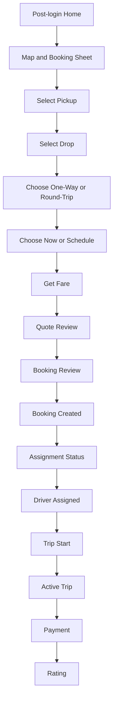

# Rydvrse UI/UX Improvement Plan

## Document Control

- **Product:** Rydvrse
- **Document Type:** UI/UX redesign and implementation blueprint
- **Version:** 2.0
- **Date:** 2026-04-17
- **Primary App:** React Native / Expo mobile app
- **Secondary Surfaces:** Future admin/ops web dashboard, driver app refinements
- **Design Direction:** Uber-inspired usability with a distinct Rydvrse light-green identity
- **Primary Brand Color Direction:** Zepto-like light green dominance on a clean charcoal/white interface
- **Implementation Rule:** Improve incrementally on top of the current working system. Do not rewrite the app or break existing auth, quote, booking, trip, driver, and support flows.

---

## 1. Purpose

This document is the design and development blueprint for upgrading Rydvrse into a production-level, enterprise-grade mobility application.

The goal is not to clone Uber visually. The goal is to learn from Uber's best usability patterns:

- map-first mental model
- fast booking
- clear pickup/drop selection
- strong location confidence
- bottom-sheet task flow
- minimal distractions
- large touch targets
- direct CTAs
- clear trip status
- calm error handling

Rydvrse must keep its own identity:

- light-green dominant brand language
- trust-first chauffeur positioning
- transparent Bengaluru pricing
- driver fairness visibility
- scheduled-first reliability
- polished but not cluttered interface

This plan must be completed before UI implementation begins so design, engineering, and product decisions stay aligned.

---

## 2. Non-Negotiable Redesign Principles

1. **Functionality first:** No screen should become static mock UI. Every redesigned screen must preserve or improve its current API/state integration.
2. **Incremental migration:** Replace one surface at a time while keeping the app usable after every stage.
3. **Map-first customer experience:** The post-login customer home must become a map plus booking bottom sheet, not a card-only dashboard.
4. **One core action:** The customer product is `Book Driver`. Customer-facing booking options are only `One-way trip` and `Round trip`.
5. **Transparent pricing:** Bengaluru distance, traffic time, driver pickup access, relocation, GST, and savings messaging must remain visible.
6. **Compact by default:** Home, Help, and Profile should fit in one phone screen in normal states. Avoid lengthy paragraphs and avoid unnecessary scrolling.
7. **Small, readable typography:** Use smaller labels and concise copy. Prioritize clear short actions over explanatory blocks.
8. **Back navigation:** Stack screens must provide a simple Uber-like back action in the top-left or a clear secondary back action.
9. **Reusable components:** New UI patterns must become reusable primitives and composed components, not one-off screen styling.
10. **Enterprise readiness:** Loading, error, empty, offline, permission-denied, quote-expired, payment-failed, reassignment, cancellation, and incident states must be designed.

---

## 3. Current Implementation Audit

## 3.1 Current Mobile Stack

The current mobile app is built with:

- React Native
- Expo SDK 54
- React Navigation
- Redux Toolkit
- local mock mode support
- centralized API service modules
- centralized theme tokens in `rydvrse-mobile/src/theme/index.ts`
- custom SVG/React Native icon system
- component folders for cards, common, feedback, inputs, layout, patterns, primitives

Important existing files:

- `rydvrse-mobile/src/navigation/RootNavigator.tsx`
- `rydvrse-mobile/src/screens/customer/CustomerScreens.tsx`
- `rydvrse-mobile/src/screens/driver/DriverScreens.tsx`
- `rydvrse-mobile/src/store/customerSlice.ts`
- `rydvrse-mobile/src/services/api/customer.ts`
- `rydvrse-mobile/src/services/api/types.ts`
- `rydvrse-mobile/src/theme/index.ts`

## 3.2 What Already Works

Current strengths:

- Auth flow exists for customer and driver.
- Customer profile setup exists.
- Customer tabs exist for Home, Bookings, Help, and Profile.
- Customer quote flow exists and is connected to `customerApi.quote`.
- Booking confirmation flow exists and is connected to `customerApi.createBooking`.
- Customer booking list and detail screens exist.
- Driver onboarding, offers, trip, earnings, support, and profile screens exist.
- Mock mode lets us test the UI without backend runtime dependency.
- Theme tokens and backward-compatible aliases already exist.
- Existing components provide a useful foundation:
  - `Screen`
  - `HeaderBlock`
  - `BottomActionBar`
  - `SectionCard`
  - `ChoiceCard`
  - `StatusBanner`
  - `StatusChip`
  - `FareBreakdown`
  - `MapPlaceholderCard`
  - `Skeleton`

## 3.3 Current Product/UI Gaps

| Area | Current State | Target State |
|---|---|---|
| Home screen | Card-based dashboard with services and upcoming booking | Map-first landing screen with booking bottom sheet |
| Map | Placeholder card only | Interactive map with current location, pickup/drop markers, drag/zoom, route preview |
| Location search | Text inputs | Google Maps-like search with suggestions, saved/recent locations |
| Booking entry | Navigate to service setup screen | `Book Driver` from home bottom sheet with only one-way and round-trip |
| Date/time | Text input ISO/date string | Modern wheel/dial-style date/time picker in bottom sheet |
| Design identity | Previously blue/neutral token direction | Light-green Rydvrse identity with charcoal/white surfaces |
| Quote UI | Functional but form-like | Premium fare bottom sheet with assumptions, savings, and trust explanation |
| Responsiveness | Basic flex wrapping | Explicit phone/tablet/desktop responsive layouts |
| Screen architecture | Customer and driver screens are large monolithic files | Incrementally split screens and patterns |
| API integration | Working service modules, some hardcoded demo quote inputs | Real selected location data mapped into quote payload |
| Error states | Present but not consistently applied | Every major flow has loading/error/empty/permission/offline states |
| Accessibility | Some labels and roles | Full baseline checklist per interactive component |

## 3.4 Current Technical Risks

- `CustomerScreens.tsx` is too large and mixes screen logic, inline components, styling, and flow behavior.
- Current map behavior is not implemented; map is represented by placeholder UI.
- The quote flow currently uses typed/manual fields and demo location coordinates for backend quote requests.
- Service type naming differs between UI and backend:
  - UI: `ONE_WAY_DROP`
  - Backend: `SCHEDULED_ONE_WAY`
  - UI: `ROUND_TRIP`
  - Backend: `SCHEDULED_ROUND_TRIP`
- The app must keep the compatibility mapping while improving UX.
- Some primitives and legacy components overlap, so migration must avoid duplicated design systems.
- Expo Go testing can be sensitive to network/tunnel issues; the UI should remain testable in mock mode and LAN/local mode.

---

## 4. Target Experience Summary

## 4.1 Customer App Target

Post-login default screen:

- top half: interactive map
- bottom half: ride booking sheet
- quick pickup/drop selection
- one-way and round-trip selector
- Book Now CTA
- schedule selector
- fare preview once enough inputs exist
- current/upcoming booking banner when applicable

Primary customer journey:

1. Customer logs in.
2. Customer lands on map-first home.
3. App asks for location permission.
4. If permission granted, map centers on current location and pre-fills pickup.
5. If permission denied, customer can manually search pickup.
6. Customer searches/selects drop.
7. Customer chooses one-way or round-trip.
8. Customer chooses now/later and date/time.
9. App calculates route distance/time and creates quote.
10. Customer reviews itemized fare.
11. Customer confirms booking.
12. Assignment, driver, trip, payment, rating, and support flows continue using existing logic.

## 4.2 Driver App Target

Driver app remains operationally focused, but should align visually:

- green availability state
- map-aware pickup/trip surfaces
- clearer job offer cards
- earning transparency
- simple arrival/start/complete actions
- incident/support entry always visible during active jobs

Driver app redesign should follow customer foundation after the customer flow stabilizes.

## 4.3 Admin/Ops Target

Admin dashboard is not the immediate mobile redesign priority, but the UI system should support future:

- live map of bookings/drivers
- rescue queue
- delayed-driver queue
- refund queue
- pricing and serviceability config
- incident timeline
- reports

---

## 5. Rydvrse Design System Direction

## 5.1 Brand Personality

Rydvrse should feel:

- fast like Uber
- fresh like Zepto
- calm like an enterprise mobility tool
- trustworthy like a chauffeur service
- operationally precise, not playful in a childish way

Tone:

- direct
- premium
- minimal
- reassuring
- data-transparent

## 5.2 Color Palette

The UI should use one dominant light-green system with charcoal and white.

Recommended production palette:

| Role | Token | Hex | Usage |
|---|---|---|---|
| Primary Green | `green.500` | `#B7F34D` | Main CTA surfaces, active tabs, selected states |
| Strong Green | `green.600` | `#8FD62F` | Pressed states, progress, map route accents |
| Deep Green | `green.800` | `#315C14` | High-contrast text on light-green tints if needed |
| Green Soft | `green.100` | `#F0FFD8` | Cards, selected chips, soft backgrounds |
| Green Mist | `green.50` | `#FAFFF2` | App background accents |
| Charcoal | `ink.900` | `#101312` | Primary text and dark CTA text |
| Graphite | `ink.700` | `#343A36` | Secondary headings and icons |
| Muted Gray | `ink.500` | `#6B716D` | Body/supporting text |
| Line Gray | `ink.200` | `#E5E8E2` | Hairline borders and separators |
| Surface | `surface.0` | `#FFFFFF` | Cards and bottom sheets |
| App Canvas | `surface.50` | `#F7F8F4` | Screen background |
| Danger | `danger.500` | `#E5484D` | Cancellation, payment failure, SOS |
| Warning | `warning.500` | `#F59E0B` | Delays, quote expiry, traffic risk |
| Success | `success.500` | `#16A34A` | Completed and confirmed states |
| Info | `info.500` | `#2563EB` | Links, external map/help information |

Important accessibility rule:

- Do not put white text on `#B7F34D`; contrast is weak.
- Primary green buttons should use charcoal text.
- Dark buttons can use white text only when the background is charcoal.

## 5.3 Visual Language

Rydvrse should use:

- clean white bottom sheets over map
- light-green CTA blocks
- rounded but disciplined cards
- crisp charcoal text
- map surfaces with subtle route overlays
- green route line and custom pickup/drop pins
- minimal icons with consistent stroke weight
- no heavy gradients unless used subtly in hero/trust surfaces

Avoid:

- too much neon
- random multi-color decoration
- decorative illustrations on the map-first home
- purple/dark-mode bias
- dense card stacks that hide the primary booking action

## 5.4 Typography

Current Manrope is acceptable and should remain to avoid unnecessary font churn.

Recommended hierarchy:

| Role | Size | Weight | Usage |
|---|---:|---:|---|
| Display | 28-30 | 800 | Auth/marketing style headers only |
| Screen Title | 20-22 | 800 | Main screen headings |
| Sheet Title | 20 | 800 | Booking bottom sheet headers |
| Section Title | 16 | 700 | Card/section titles |
| Body | 14 | 500 | Normal text |
| Body Strong | 14 | 700 | Important values |
| Caption | 11-12 | 600 | Metadata, labels, helper text |
| CTA | 14-15 | 800 | Buttons |

## 5.5 Spacing and Radius

Use an 8px-based spacing system:

| Token | Value |
|---|---:|
| `space.1` | 4 |
| `space.2` | 8 |
| `space.3` | 12 |
| `space.4` | 16 |
| `space.5` | 20 |
| `space.6` | 24 |
| `space.7` | 32 |
| `space.8` | 40 |
| `space.9` | 48 |
| `space.10` | 64 |

Radius:

- small controls: `10-12`
- input fields: `14-16`
- cards: `18-22`
- bottom sheets: `24-30` top radius
- pills: `999`

## 5.6 Motion

Motion should be purposeful:

- bottom sheet spring open/close
- map pin settle animation after selection
- CTA press scale
- quote card fade/slide in after API success
- progress step transitions during assignment/trip
- skeleton shimmer for loading states

Avoid:

- decorative looping animations
- random bouncing icons
- animations that delay booking

---

## 6. Home Screen Redesign

## 6.1 Purpose

The customer home screen becomes the main booking surface after login.

It should answer immediately:

- Where am I?
- Where do I want to go?
- Am I booking one-way or round-trip?
- Do I want now or scheduled?
- What will it cost?
- What is the next action?

## 6.2 Layout

Mobile layout:

```text
+----------------------------------+
| Status/Safe Area                 |
| Floating top controls            |
|  - menu/profile                  |
|  - current city                  |
|  - locate me                     |
+----------------------------------+
|                                  |
|          Interactive Map         |
|       pickup/drop markers        |
|       route preview when set     |
|                                  |
+----------------------------------+
| Bottom Booking Sheet             |
| - Where from?                    |
| - Where to?                      |
| - One-way / Round-trip           |
| - Now / Schedule                 |
| - Quote preview or Book Now CTA  |
+----------------------------------+
| Bottom Tabs                      |
+----------------------------------+
```

Target proportions:

- map: `45-55%` of screen height
- booking sheet: `45-55%` of screen height
- sheet can expand to `85-90%` when searching/selecting
- tabs remain visible only when sheet is in default state; during focused booking flow, bottom tabs may hide

## 6.3 Home Screen States

| State | UI Behavior |
|---|---|
| First load | Map skeleton plus booking sheet skeleton |
| Location permission prompt | Friendly permission card inside bottom sheet |
| Permission granted | Center map on current location and prefill pickup |
| Permission denied | Show manual pickup search as primary path |
| No internet | Preserve last known city/saved locations; disable quote CTA |
| Active booking exists | Show compact active booking pill over the map and continue trip CTA |
| Upcoming booking exists | Do not expand Home; keep history inside Bookings tab or show only a tiny pill later |
| Quote loading | CTA becomes loading |
| Quote ready | Navigate to compact fare review |
| Quote expired | Warning banner with refresh quote CTA |
| Non-serviceable route | Inline error near location fields with edit CTA |

## 6.4 Booking Sheet Default Content

Default collapsed sheet:

- compact title: `Book Driver`
- pickup field
- drop field
- segmented control:
  - One-way trip
  - Round trip
- schedule row:
  - Now
  - Later
- primary CTA:
  - `Get fare`

Do not show route distance, traffic ETA, driver pickup distance, or internal map calculation fields on the Home screen. These values are calculated internally and passed to pricing.

## 6.5 Booking Sheet Expanded Search Mode

When pickup/drop field is tapped:

- bottom sheet expands to near full screen
- search field focused
- map remains visible behind dim/blur backdrop or compressed top strip
- recent locations appear
- saved locations appear
- location suggestions appear as user types
- current location appears as quick action
- selected item updates booking form and map marker

## 6.6 Map Controls

Required controls:

- locate me button
- map recenter button after user drags
- pickup/drop marker distinction
- route line after both locations are selected
- drag-to-adjust pin mode
- current city badge
- do not show distance/ETA badges on the map preview

Optional later:

- traffic overlay
- driver supply heat indicator for ops/admin only
- pickup confidence ring

---

## 7. Map and Location Behavior

## 7.1 Required Capabilities

The app should support:

- ask location permission with clear reason
- get current location
- manually search pickup/drop
- select suggestion
- save recent searches
- use saved locations
- drag map to adjust pin
- show selected location title/address
- compute distance/time estimate
- pass distance/time/pickup/drop into quote API
- keep route distance/time hidden from customer-facing Home and booking detail entry

## 7.2 Recommended Libraries

Use Expo-compatible libraries:

- `expo-location` for location permission and GPS
- `react-native-maps` for native map rendering when staying Expo-compatible
- Ola Maps REST APIs for geocoding/directions/distance estimate while in Expo-compatible mode
- Ola Maps Android SDK only inside Android native/dev-build path, because it requires native SDK setup and cannot be dropped into Expo Go safely
- backend/proxy should become the production path for provider calls so API keys are not exposed in public app bundles
- `@gorhom/bottom-sheet` is already available and should be used for sheet patterns

Important:

- Keep `MapPlaceholderCard` as a fallback component for web/mock/offline environments.
- Do not block the entire app if maps fail to load.
- API keys must live in ignored env files such as `rydvrse-mobile/.env.local`; only placeholders belong in `.env.example`.

## 7.2.1 Ola Maps Integration Rules

Reference docs:

- Android SDK: `https://maps.olakrutrim.com/docs/sdks/map-sdks/android`
- Directions API: `https://maps.olakrutrim.com/docs/routing-apis/directions-api`
- Distance Matrix API: `https://maps.olakrutrim.com/docs/routing-apis/distance-matrix-api`
- Geocoding API: `https://maps.olakrutrim.com/docs/geocoding/geocoding-api`

Current Expo-safe implementation:

- read `EXPO_PUBLIC_OLA_MAPS_PROJECT_ID` and `EXPO_PUBLIC_OLA_MAPS_API_KEY` from `.env.local`
- call map estimation through a single route-estimator service
- use Ola Directions where available
- use Ola Geocoding where labels are not locally resolvable
- fallback to Bengaluru-aware local estimates if API/network fails
- update hidden quote fields:
  - `distanceKm`
  - `predictedDriveMinutes`
  - `driverPickupDistanceKm`
  - `driverPickupEtaMinutes`
  - `durationLabel`

Native Android SDK future path:

- create a custom native module or config plugin
- add Ola SDK dependency to Android native project
- initialize map view in native Android container
- expose markers/current location/polyline controls to React Native
- use dev build/EAS build, not Expo Go
- keep the same route-estimator service contract so pricing does not change

## 7.3 Location Data Model

UI location object:

```typescript
type UiLocation = {
  id?: string;
  label: string;
  addressLine1: string;
  addressLine2?: string;
  landmark?: string;
  cityId: string;
  latitude: number;
  longitude: number;
  source: "gps" | "search" | "saved" | "recent" | "manual" | "map_drag";
};
```

Quote payload mapping:

```typescript
pickup: {
  label,
  address_line_1,
  address_line_2,
  landmark,
  city_id,
  latitude,
  longitude
}
```

## 7.4 Search UX

Search should feel like Google Maps:

- immediate focus
- clear button
- suggestions below field
- recent/saved locations before typing
- current location quick action
- suggestion row includes icon, title, subtitle, distance if known
- search error appears inline, not as alert
- selected result closes sheet and updates marker

Suggestion groups:

- Current location
- Saved
- Recent
- Search results

## 7.5 Permission UX

Permission copy:

- Title: "Use your location for faster pickup"
- Body: "Rydvrse uses your location to place the pickup pin. You can still search manually."
- CTAs:
  - `Allow location`
  - `Search manually`

If denied:

- do not nag repeatedly
- show "Location is off" compact banner
- allow manual pickup
- provide "Open settings" only where supported

---

## 8. Date and Time Selection

## 8.1 Target UX

Replace raw text entry with a modern scheduler:

- bottom sheet date/time picker
- Now/Later segmented control
- wheel-style time selection where feasible
- quick chips:
  - Now
  - In 30 min
  - In 1 hour
  - Later
- calendar strip for date
- time wheel/dial for time
- clear display of local timezone

## 8.2 Validation Rules

- pickup time cannot be in the past
- service lead time must meet serviceability rules
- if requested time is too soon, show nearest available time
- quote must refresh if date/time changes

## 8.3 UI States

| State | UI |
|---|---|
| No schedule selected | default `Now` |
| Later selected | date/time sheet opens |
| Invalid time | inline warning and disabled confirm |
| Peak time | visible traffic risk hint |

---

## 9. Ride Booking Flow

## 9.1 Primary Flow



## 9.2 One-Way Flow

Required inputs:

- pickup
- drop
- schedule
- car details

Internal calculated inputs:

- rounded distance
- predicted drive minutes
- driver pickup estimate when available

Quote must show:

- base fare
- distance fee
- traffic-time buffer
- driver pickup access
- one-way relocation
- optional safety fee
- tax
- savings summary

## 9.3 Round-Trip Flow

Required inputs:

- pickup
- destination/turnaround point
- return expectation
- schedule
- car details

Internal calculated inputs:

- expected total duration
- rounded total distance
- planned waiting time if known

Quote must show:

- round-trip bundle
- included distance/time
- extra distance/time if applicable
- one pickup access fee
- bundle savings explanation
- tax

## 9.4 Backward Compatibility and Service Scope

Keep existing navigation routes during migration:

- `CustomerHome`
- `CustomerServiceSetup`
- `CustomerQuote`
- `CustomerBookingReview`
- `CustomerBookingStatus`
- `CustomerAssignedDriver`
- `CustomerStartTrip`
- `CustomerActiveTrip`
- `CustomerPayment`
- `CustomerRatingIssue`

New map-first home can initially navigate to existing quote/review screens until those screens are redesigned.

Customer-facing service choices are locked to:

- `ONE_WAY_DROP`
- `ROUND_TRIP`

Airport, hourly/local, and late-night labels must not be shown in the customer booking UI. If legacy backend records contain those service types, the UI may still display them in booking history using a compatibility label, but new customer booking should not create them.

## 9.5 Compact Screen Rules

Home, Help, and Profile must be one-screen-first on common mobile devices:

- Home must not depend on long vertical scrolling. The map takes the top portion and the compact `Book Driver` sheet takes the bottom portion.
- Booking entry must expose only two choices: `One-way trip` and `Round trip`.
- Help must show category, short issue text, and submit state in one compact screen.
- Profile must be editable in-place with name, email, city, mobile display, save, and logout.
- Header copy must stay short: one title line where possible and one compact subtitle only when useful.
- Long education copy belongs in docs, onboarding, or support articles, not the main customer screens.
- Use smaller type, tighter card padding, and only essential helper text.
- Every secondary screen must have an Uber-like back action near the top.

Service type mapping must stay centralized:

| UI Type | Backend Type |
|---|---|
| `ONE_WAY_DROP` | `SCHEDULED_ONE_WAY` |
| `ROUND_TRIP` | `SCHEDULED_ROUND_TRIP` |

---

## 10. Gap Analysis

## 10.1 Current vs Target UI

| Feature | Current | Gap | Target |
|---|---|---|---|
| Default screen | Dashboard/cards | No map-first booking | Interactive map with booking bottom sheet |
| Current location | Permission info only | No real GPS flow | `expo-location` permission and current location pin |
| Map interaction | Placeholder | No drag/zoom/select | Native map with markers and route preview |
| Location search | Manual text fields | No autosuggest/recent/saved | Google Maps-like bottom sheet search |
| Booking mode | Multiple service cards | Too many choices for MVP | Only `One-way trip` and `Round trip` |
| Date/time | Text input | Error-prone and non-premium | Bottom sheet wheel/dial-style picker |
| Quote | Functional screen | Not bottom-sheet or map-aware | Premium fare review with assumptions |
| Theme | Blue/neutral tokens | Not aligned with new brand ask | Light-green Rydvrse system |
| Text density | Long explanatory copy | Feels heavy and scroll-prone | Short labels, short helper text, one-screen defaults |
| Help/Profile | Long header copy and scroll tendency | Not compact | One-screen forms with concise actions |
| Components | Many good pieces | Some overlap and legacy naming | Consolidated primitives and patterns |
| API data | Service modules exist | Hardcoded demo coords in quote flow | Real selected locations and route metrics |
| Responsiveness | Basic flex | Not designed by breakpoint | Explicit phone/tablet/desktop layouts |
| Accessibility | Partial | Needs systematic checklist | Roles, labels, hints, state, contrast |
| Performance | Fine for mock app | Map may become heavy | Lazy map, memoized suggestions, virtual lists |

## 10.2 Current vs Target Architecture

| Area | Current | Target |
|---|---|---|
| Customer screens | One large file | Feature folders and extracted screens |
| Booking form | Redux draft fields | Redux draft plus typed `UiLocation` objects |
| Server state | Manual API calls | Keep current service modules; optionally add query hooks later |
| Map | Placeholder card | Map module with provider fallback |
| Bottom sheets | Library installed but not core pattern | Bottom sheet becomes core booking/search/scheduler UI |
| Theme | Existing token file | Rebrand tokens to green with compatibility aliases |

---

## 11. Suggested Component Architecture

## 11.1 Keep and Improve

Keep these components, but restyle to the new green identity:

- `Screen`
- `BottomActionBar`
- `SectionCard`
- `StatusBanner`
- `StatusChip`
- `FareBreakdown`
- `Skeleton`
- `AppIcon`
- `ServiceIcon`
- `BrandMark`
- `BrandLockup`

## 11.2 Add New Components

Recommended additions:

```text
src/components/maps/
  RydvrseMap.tsx
  MapPin.tsx
  RoutePolyline.tsx
  LocateMeButton.tsx
  MapFallback.tsx

src/components/booking/
  BookingHomeSheet.tsx
  LocationSearchSheet.tsx
  TripTypeSegment.tsx
  ScheduleSelector.tsx
  QuotePreviewCard.tsx
  VehicleDetailsSheet.tsx

src/components/sheets/
  AppBottomSheet.tsx
  SheetHandle.tsx
  SheetHeader.tsx

src/components/location/
  LocationSearchField.tsx
  LocationSuggestionRow.tsx
  SavedLocationRow.tsx
  RecentLocationRow.tsx
  PermissionPromptCard.tsx

src/components/time/
  DateStrip.tsx
  TimeWheelPicker.tsx
  QuickTimeChips.tsx

src/hooks/
  useCurrentLocation.ts
  useLocationSearch.ts
  useRecentLocations.ts
  useRouteEstimate.ts
  useQuoteDraft.ts
```

## 11.3 Target Screen Split

Do not split everything at once. First extraction target:

```text
src/screens/customer/home/
  CustomerHomeScreen.tsx
  useCustomerHomeController.ts

src/screens/customer/booking/
  CustomerQuoteScreen.tsx
  CustomerBookingReviewScreen.tsx

src/screens/customer/components/
  BookingCard.tsx
  QuoteSummaryStrip.tsx
  DriverTrustStrip.tsx
```

After that:

- split auth screens
- split trip screens
- split payment/rating/support
- repeat same strategy for driver screens

## 11.4 Component Responsibility Rules

- Screen components own navigation and high-level orchestration.
- Controller hooks own API calls and state transitions.
- UI components render visual state only.
- API service modules remain the only place that knows endpoint paths.
- Components must not hardcode backend service type names directly; use mapping utilities.

---

## 12. API Integration Mapping

## 12.1 Swagger/API to UI Mapping

| UI Area | Endpoint | Usage |
|---|---|---|
| OTP request | `POST /api/v1/auth/otp/request` | Existing login |
| OTP verify | `POST /api/v1/auth/otp/verify` | Existing session hydration |
| Customer home | `GET /api/v1/customers/me/home` | Upcoming booking, active trip |
| Customer profile | `GET /api/v1/customers/me`, `PATCH /api/v1/customers/me` | Profile setup/edit |
| Saved locations | `/api/v1/customers/me/saved-locations` | Saved pickup/drop suggestions |
| Serviceability | `POST /api/v1/serviceability/check` | Validate city/zone/time before quote |
| Quote create | `POST /api/v1/quotes` | Fare generation from selected map/search data |
| Quote get | `GET /api/v1/quotes/{quote_id}` | Refresh active quote |
| Booking create | `POST /api/v1/bookings` | Confirm booking from quote |
| Booking list | `GET /api/v1/bookings` | Bookings tab |
| Booking detail | `GET /api/v1/bookings/{booking_id}` | Detail/timeline |
| Cancellation preview | `GET /api/v1/bookings/{booking_id}/cancellation-preview` | Cancellation sheet |
| Cancel booking | `POST /api/v1/bookings/{booking_id}/cancel` | Confirm cancellation |
| Modification preview | `POST /api/v1/bookings/{booking_id}/modification-preview` | Date/location edit preview |
| Start confirmation | `POST /api/v1/bookings/{booking_id}/start-confirmation` | Customer trip start |
| Tracking stream | `GET /api/v1/trips/{trip_id}/tracking/stream` | Active trip map updates |
| Payment order | `POST /api/v1/bookings/{booking_id}/payment-orders` | Payment flow |
| Invoice | `GET /api/v1/bookings/{booking_id}/invoice` | Final receipt |
| Rating | `POST /api/v1/bookings/{booking_id}/ratings` | Rating flow |
| Support tickets | `/api/v1/support/tickets` | Support tab and incident flows |

## 12.2 Quote Payload From New UI

The redesigned booking UI must send real map/search-derived values:

```json
{
  "service_type": "SCHEDULED_ONE_WAY",
  "pickup": {
    "label": "Current location",
    "address_line_1": "Koramangala 4th Block",
    "city_id": "20000000-0000-0000-0000-000000000001",
    "latitude": 12.9352,
    "longitude": 77.6245
  },
  "drop": {
    "label": "Whitefield Main Road",
    "address_line_1": "Whitefield Main Road",
    "city_id": "20000000-0000-0000-0000-000000000001",
    "latitude": 12.9698,
    "longitude": 77.75
  },
  "scheduled_pickup_at": "2026-04-17T16:30:00+05:30",
  "expected_duration_minutes": 105,
  "rounded_distance_km": 31,
  "predicted_drive_minutes": 105,
  "driver_pickup_distance_km": 8,
  "driver_pickup_eta_minutes": 24,
  "transmission_type": "AUTOMATIC",
  "car_type": "SEDAN",
  "car_brand_model": "Hyundai Verna",
  "car_number": "KA03AB1234",
  "safety_addon_opted": true,
  "customer_notes": "Pickup from Gate 2"
}
```

## 12.3 Backend Compatibility Requirements

The frontend must continue supporting both:

- current normalized mock quote shape
- real backend quote shape from `/quotes`

The `customerApi.quote` normalization layer must remain responsible for translating backend fields into UI-friendly `QuotePayload`.

## 12.4 Location Provider Strategy

Location search can be implemented in stages:

1. Mock suggestions from local data.
2. Device GPS via `expo-location`.
3. Provider autocomplete/geocode through backend proxy.
4. Route distance/time estimate through backend proxy.
5. Saved/recent locations integration.

Do not put provider secrets inside the mobile app.

---

## 13. Responsive Design Strategy

## 13.1 Breakpoints

| Breakpoint | Width | Behavior |
|---|---:|---|
| Compact phone | `<390` | Single column, tighter spacing, sheet controls stacked |
| Standard phone | `390-430` | Primary design target |
| Large phone | `431-640` | Slightly more sheet height and visible context |
| Tablet | `641-1024` | Map and booking content can sit side-by-side in landscape |
| Desktop/web | `1025+` | Centered max-width shell or split map/list view |

## 13.2 Mobile Portrait

- map on top
- booking sheet bottom
- full-width CTA
- two-option segmented controls
- tabs visible only outside focused booking/search mode

## 13.3 Tablet

- portrait: same as mobile with larger map
- landscape: map left, booking panel right
- booking sheet becomes side panel where useful

## 13.4 Desktop/Web Future

- persistent left navigation
- map center/right
- booking panel left or bottom
- max content width for non-map screens

---

## 14. Loading, Empty, Error, and Edge States

## 14.1 Home

- loading map
- loading home data
- permission waiting
- permission denied
- GPS unavailable
- map provider unavailable
- offline
- no service in selected area
- active booking present
- upcoming booking present

## 14.2 Search

- empty query with saved/recent locations
- searching
- no results
- provider error
- selected location outside service area
- keyboard overlap

## 14.3 Quote

- quote loading
- quote success
- quote expired
- quote unavailable
- route estimate missing
- pricing assumptions fallback
- backend validation error
- network error

## 14.4 Booking

- booking create loading
- duplicate tap/idempotency
- quote expired before confirm
- booking created
- assignment pending
- assignment delayed
- driver reassigned
- user cancellation preview
- payment failed
- incident flow

---

## 15. Accessibility Requirements

Every redesigned component must follow:

- minimum touch target `44x44`
- visible focus state where keyboard navigation is possible
- `accessibilityRole` for buttons, tabs, toggles, search fields
- `accessibilityLabel` for icon-only controls
- `accessibilityHint` for destructive or high-stakes actions
- `accessibilityState` for selected/disabled/loading states
- live region for assignment/trip status updates
- contrast check for green surfaces
- text should support system font scaling where feasible

Examples:

- Locate me button label: "Use current location"
- Pickup field label: "Pickup location"
- Drop field label: "Drop location"
- Book CTA hint: "Creates a fare quote before booking confirmation"
- Cancel booking hint: "Shows cancellation fee before cancellation is confirmed"

---

## 16. Performance Requirements

Map-first UI introduces performance risks. Mitigation:

- lazy-load map components only on map screens
- keep map fallback in mock/web/error environments
- debounce search input `250-350ms`
- virtualize long suggestion/recent lists
- avoid re-rendering map on every text input change
- memoize markers and route overlays
- keep route calculation outside render path
- use skeletons instead of blocking spinners
- avoid loading all screens in tab navigator if not needed
- keep heavy SVG illustrations off the map-first home

---

## 17. Incremental Refactor Strategy

## 17.1 Migration Rules

- No full rewrite.
- No breaking route names unless all navigators are updated in the same change.
- Keep mock mode working.
- Keep backend API integration working.
- Keep existing service type mapping.
- Keep `MapPlaceholderCard` fallback until native maps are stable.
- Each milestone should be typechecked before moving forward.

## 17.2 Phase 0: Documentation and Design Lock

Deliverables:

- update this plan
- confirm Rydvrse green theme
- confirm home screen layout
- confirm booking flow states
- confirm API mapping

Status:

- this document is the output of Phase 0

## 17.3 Phase 1: Theme Foundation

Tasks:

- update `src/theme/index.ts` from blue to Rydvrse green palette
- preserve backward-compatible token aliases
- update button/status/card components to use green tokens
- ensure contrast on all buttons and chips
- typecheck

Acceptance criteria:

- app compiles
- existing screens remain functional
- no route/API changes
- visual identity shifts to green without layout rewrite

## 17.4 Phase 2: Map Foundation

Tasks:

- add `expo-location` and `react-native-maps`
- create `RydvrseMap`
- create `MapFallback`
- create `useCurrentLocation`
- keep placeholder fallback for errors/mock/web
- add permission prompt UX

Acceptance criteria:

- home can show map or fallback
- permission denied path works
- no booking flow breakage

## 17.5 Phase 3: Map-First Home

Tasks:

- redesign `CustomerHomeScreen` into map plus booking sheet
- add `BookingHomeSheet`
- add `TripTypeSegment`
- add location input rows
- show active/upcoming booking compact cards
- keep navigation to existing quote/review screens

Acceptance criteria:

- post-login lands on map-first home
- one-way and round-trip can be selected
- existing quote CTA still works
- tabs remain usable

## 17.6 Phase 4: Location Search

Tasks:

- create `LocationSearchSheet`
- add suggestion rows
- add saved/recent local state
- integrate current location result
- map selected location into booking draft
- replace hardcoded quote pickup/drop values

Acceptance criteria:

- pickup/drop are selected from UI location objects
- quote API receives selected coordinates
- manual fallback remains available

## 17.7 Phase 5: Date/Time Picker

Tasks:

- create schedule bottom sheet
- add quick chips
- add wheel/dial-style picker where feasible
- add lead-time validation
- disclose night/peak implications

Acceptance criteria:

- no raw date string editing required for normal users
- selected time maps to `scheduled_pickup_at`
- invalid time disables quote CTA

## 17.8 Phase 6: Quote and Review Polish

Tasks:

- redesign quote as premium fare review
- show Bengaluru assumptions visually
- show savings summary
- show driver fairness note
- show quote expiry timer
- improve quote expired refresh state

Acceptance criteria:

- quote remains API-driven
- fare components remain itemized
- expired quote cannot confirm booking

## 17.9 Phase 7: Trip and Payment Polish

Tasks:

- map-aware assigned driver screen
- map-aware active trip screen
- tracking stream UI when available
- payment failed/retry state
- rating and incident flows

Acceptance criteria:

- active trip progression still works
- support remains accessible
- payment failure is recoverable

## 17.10 Phase 8: Driver App Alignment

Tasks:

- apply green theme
- improve driver home
- job offer cards
- pickup map/fallback
- earnings clarity
- support/incident access

Acceptance criteria:

- driver app remains task-first
- no customer-specific map assumptions leak into driver flows

---

## 18. Implementation Roadmap

## 18.1 Sprint Breakdown

| Sprint | Focus | Output |
|---|---|---|
| Sprint 1 | Theme and component baseline | Green design system, buttons/cards/status updated |
| Sprint 2 | Map foundation | Map/fallback/permission infrastructure |
| Sprint 3 | Home redesign | Map-first customer home and booking sheet |
| Sprint 4 | Location search | Search sheet, recent/saved locations, quote payload mapping |
| Sprint 5 | Date/time and quote polish | Scheduler, premium quote review, expiry/error states |
| Sprint 6 | Trip/payment polish | Tracking, payment failure, cancellation/reassignment states |
| Sprint 7 | Driver app alignment | Driver dashboard, offers, earnings, trip states |
| Sprint 8 | QA and hardening | accessibility, performance, test coverage, bug fixes |

## 18.2 Workstream Owners

| Workstream | Owner Role |
|---|---|
| Design system | Mobile frontend |
| Map/location UX | Mobile frontend plus backend/API support |
| Quote/booking integration | Mobile frontend plus backend |
| API contract | Backend |
| Driver app | Mobile frontend |
| QA/accessibility | QA plus frontend |
| Product acceptance | Product/Founder |

## 18.3 Dependencies

- map provider decision
- location autocomplete/geocode provider
- route estimate source
- API key/backend proxy approach
- backend serviceability/check readiness
- backend quote route metrics support
- Expo Go compatibility decision versus development build

---

## 19. Acceptance Criteria

The redesign is considered successful when:

- post-login home is map-first
- pickup/drop can be selected via current location or search
- one-way and round-trip are clear and fast
- date/time selection is not a raw text field
- quote remains API-driven
- Bengaluru pricing assumptions are visible
- existing auth/booking/payment/support flows remain functional
- mock mode remains functional
- backend real mode remains functional
- mobile typecheck passes
- major states have loading/error/empty designs
- UI works on compact phone, standard phone, large phone, and tablet
- primary CTA and text contrast pass accessibility baseline

---

## 20. First Implementation Step After This Document

The next implementation step should be:

1. Rebrand the theme from blue to Rydvrse light green.
2. Update core primitives and existing screens to consume the new theme without changing behavior.
3. Typecheck.
4. Then add map foundation behind a safe fallback.

This order is intentional. It creates the new identity first while minimizing risk, then introduces map complexity only after the visual system is stable.
