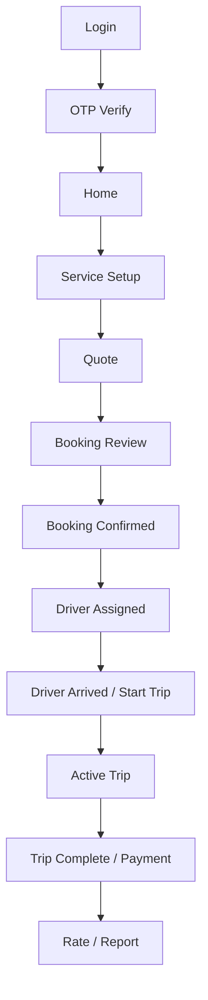
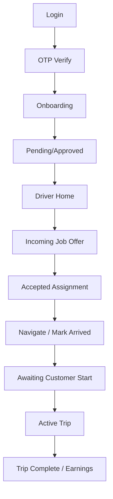
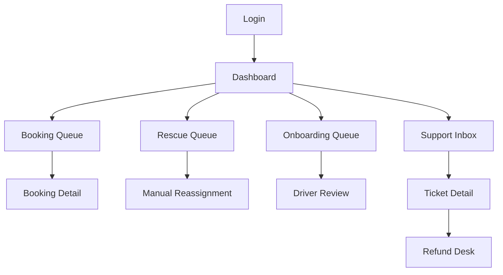
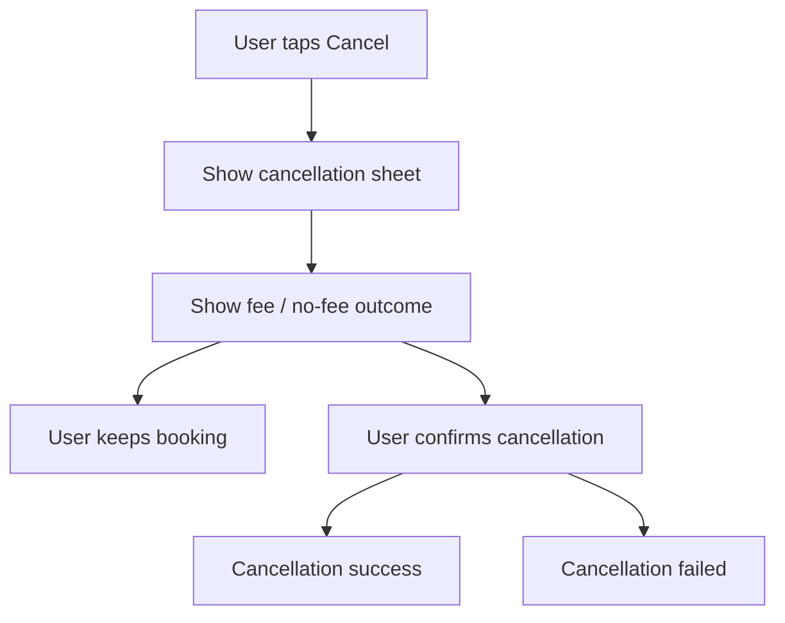
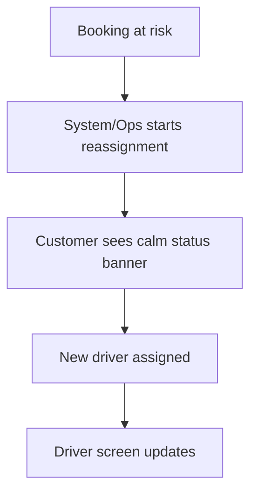

# Rydvrse Wireframes and UX States

## Document Control

- Document Name: `Wireframes_and_UX_States.md`
- Product: `Rydvrse`
- Version: `1.0`
- Status: `Baseline Low-Fidelity UX Spec for MVP`
- Last Updated: `2026-04-10`
- Source Documents:
  - `High_Level_Design.md`
  - `MVP_Scope.md`
  - `Product_Requirements_Document.md`
  - `Screen_Flow.md`

## 1. Purpose

This document defines low-fidelity wireframes and UX state behavior for the Rydvrse MVP.

It is intended to remove product ambiguity before:

- high-fidelity UI design
- API specification
- frontend implementation
- QA test case creation

This document focuses on:

- happy-path wireframes
- empty states
- loading states
- validation states
- error states
- cancellation flow
- reassignment flow
- delay flow
- payment-failed flow
- incident and support flows

## 2. Scope

This document covers:

- customer app
- driver app
- admin/ops dashboard

This document does not cover:

- final visual design system
- exact colors, spacing, and branding assets
- API payload details
- animation specifications in detail

## 3. UX Principles

These principles must be reflected in all wireframes and state behavior.

### 3.1 Trust First

The UI must always answer:

- who is coming
- when they will arrive
- what this will cost
- what is happening right now
- what the user can do if something is wrong

### 3.2 Calm Under Stress

High-stress states such as delay, reassignment, payment failure, and safety issues must use calm, direct language. The UI should reduce panic, not amplify it.

### 3.3 Explain Before Action

Whenever a decision has consequences, the UI should explain them before the user confirms.

Examples:

- cancellation fee preview
- quote expiry
- payment retry
- reassignment waiting

### 3.4 Primary Action Clarity

Every screen should have one obvious next step.

### 3.5 Context Persistence

If an action fails, the user should not lose their context.

Examples:

- payment failure should not erase invoice
- support submission failure should not erase typed text
- booking confirmation error should not erase booking inputs

## 4. Wireframe Conventions

Low-fidelity wireframes use plain text blocks to describe structure.

Notation:

- `[Button]` = primary or secondary action
- `(Field)` = input
- `{Card}` = information block
- `<Tab>` = tab or navigation segment
- `---` = divider
- `...` = truncated repeating content

## 5. Global UX State Model

These state patterns should be reused consistently across the product.

### 5.1 Loading State

- show skeleton or structured placeholder
- avoid blank screens
- preserve previous screen context if loading a refresh rather than first load

### 5.2 Empty State

- explain why there is no data
- give a useful next action
- avoid dead-end screens

### 5.3 Inline Validation State

- show validation close to the field causing the issue
- do not rely only on top banners for form mistakes

### 5.4 Recoverable Error State

- explain what went wrong in plain language
- preserve user input where possible
- provide retry and back options

### 5.5 Blocking Error State

- explain why user cannot proceed
- provide support path if needed

### 5.6 Informational Warning State

- use for delays, risk, reassignment, or pending review
- should be noticeable but not alarming

### 5.7 Success State

- confirm outcome clearly
- immediately present next logical step

## 6. Customer App Wireframes and UX States

## 6.1 Customer Happy Path Overview



## 6.2 Customer Core Mobile Layout Pattern

All major customer screens should follow this pattern:

```text
+----------------------------------+
| Header / Back / Title            |
| Status Banner if needed          |
+----------------------------------+
| Main content area                |
| - key context                    |
| - progress/state                 |
| - form or map or cards           |
|                                  |
|                                  |
+----------------------------------+
| Secondary action   Primary CTA   |
+----------------------------------+
```

## 6.3 Customer Screen Wireframes

### C-W1 Login / Mobile Entry

Purpose:

- fast authentication start

Happy Path Wireframe:

```text
+----------------------------------+
| Rydvrse                          |
| Book a verified driver           |
+----------------------------------+
| Mobile Number                    |
| ( +91 9XXXXXXXXX )               |
|                                  |
| Terms and Privacy note           |
|                                  |
|                [Continue]        |
+----------------------------------+
```

Empty State:

- phone field empty
- continue disabled

Validation State:

```text
Mobile Number
( +91 98 )   ! Enter a valid mobile number
```

Error State:

```text
[!] We couldn't send the OTP right now.
    Check your connection and try again.

[Try Again]   [Back]
```

UX Notes:

- numeric keypad only
- continue button becomes enabled only when minimum valid number pattern is met

### C-W2 OTP Verification

Purpose:

- complete login

Happy Path Wireframe:

```text
+----------------------------------+
| Verify your number               |
+----------------------------------+
| Code sent to +91 9XXXXXXXXX      |
|                                  |
| ( _ _ _ _ _ _ )                  |
|                                  |
| Resend in 00:24                  |
| [Change Number]                  |
|                                  |
|                [Verify OTP]      |
+----------------------------------+
```

Error State: Wrong OTP

```text
( 2 1 4 9 8 0 )
! Incorrect code. Try again.
```

Expired State:

```text
[!] This OTP has expired.
[Resend OTP]
```

Too Many Attempts State:

```text
[!] Too many incorrect attempts.
Try again in 10 minutes or contact support.
```

### C-W3 Home

Purpose:

- central launch point

Happy Path Wireframe:

```text
+----------------------------------+
| Hi, Prince                       |
| Bengaluru                        |
+----------------------------------+
| {Active booking / upcoming card} |
| Saturday, 8:30 PM                |
| Airport Drop                     |
| [View Booking]                   |
+----------------------------------+
| Services                         |
| [Scheduled Local]                |
| [One-Way Drop]                   |
| [Round Trip]                     |
| [Airport]                        |
| [Late-Night Safe Return]         |
+----------------------------------+
| Saved Places                     |
| Home   Office   Airport          |
+----------------------------------+
| <Home> <Bookings> <Help> <Profile|
+----------------------------------+
```

Empty State:

```text
+----------------------------------+
| Hi, Prince                       |
+----------------------------------+
| No upcoming bookings yet         |
| Book your first driver in a few  |
| taps.                            |
|                                  |
| [Book a Driver]                  |
+----------------------------------+
```

Service Unavailable State:

```text
[!] Service is temporarily unavailable
in your selected area right now.

[Change Location]   [Help]
```

### C-W4 Service Setup / Booking Input

Purpose:

- collect booking inputs

Happy Path Wireframe:

```text
+----------------------------------+
| New Booking                      |
+----------------------------------+
| Service Type                     |
| [Airport Drop v]                 |
|                                  |
| Pickup                           |
| ( Home )                         |
|                                  |
| Drop                             |
| ( Bengaluru Airport )            |
|                                  |
| Date                             |
| ( Sat, Apr 12 )                  |
| Time                             |
| ( 8:30 PM )                      |
|                                  |
| Instructions (optional)          |
| ( Meet near Gate 2 )             |
|                                  |
|                [Get Quote]       |
+----------------------------------+
```

Validation States:

- no pickup selected
- no drop selected for required services
- past time selected
- unsupported zone selected

Example Validation:

```text
Drop
( )   ! Drop location is required for this service
```

Non-Serviceable State:

```text
[!] This route or time is not available yet.
Try a nearby area or another time slot.

[Edit Booking]   [Help]
```

### C-W5 Quote Screen

Purpose:

- show transparent pricing

Happy Path Wireframe:

```text
+----------------------------------+
| Quote                            |
| Valid for 04:58                  |
+----------------------------------+
| Airport Drop                     |
| Home -> Bengaluru Airport        |
| Sat, Apr 12 | 8:30 PM            |
+----------------------------------+
| Fare Breakdown                   |
| Base Charge              Rs 249  |
| Service Charge           Rs 180  |
| Night Charge             Rs  99  |
| Taxes                    Rs  53  |
| ------------------------------   |
| Total                    Rs 581  |
+----------------------------------+
| Notes                            |
| - No hidden charges              |
| - Toll/parking extra if applied  |
| - Cancellation fees may apply    |
+----------------------------------+
| [Edit]               [Continue]  |
+----------------------------------+
```

Quote Expired State:

```text
[!] This quote has expired.
Pricing may have changed.

[Refresh Quote]
```

Quote Error State:

```text
[!] We couldn't generate a quote right now.

[Retry]   [Edit Details]
```

### C-W6 Booking Review

Purpose:

- confirm final summary before booking

Happy Path Wireframe:

```text
+----------------------------------+
| Review Booking                   |
+----------------------------------+
| Airport Drop                     |
| Home -> Bengaluru Airport        |
| Sat, Apr 12 | 8:30 PM            |
|                                  |
| Fare Snapshot                    |
| Total: Rs 581                    |
|                                  |
| Instructions                     |
| Meet near Gate 2                 |
+----------------------------------+
| [Edit Details]   [Confirm Booking|
+----------------------------------+
```

Booking Submission State:

```text
[Confirm Booking]
Loading...
Please don't close the app.
```

Duplicate Tap Protection State:

- disable CTA after first tap
- show spinner and "Booking in progress"

Booking Failure State:

```text
[!] We couldn't confirm your booking.
No payment was captured.

[Try Again]   [Edit Booking]
```

### C-W7 Booking Confirmed / Pending Assignment

Purpose:

- reassure user after booking confirmation

Happy Path Wireframe:

```text
+----------------------------------+
| Booking Confirmed                |
+----------------------------------+
| Booking ID: RYD-24851            |
| Airport Drop                     |
| Sat, Apr 12 | 8:30 PM            |
| Total: Rs 581                    |
+----------------------------------+
| Assignment Status                |
| [1] Booking Confirmed            |
| [2] Finding your driver...       |
| [3] Driver will appear here      |
+----------------------------------+
| Expected update by 8:00 PM       |
+----------------------------------+
| [Modify] [Cancel] [Support]      |
+----------------------------------+
```

Delay State:

```text
[!] We're still assigning your driver.
Our operations team is actively working on it.

Next update expected in 5 minutes.

[Wait]   [Cancel]   [Support]
```

Failed Fulfillment State:

```text
[!] We couldn't confirm a driver in time.
You will not be charged.

[Rebook]   [Support]
```

### C-W8 Driver Assigned

Purpose:

- show who is coming

Happy Path Wireframe:

```text
+----------------------------------+
| Driver Assigned                  |
+----------------------------------+
| [Photo] Ravi K                   |
| Verified Driver                  |
| Rating 4.8                       |
| Hindi, English                   |
| Arriving in 18 min               |
+----------------------------------+
| [Mini map preview]               |
+----------------------------------+
| [Call] [Support] [Booking Detail]|
+----------------------------------+
```

Reassignment State:

```text
[i] Your previous driver was replaced
to keep your booking on track.

New driver:
[Photo] Arjun S
Arriving in 14 min
```

Delay State:

```text
[!] Driver is running late.
We're checking alternatives now.

[Wait]   [Support]
```

Contact Error State:

```text
[!] Driver contact is temporarily unavailable.

[Retry]   [Support]
```

### C-W9 Driver Arrived / Start Trip

Purpose:

- customer-controlled trip start

Happy Path Wireframe:

```text
+----------------------------------+
| Driver Arrived                   |
+----------------------------------+
| Ravi K has arrived at pickup.    |
|                                  |
| Handover Checklist (optional)    |
| [ ] Correct driver confirmed     |
| [ ] Fuel note added              |
| [ ] Instructions added           |
| [ ] Visible concern noted        |
+----------------------------------+
| [Issue at Pickup] [Start Trip]   |
+----------------------------------+
```

Wrong Driver / Pickup Issue State:

```text
[!] The arriving driver does not match
the app details.

[Report Issue]   [Support]
```

Start Failure State:

```text
[!] We couldn't start the trip right now.
Your trip has not started yet.

[Try Again]   [Support]
```

### C-W10 Active Trip

Purpose:

- live visibility and safety

Happy Path Wireframe:

```text
+----------------------------------+
| Active Trip                      |
+----------------------------------+
| [Live map]                       |
|                                  |
+----------------------------------+
| Ravi K                           |
| Trip time: 00:42                 |
| Airport Drop                     |
+----------------------------------+
| [Share Trip] [SOS] [Support]     |
+----------------------------------+
```

Tracking Delayed State:

```text
[!] Live location is delayed.
We are still tracking your trip.

[Share Trip]   [Support]
```

Low Network State:

```text
[i] Weak connection.
Some updates may take longer.
```

Incident Shortcut State:

- if user starts a support or safety flow, preserve trip screen beneath overlay

### C-W11 Trip Complete / Payment

Purpose:

- close trip with fare clarity

Happy Path Wireframe:

```text
+----------------------------------+
| Trip Completed                   |
+----------------------------------+
| Start: 8:32 PM                   |
| End: 9:26 PM                     |
| Duration: 54 mins                |
+----------------------------------+
| Final Fare                       |
| Base Charge              Rs 249  |
| Service Charge           Rs 180  |
| Night Charge             Rs  99  |
| Taxes                    Rs  53  |
| ------------------------------   |
| Total                    Rs 581  |
+----------------------------------+
| Pay with UPI                     |
| [Pay Now]                        |
| [Fare Issue?]                    |
+----------------------------------+
```

Payment Failed State:

```text
[!] Payment failed.
Your trip summary is saved and you can try again.

Amount due: Rs 581

[Retry Payment]   [Support]
```

Payment Pending State:

```text
[i] Waiting for payment confirmation...
Do not close this screen yet.
```

Fare Review State:

```text
[!] This fare is under review.
Payment is paused while support checks the issue.

[Open Support Ticket]
```

### C-W12 Rating / Report Issue

Purpose:

- capture feedback and quick issue reporting

Happy Path Wireframe:

```text
+----------------------------------+
| Rate Your Trip                   |
+----------------------------------+
| Ravi K                           |
| [ * * * * * ]                    |
|                                  |
| Feedback (optional)              |
| ( Smooth ride. Thank you. )      |
|                                  |
| [Submit]      [Skip]             |
+----------------------------------+
```

Low Rating Assisted State:

```text
You rated this trip 2 stars.
What went wrong?

[Billing] [Behavior] [Late] [Car]
```

Immediate Issue State:

```text
[Billing Issue]
[Driver Behavior]
[Pickup Problem]
[Other]
```

### C-W13 Bookings List

Happy Path Wireframe:

```text
+----------------------------------+
| Bookings                         |
| <Upcoming> <Past>                |
+----------------------------------+
| {Airport Drop}                   |
| Sat, Apr 12 | 8:30 PM            |
| Assigned | Ravi K                |
| [View]                           |
|                                  |
| {Scheduled Local}                |
| Mon, Apr 14 | 10:00 AM           |
| Pending Assignment               |
| [View]                           |
+----------------------------------+
```

Empty Upcoming State:

```text
No upcoming bookings.

[Book a Driver]
```

Empty Past State:

```text
No ride history yet.
Once you complete a trip, it will appear here.
```

### C-W14 Booking Detail

Purpose:

- single truth for each booking

Happy Path Wireframe:

```text
+----------------------------------+
| Booking Detail                   |
+----------------------------------+
| Airport Drop                     |
| Sat, Apr 12 | 8:30 PM            |
| Status: Driver Assigned          |
+----------------------------------+
| Timeline                         |
| [x] Booking Confirmed            |
| [x] Driver Assigned              |
| [ ] Driver Arrived               |
| [ ] Trip Started                 |
+----------------------------------+
| Fare Snapshot: Rs 581            |
| Driver: Ravi K                   |
+----------------------------------+
| [Cancel] [Support]               |
+----------------------------------+
```

Cancelled State:

```text
Status: Cancelled
Reason: Customer cancelled before trip start
Fee: Rs 0
```

Failed Fulfillment State:

```text
Status: Could not be fulfilled
No charge applied

[Rebook]   [Support]
```

### C-W15 Support Ticket Flow

Purpose:

- structured help

Happy Path Wireframe:

```text
+----------------------------------+
| Get Help                         |
+----------------------------------+
| Booking: RYD-24851               |
| Airport Drop                     |
+----------------------------------+
| Category                         |
| [Billing v]                      |
|                                  |
| Describe the issue               |
| ( Fare shown is different... )   |
|                                  |
|                [Submit Ticket]   |
+----------------------------------+
```

Submit Error State:

```text
[!] We couldn't send your ticket.
Your message is still here.

[Try Again]   [Back]
```

Escalated Safety State:

```text
[!] This issue has been marked urgent.
Our team is reviewing it now.

[Back to Trip]
```

### C-W16 Cancellation Confirmation Sheet

Purpose:

- show consequences before cancel

Happy Path Wireframe:

```text
+----------------------------------+
| Cancel Booking?                  |
+----------------------------------+
| Airport Drop                     |
| Sat, Apr 12 | 8:30 PM            |
|                                  |
| Cancellation Outcome             |
| Fee: Rs 0                        |
|                                  |
| If you cancel now:               |
| - booking will be released       |
| - no driver will be reserved     |
+----------------------------------+
| [Keep Booking] [Cancel Booking]  |
+----------------------------------+
```

Fee Applies State:

```text
Cancellation Outcome
Fee: Rs 99

Why:
Driver has already been assigned.
```

Alternative Suggestion State:

```text
Instead of cancelling:
[Wait for Driver]
[Contact Support]
```

### C-W17 Reassignment Banner Pattern

Purpose:

- communicate operational recovery without confusion

Pattern:

```text
[i] We updated your driver to keep this
booking on track.

New driver arriving in 14 min.
[View Driver]
```

### C-W18 Delay State Pattern

Purpose:

- handle delay calmly

Pattern:

```text
[!] Your driver is delayed.
We are checking the fastest available option.

Next update in 5 minutes.
[Support]
```

### C-W19 Incident / SOS Overlay

Purpose:

- fast safety actions

Wireframe:

```text
+----------------------------------+
| Emergency Help                   |
+----------------------------------+
| [Call Support Now]               |
| [Share Live Trip Again]          |
| [Report Safety Issue]            |
|                                  |
| Booking RYD-24851                |
+----------------------------------+
| [Close]                          |
+----------------------------------+
```

Network Failure State:

```text
[!] We couldn't reach live support.
Try calling emergency services if needed.

[Retry]   [Close]
```

## 6.4 Customer State Matrix

| Screen | Happy | Empty | Validation | Error | Delay | Reassignment | Payment Failed | Incident |
|---|---|---|---|---|---|---|---|---|
| Login | Yes | Yes | Yes | Yes | No | No | No | No |
| OTP | Yes | No | Yes | Yes | No | No | No | No |
| Home | Yes | Yes | No | Yes | No | No | No | No |
| Booking Input | Yes | Yes | Yes | Yes | No | No | No | No |
| Quote | Yes | No | No | Yes | No | No | No | No |
| Pending Assignment | Yes | No | No | Yes | Yes | No | No | No |
| Driver Assigned | Yes | No | No | Yes | Yes | Yes | No | No |
| Start Trip | Yes | No | Yes | Yes | No | No | No | Yes |
| Active Trip | Yes | No | No | Yes | No | No | No | Yes |
| Payment | Yes | No | No | Yes | No | No | Yes | No |
| Support | Yes | Yes | Yes | Yes | No | No | No | Yes |

## 7. Driver App Wireframes and UX States

## 7.1 Driver Happy Path Overview



## 7.2 Driver Core Mobile Layout Pattern

```text
+----------------------------------+
| Header / Status                  |
+----------------------------------+
| Job / compliance / earnings      |
| details                          |
|                                  |
+----------------------------------+
| Secondary CTA   Primary CTA      |
+----------------------------------+
```

## 7.3 Driver Screen Wireframes

### D-W1 Login / OTP

Purpose:

- authenticate drivers quickly

Wireframe:

```text
+----------------------------------+
| Rydvrse Driver                   |
+----------------------------------+
| Mobile Number                    |
| ( +91 9XXXXXXXXX )               |
|                [Continue]        |
+----------------------------------+
```

States:

- empty
- invalid
- rate limited
- network error

### D-W2 Onboarding Checklist

Purpose:

- make onboarding progress explicit

Happy Path Wireframe:

```text
+----------------------------------+
| Complete Your Profile            |
+----------------------------------+
| [x] Personal Details             |
| [ ] Driving License              |
| [ ] Identity Document            |
| [ ] Bank Details                 |
| [ ] Profile Photo                |
+----------------------------------+
| Progress: 1 / 5                  |
|                [Continue]        |
+----------------------------------+
```

Empty State:

- first-time login with 0 completed items

Validation State:

- missing mandatory fields or invalid document format

### D-W3 Document Upload

Happy Path Wireframe:

```text
+----------------------------------+
| Upload Documents                 |
+----------------------------------+
| Driving License                  |
| [Upload Front] [Upload Back]     |
|                                  |
| Aadhaar / ID                     |
| [Upload]                         |
|                                  |
| Bank Details                     |
| [Add]                            |
+----------------------------------+
|                [Submit Review]   |
+----------------------------------+
```

Upload Failure State:

```text
[!] Upload failed for Driving License.
[Retry]
```

### D-W4 Onboarding Review Status

Happy Path Wireframe:

```text
+----------------------------------+
| Review Status                    |
+----------------------------------+
| Status: Pending Review           |
| Our team is checking your docs.  |
|                                  |
| [Contact Support]                |
+----------------------------------+
```

Correction Needed State:

```text
Status: Correction Needed
Reason: Driving License image unclear

[Re-upload Document]
```

Rejected State:

```text
Status: Rejected
Reason: Required document mismatch

[Contact Support]
```

### D-W5 Driver Home

Happy Path Wireframe:

```text
+----------------------------------+
| Good Evening                     |
+----------------------------------+
| Availability: [Available v]      |
| Earnings Today: Rs 1,240         |
+----------------------------------+
| Upcoming Jobs                    |
| Airport Drop | 8:30 PM           |
| Pickup: Koramangala              |
| [View Job]                       |
+----------------------------------+
| [Jobs] [Earnings] [Support]      |
+----------------------------------+
```

Empty State:

```text
No jobs assigned yet.
Stay available to receive offers.
```

Compliance Blocked State:

```text
[!] You cannot go available.
Your license verification has expired.

[Review Documents]
```

### D-W6 Incoming Job Offer

Purpose:

- informed acceptance

Happy Path Wireframe:

```text
+----------------------------------+
| New Job Offer                    |
+----------------------------------+
| Airport Drop                     |
| Pickup Zone: Koramangala         |
| Time: 8:30 PM                    |
| Expected Duration: 1 hr          |
| Estimated Earning: Rs 290        |
+----------------------------------+
| Offer expires in 00:20           |
+----------------------------------+
| [Decline]           [Accept]     |
+----------------------------------+
```

Expired State:

```text
This offer has expired.
[Back to Home]
```

Accept Conflict State:

```text
[!] This job was assigned to another driver.
[Back to Home]
```

### D-W7 Accepted Assignment Detail

Happy Path Wireframe:

```text
+----------------------------------+
| Assigned Job                     |
+----------------------------------+
| Airport Drop                     |
| Pickup: Koramangala              |
| Time: 8:30 PM                    |
| Customer Notes: Gate 2           |
| Estimated Earning: Rs 290        |
+----------------------------------+
| [Open Navigation] [Support]      |
+----------------------------------+
```

Reassigned Away State:

```text
[i] This job is no longer assigned to you.
[Back to Home]
```

### D-W8 Navigate to Pickup / Arrived

Happy Path Wireframe:

```text
+----------------------------------+
| Navigate to Pickup               |
+----------------------------------+
| [Map preview]                    |
| ETA: 18 mins                     |
+----------------------------------+
| [Issue]             [Mark Arrived]|
+----------------------------------+
```

Location Issue State:

```text
[!] Pickup location looks incorrect.
[Raise Issue]   [Support]
```

### D-W9 Awaiting Customer Start

Happy Path Wireframe:

```text
+----------------------------------+
| Waiting for Customer             |
+----------------------------------+
| You have marked arrival.         |
| Trip will start once the customer|
| confirms in the app.             |
+----------------------------------+
| [Pickup Issue] [Support]         |
+----------------------------------+
```

Delay State:

```text
Waiting for customer confirmation...
3 mins elapsed

[Customer Not Reachable]
```

### D-W10 Active Trip

Happy Path Wireframe:

```text
+----------------------------------+
| Active Trip                      |
+----------------------------------+
| Airport Drop                     |
| Trip time: 00:24                 |
| [Open Navigation]                |
+----------------------------------+
| [Issue]             [Complete]   |
+----------------------------------+
```

Connectivity Weak State:

```text
[i] Weak connection.
Trip is still active.
```

Completion Error State:

```text
[!] We couldn't complete the trip.
Your trip is still active.

[Try Again]   [Support]
```

### D-W11 Trip Complete / Earnings

Happy Path Wireframe:

```text
+----------------------------------+
| Trip Complete                    |
+----------------------------------+
| Airport Drop                     |
| Total Earning: Rs 290            |
+----------------------------------+
| Breakdown                        |
| Arrival Fee              Rs  50  |
| Service Payout           Rs 200  |
| Night Bonus              Rs  40  |
+----------------------------------+
| [Done]   [Raise Issue]           |
+----------------------------------+
```

Payout Pending State:

```text
Payout Status: Pending settlement
```

Earning Dispute State:

```text
[!] Something looks wrong with payout?
[Raise Issue]
```

### D-W12 Earnings History

Happy Path Wireframe:

```text
+----------------------------------+
| Earnings                         |
+----------------------------------+
| Today: Rs 1,240                  |
| This Week: Rs 5,820              |
+----------------------------------+
| Airport Drop   Rs 290            |
| Local Ride     Rs 180            |
| Round Trip     Rs 410            |
+----------------------------------+
```

Empty State:

```text
No earnings yet.
Complete your first ride to see them here.
```

### D-W13 Driver Support Flow

Happy Path Wireframe:

```text
+----------------------------------+
| Driver Support                   |
+----------------------------------+
| Context: Airport Drop            |
|                                  |
| Issue Type                       |
| [Pickup Problem v]               |
|                                  |
| Describe the issue               |
| ( Customer not reachable... )    |
+----------------------------------+
|                [Submit]          |
+----------------------------------+
```

Submission Failure State:

```text
[!] Could not send your issue.
Your message is still saved here.

[Retry]
```

## 7.4 Driver State Matrix

| Screen | Happy | Empty | Validation | Error | Delay | Compliance Block | Payout Issue |
|---|---|---|---|---|---|---|---|
| Login | Yes | Yes | Yes | Yes | No | No | No |
| Onboarding | Yes | Yes | Yes | Yes | No | No | No |
| Review Status | Yes | No | No | Yes | Yes | No | No |
| Home | Yes | Yes | No | Yes | No | Yes | No |
| Job Offer | Yes | No | No | Yes | No | No | No |
| Assignment | Yes | No | No | Yes | No | No | No |
| Waiting Start | Yes | No | No | Yes | Yes | No | No |
| Active Trip | Yes | No | No | Yes | No | No | No |
| Earnings | Yes | Yes | No | Yes | No | No | Yes |
| Support | Yes | Yes | Yes | Yes | No | No | Yes |

## 8. Admin / Ops Dashboard Wireframes and UX States

## 8.1 Ops Happy Path Overview



## 8.2 Ops Core Layout Pattern

```text
+------------------------------------------------------+
| Top Bar / Search / User                              |
+-------------+----------------------------------------+
| Left Nav     | Main Content                          |
| - Dashboard  | - filters                             |
| - Bookings   | - summary cards / tables / actions    |
| - Rescue     | - details panel                       |
| - Drivers    |                                        |
| - Support    |                                        |
+-------------+----------------------------------------+
```

## 8.3 Ops Screen Wireframes

### O-W1 Dashboard Home

Happy Path Wireframe:

```text
+------------------------------------------------------+
| Dashboard                                            |
+------------------------------------------------------+
| Fulfillment 92% | At Risk 4 | Open Tickets 8         |
| Pending Onboarding 12 | Refunds 3                    |
+------------------------------------------------------+
| Priority Actions                                     |
| [Open Rescue Queue] [Open Support Inbox]             |
+------------------------------------------------------+
| Live Booking Health                                  |
| {Pending Assignment} {Assigned} {In Trip}            |
+------------------------------------------------------+
```

Empty / Calm State:

```text
No critical issues right now.
All queues are within normal range.
```

Alert-Heavy State:

```text
[!] Rescue queue has 12 high-priority bookings.
[Open Rescue Queue]
```

### O-W2 Booking Queue

Happy Path Wireframe:

```text
+------------------------------------------------------+
| Bookings                                             |
+------------------------------------------------------+
| Filters: Status | Service | Zone | Time             |
+------------------------------------------------------+
| RYD-24851 | Airport | 8:30 PM | Assigned | View     |
| RYD-24852 | Local   | 9:00 PM | Pending  | View     |
| RYD-24853 | Local   | 9:15 PM | At Risk  | View     |
+------------------------------------------------------+
```

Empty State:

```text
No bookings match these filters.
[Clear Filters]
```

Error State:

```text
[!] Booking data couldn't be loaded.
[Retry]
```

### O-W3 Booking Detail / Timeline

Happy Path Wireframe:

```text
+------------------------------------------------------+
| Booking RYD-24851                                    |
+------------------------------------------------------+
| Customer: Prince                                     |
| Service: Airport Drop                                |
| Schedule: Sat 8:30 PM                                |
| Fare Snapshot: Rs 581                                |
| Driver: Ravi K                                       |
+------------------------------------------------------+
| Timeline                                             |
| [x] Confirmed                                        |
| [x] Assigned                                         |
| [ ] Arrived                                          |
| [ ] Started                                          |
+------------------------------------------------------+
| [Reassign] [Open Support] [Open Refund Desk]         |
+------------------------------------------------------+
```

Cancelled State:

```text
Status: Cancelled
Reason: Customer cancelled before arrival
Fee: Rs 0
```

Under Review State:

```text
Status: Under Review
Linked Ticket: TKT-9021
```

### O-W4 Rescue Queue

Purpose:

- save rides before failure

Happy Path Wireframe:

```text
+------------------------------------------------------+
| Rescue Queue                                         |
+------------------------------------------------------+
| RYD-24853 | No driver accepted | 7 mins to SLA       |
| [Open] [Reassign]                                    |
|                                                      |
| RYD-24854 | Driver delayed | ETA breach              |
| [Open] [Reassign]                                    |
+------------------------------------------------------+
```

Empty State:

```text
No at-risk bookings right now.
```

Burst State:

```text
[!] High rescue load
12 bookings require intervention now.
```

### O-W5 Manual Assignment / Reassignment

Happy Path Wireframe:

```text
+------------------------------------------------------+
| Reassign Booking RYD-24853                           |
+------------------------------------------------------+
| Candidate Drivers                                    |
| Ravi K   | 2.1 km | 4.8 | Available | [Select]       |
| Arjun S  | 2.8 km | 4.7 | Available | [Select]       |
| Mehul P  | 4.0 km | 4.9 | Available | [Select]       |
+------------------------------------------------------+
| Reason                                               |
| ( Existing driver delayed )                          |
+------------------------------------------------------+
| [Cancel]                          [Confirm Assign]   |
+------------------------------------------------------+
```

No Candidates State:

```text
No eligible drivers available right now.

[Back to Rescue Queue]   [Contact Customer]
```

Conflict State:

```text
[!] This booking was updated by another operator.
Refresh before taking action.

[Refresh]
```

### O-W6 Driver Onboarding Queue

Happy Path Wireframe:

```text
+------------------------------------------------------+
| Driver Onboarding Queue                              |
+------------------------------------------------------+
| D-1021 | Complete docs | Pending review | [Open]     |
| D-1022 | Missing selfie | Correction    | [Open]     |
+------------------------------------------------------+
```

Empty State:

```text
No driver applications pending review.
```

### O-W7 Driver Review Detail

Happy Path Wireframe:

```text
+------------------------------------------------------+
| Driver Review: Ravi K                                |
+------------------------------------------------------+
| License: Uploaded                                    |
| ID: Uploaded                                         |
| Bank Details: Uploaded                               |
| Selfie: Uploaded                                     |
+------------------------------------------------------+
| Reviewer Notes                                       |
| ( Looks complete )                                   |
+------------------------------------------------------+
| [Reject] [Request Correction] [Approve]              |
+------------------------------------------------------+
```

Correction Required State:

```text
Reason required before sending correction request.
```

### O-W8 Support Ticket Inbox

Happy Path Wireframe:

```text
+------------------------------------------------------+
| Support Inbox                                        |
+------------------------------------------------------+
| TKT-9021 | Billing | SEV3 | Open | [Open]            |
| TKT-9022 | Safety  | SEV1 | Open | [Open]            |
| TKT-9023 | Pickup  | SEV2 | Open | [Open]            |
+------------------------------------------------------+
```

Empty State:

```text
No open tickets right now.
```

### O-W9 Ticket / Incident Detail

Happy Path Wireframe:

```text
+------------------------------------------------------+
| TKT-9021                                             |
+------------------------------------------------------+
| Category: Billing                                    |
| Severity: SEV3                                       |
| Booking: RYD-24851                                   |
| Customer: Prince                                     |
| Driver: Ravi K                                       |
+------------------------------------------------------+
| Timeline                                             |
| 9:29 PM Ticket created                               |
| 9:31 PM Assigned to support                          |
+------------------------------------------------------+
| Notes                                                |
| ( Customer says fare is incorrect )                  |
+------------------------------------------------------+
| [Add Note] [Escalate] [Resolve] [Open Refund Desk]   |
+------------------------------------------------------+
```

Escalated Safety State:

```text
[!] SEV1 safety incident
Immediate response required.
```

### O-W10 Refund Desk

Happy Path Wireframe:

```text
+------------------------------------------------------+
| Refund Desk                                          |
+------------------------------------------------------+
| Booking: RYD-24851                                   |
| Paid Amount: Rs 581                                  |
| Eligible Refund: Rs 581                              |
+------------------------------------------------------+
| Refund Amount                                        |
| ( 99 )                                               |
| Reason Code                                          |
| [Driver Delay v]                                     |
| Note                                                 |
| ( Approved as goodwill adjustment )                  |
+------------------------------------------------------+
| [Cancel]                           [Process Refund]  |
+------------------------------------------------------+
```

Validation State:

```text
! Reason code is required
! Refund amount exceeds allowable limit
```

Duplicate Refund State:

```text
[!] A refund is already being processed for this booking.
[Back to Ticket]
```

### O-W11 Pricing and Serviceability Config

Happy Path Wireframe:

```text
+------------------------------------------------------+
| Pricing & Serviceability                             |
+------------------------------------------------------+
| City: Bengaluru                                      |
| Zone: Core South                                     |
+------------------------------------------------------+
| Service Enabled: [Yes]                               |
| Base Charge: ( 249 )                                 |
| Night Charge: ( 99 )                                 |
| One-Way Allowance Band A: ( 80 )                     |
+------------------------------------------------------+
| [Discard]                           [Save Changes]   |
+------------------------------------------------------+
```

Validation State:

```text
! Base Charge cannot be empty
! Zone configuration overlaps invalid service area
```

### O-W12 Audit Log

Happy Path Wireframe:

```text
+------------------------------------------------------+
| Audit Log                                            |
+------------------------------------------------------+
| Filters: Action | Actor | Date | Entity             |
+------------------------------------------------------+
| 9:31 PM | refund.created | ops_14 | RYD-24851       |
| 8:05 PM | assignment.reassigned | ops_02 | RYD-24853|
+------------------------------------------------------+
```

Empty State:

```text
No audit records match your filters.
```

### O-W13 Reporting

Happy Path Wireframe:

```text
+------------------------------------------------------+
| Operations Reporting                                 |
+------------------------------------------------------+
| Fulfillment 92% | Refund Rate 3% | Support Rate 7    |
+------------------------------------------------------+
| [Trend Chart Placeholder]                            |
| [Driver Utilization Placeholder]                     |
+------------------------------------------------------+
```

Data Delay State:

```text
[i] Reporting data is delayed by 15 minutes.
```

## 8.4 Ops State Matrix

| Screen | Happy | Empty | Validation | Error | Delay / Alert | Conflict | Incident |
|---|---|---|---|---|---|---|---|
| Dashboard | Yes | Yes | No | Yes | Yes | No | Yes |
| Booking Queue | Yes | Yes | No | Yes | No | No | No |
| Booking Detail | Yes | No | No | Yes | Yes | No | Yes |
| Rescue Queue | Yes | Yes | No | Yes | Yes | Yes | No |
| Reassignment | Yes | Yes | Yes | Yes | No | Yes | No |
| Onboarding Queue | Yes | Yes | No | Yes | No | No | No |
| Driver Review | Yes | No | Yes | Yes | No | No | No |
| Support Inbox | Yes | Yes | No | Yes | Yes | No | Yes |
| Ticket Detail | Yes | No | Yes | Yes | Yes | No | Yes |
| Refund Desk | Yes | No | Yes | Yes | No | Yes | No |
| Config | Yes | No | Yes | Yes | No | No | No |
| Reporting | Yes | Yes | No | Yes | Yes | No | No |

## 9. Special UX Flows

## 9.1 Cancellation Flow

Trigger Points:

- customer booking detail
- pending assignment screen
- assigned driver screen

Flow:



Required UX Behavior:

- show financial consequence before confirm
- if a fee applies, explain why in plain language
- suggest alternatives when reasonable:
  - wait
  - support
- after successful cancellation, show final status and financial outcome

Success State:

```text
Booking cancelled successfully.
Cancellation fee: Rs 0

[Done]
```

Failure State:

```text
[!] We couldn't cancel this booking right now.
Please try again or contact support.

[Retry]   [Support]
```

## 9.2 Reassignment Flow

Trigger Points:

- assigned driver delayed
- driver cancelled
- ops intervened to rescue booking

Flow:



Required UX Behavior:

- do not expose raw operational failure language
- explain that the platform updated the driver to keep the ride on track
- replace stale driver information immediately
- preserve booking context and fare

## 9.3 Delay Flow

Trigger Points:

- no assignment within threshold
- driver ETA exceeds threshold
- pickup timing slips materially

Required UX Behavior:

- communicate delay clearly
- show when next update is expected
- offer support path
- do not trap the user in uncertainty

Recommended copy pattern:

```text
Your driver is delayed.
We are actively checking the fastest available option.
Next update in 5 minutes.
```

## 9.4 Payment-Failed Flow

Trigger Points:

- provider reject
- network interruption
- callback failure or timeout

Required UX Behavior:

- keep invoice and final fare visible
- clearly show whether payment is still due
- allow retry without re-entering trip context
- offer support if repeated failures occur

Do not:

- dump the user back to home
- hide whether money was charged
- lose the booking/trip linkage

## 9.5 Incident and Safety Flow

Trigger Points:

- customer taps SOS
- customer raises safety issue
- driver raises severe trip issue
- ops marks a ticket as SEV1 or SEV2

Required UX Behavior:

- prioritize speed over detail
- attach live booking and trip context automatically
- keep action labels unambiguous
- preserve a return path to the active trip screen if appropriate

## 9.6 Support Submission Failure Flow

Required UX Behavior:

- preserve typed message
- preserve selected category
- allow retry
- do not silently dismiss

## 10. Empty State Copy Recommendations

These empty states should feel useful, not decorative.

### Customer

- No upcoming bookings:
  - `No upcoming bookings yet. Book a verified driver in a few taps.`
- No past bookings:
  - `No ride history yet. Your completed trips will appear here.`
- No service in location:
  - `This area is not live yet. Try a nearby location or contact support.`

### Driver

- No jobs:
  - `No jobs assigned yet. Stay available to receive offers.`
- No earnings:
  - `No earnings yet. Complete your first trip to see them here.`
- Pending approval:
  - `Your profile is under review. We'll notify you when you're ready to go live.`

### Ops

- Empty rescue queue:
  - `No at-risk bookings right now.`
- Empty onboarding queue:
  - `No driver applications pending review.`
- Empty support inbox:
  - `No open tickets right now.`

## 11. Error State Copy Principles

- say what happened
- say what it means
- say what to do next

Preferred structure:

```text
[Problem]
[Meaning or reassurance]
[Action options]
```

Example:

```text
Payment failed.
Your trip summary is saved and you can try again.

[Retry Payment] [Support]
```

## 12. Design Handoff Notes

When converting these wireframes into high-fidelity UI:

- keep the trust-critical information above the fold:
  - fare
  - status
  - driver identity
  - next action
- preserve the difference between:
  - warning
  - blocking error
  - informational status
- do not hide key state changes behind generic toasts only
- keep support and safety actions visible in all active booking/trip contexts

## 13. Summary

This document provides the low-fidelity structural UX reference for the Rydvrse MVP.

It should be used before visual mockups and frontend implementation to ensure:

- every core screen has a clear happy path
- empty states are intentional
- error states are recoverable where possible
- delay, reassignment, payment-failed, cancellation, and incident flows are planned upfront

The next best artifact after this is either:

- a clickable design system-backed wireframe set in Figma, or
- an `API_Spec.md` aligned to these UX states and transitions
